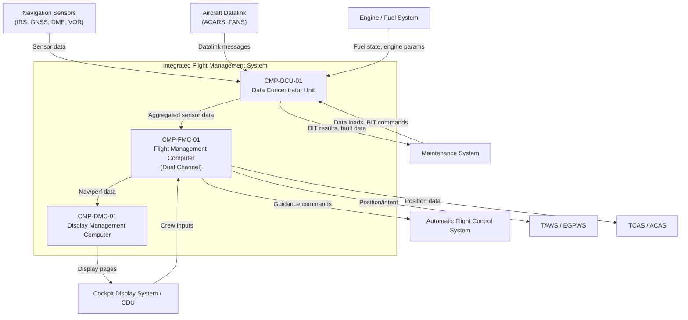
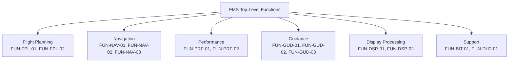
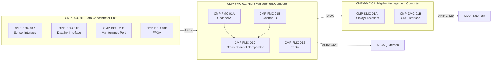

# Architecture

## System Context

## Functional Architecture

### System Functions

| FUN ID       | Function Name                  | Description                                                             | Inputs                           | Outputs                          | Dependencies     |
|--------------|--------------------------------|-------------------------------------------------------------------------|----------------------------------|----------------------------------|------------------|
| FUN-FPL-01   | Flight Plan Management         | Create, modify, and sequence lateral and vertical flight plan legs      | Crew entries, datalink plans     | Active flight plan, leg sequence | FUN-NAV-01       |
| FUN-FPL-02   | Flight Plan Validation         | Check plan feasibility against performance limits and airspace constraints | Active flight plan, PERF data  | Validation status, advisories    | FUN-PRF-01       |
| FUN-NAV-01   | Position Computation           | Multi-sensor fusion for aircraft position, velocity, and time           | IRS, GNSS, DME, VOR raw data    | PVT solution, integrity flags    | None             |
| FUN-NAV-02   | Navigation Integrity Monitoring| Fault detection and exclusion for navigation sensor inputs              | PVT solution, sensor raw data    | FDE status, exclusion flags      | FUN-NAV-01       |
| FUN-NAV-03   | RNP/RNAV Containment           | Compute and monitor required navigation performance containment         | PVT solution, FDE status         | RNP containment status, alerts   | FUN-NAV-01, FUN-NAV-02 |
| FUN-PRF-01   | Performance Computation        | Compute aircraft performance predictions for climb, cruise, descent     | Weight, wind, temperature, engine data | Predicted profiles, fuel estimates | FUN-NAV-01   |
| FUN-PRF-02   | Fuel Management                | Monitor fuel state, compute fuel predictions, generate fuel advisories  | Fuel quantity, burn rate         | Fuel predictions, low-fuel alerts| FUN-PRF-01       |
| FUN-GUD-01   | Lateral Guidance               | Compute roll steering commands for LNAV                                 | Active leg, PVT solution         | Roll commands to AFCS            | FUN-FPL-01, FUN-NAV-01 |
| FUN-GUD-02   | Vertical Guidance              | Compute pitch/thrust commands for VNAV                                  | Active profile, PVT solution     | Pitch/thrust commands to AFCS    | FUN-FPL-01, FUN-PRF-01, FUN-NAV-01 |
| FUN-GUD-03   | Guidance Mode Management       | Manage transitions between guidance modes and annunciations             | Crew selections, flight phase    | Active mode, annunciations       | FUN-GUD-01, FUN-GUD-02 |
| FUN-DSP-01   | Navigation Display Processing  | Format navigation data for cockpit display presentation                 | PVT solution, flight plan, map data | Display pages, symbology       | FUN-NAV-01, FUN-FPL-01 |
| FUN-DSP-02   | CDU Page Management            | Process CDU page requests and crew data entry                           | Crew key presses                 | CDU page content, data fields    | FUN-FPL-01       |
| FUN-BIT-01   | Built-In Test                  | Power-up, continuous, and initiated BIT for all LRUs                    | BIT commands, health data        | Fault reports, LRU status        | None             |
| FUN-DLD-01   | Data Load Management           | Manage navigation database and software part loads                      | Maintenance commands, load media | Load status, configuration ID    | FUN-BIT-01       |

### Functional Decomposition

## Physical Architecture

### Component Hierarchy

| CMP ID        | Component Name                         | Type     | Parent        | Description                                                        |
|---------------|----------------------------------------|----------|---------------|--------------------------------------------------------------------|
| CMP-FMC-01    | Flight Management Computer             | LRU      | System        | Dual-channel FMC; primary computation for nav, guidance, perf      |
| CMP-FMC-01A   | FMC Channel A Processor Module         | Module   | CMP-FMC-01    | Primary channel; runs Software Build A                             |
| CMP-FMC-01B   | FMC Channel B Processor Module         | Module   | CMP-FMC-01    | Dissimilar channel; runs Software Build B                          |
| CMP-FMC-01C   | FMC Cross-Channel Comparator           | Module   | CMP-FMC-01    | Hardware comparator for channel output cross-check                 |
| CMP-FMC-01D   | FMC ARINC 653 RTOS                     | Software | CMP-FMC-01    | Real-time operating system providing partition management          |
| CMP-FMC-01E   | FMC Navigation Application (Ch A)      | Software | CMP-FMC-01A   | Navigation algorithms, Software Build A implementation             |
| CMP-FMC-01F   | FMC Navigation Application (Ch B)      | Software | CMP-FMC-01B   | Navigation algorithms, Software Build B (dissimilar)               |
| CMP-FMC-01G   | FMC Guidance Application               | Software | CMP-FMC-01    | Lateral and vertical guidance command computation                  |
| CMP-FMC-01H   | FMC Performance Application            | Software | CMP-FMC-01    | Performance prediction and fuel management                         |
| CMP-FMC-01J   | FMC FPGA Subsystem                     | Hardware | CMP-FMC-01    | I/O processing and bus interface FPGA                              |
| CMP-DMC-01    | Display Management Computer            | LRU      | System        | FMS display processing and CDU interface management                |
| CMP-DMC-01A   | DMC Display Processor                  | Module   | CMP-DMC-01    | Graphics rendering and page formatting                             |
| CMP-DMC-01B   | DMC CDU Interface Module               | Module   | CMP-DMC-01    | CDU protocol handling and key decode                               |
| CMP-DMC-01C   | DMC Display Application Software       | Software | CMP-DMC-01    | Navigation display and CDU page management software                |
| CMP-DCU-01    | Data Concentrator Unit                 | LRU      | System        | Sensor aggregation, datalink interface, maintenance port           |
| CMP-DCU-01A   | DCU Sensor Interface Module            | Module   | CMP-DCU-01    | ARINC 429 receive for IRS, GNSS, DME, VOR, engine/fuel            |
| CMP-DCU-01B   | DCU Datalink Interface Module          | Module   | CMP-DCU-01    | ACARS/FANS message handling and protocol conversion                |
| CMP-DCU-01C   | DCU Maintenance Port                   | Module   | CMP-DCU-01    | Maintenance data load interface with access control                |
| CMP-DCU-01D   | DCU FPGA Subsystem                     | Hardware | CMP-DCU-01    | Bus arbitration and data routing FPGA                              |
| CMP-DCU-01E   | DCU Aggregation Application Software   | Software | CMP-DCU-01    | Sensor validation, aggregation, and routing logic                  |

### Physical Architecture Diagram

## Allocation

| FUN ID       | REQ ID(s)                                          | CMP ID(s)                            | Assurance Level | Rationale                                                    |
|--------------|-----------------------------------------------------|--------------------------------------|-----------------|--------------------------------------------------------------|
| FUN-FPL-01   | REQ-FUN-001, REQ-FUN-002, REQ-FUN-003              | CMP-FMC-01A, CMP-FMC-01B            | DAL A           | Flight plan drives guidance; erroneous plan is Hazardous     |
| FUN-FPL-02   | REQ-FUN-004                                         | CMP-FMC-01A, CMP-FMC-01B            | DAL A           | Validation prevents infeasible plans reaching guidance        |
| FUN-NAV-01   | REQ-FUN-005, REQ-FUN-006, REQ-FUN-007              | CMP-FMC-01E, CMP-FMC-01F, CMP-DCU-01A | DAL A        | Position computation is safety-critical; drives guidance      |
| FUN-NAV-02   | REQ-FUN-008, REQ-FUN-009                            | CMP-FMC-01E, CMP-FMC-01F            | DAL A           | FDE failure could allow erroneous guidance                    |
| FUN-NAV-03   | REQ-FUN-010                                         | CMP-FMC-01E, CMP-FMC-01F            | DAL A           | RNP containment is a regulatory requirement                  |
| FUN-PRF-01   | REQ-FUN-011, REQ-FUN-012                            | CMP-FMC-01H                          | DAL C           | Performance advisory; erroneous prediction is Major           |
| FUN-PRF-02   | REQ-FUN-013                                         | CMP-FMC-01H                          | DAL C           | Fuel advisory; crew has independent fuel gauges               |
| FUN-GUD-01   | REQ-FUN-014, REQ-FUN-015                            | CMP-FMC-01G                          | DAL A           | Lateral guidance directly commands AFCS                       |
| FUN-GUD-02   | REQ-FUN-016, REQ-FUN-017                            | CMP-FMC-01G                          | DAL A           | Vertical guidance directly commands AFCS                      |
| FUN-GUD-03   | REQ-FUN-018                                         | CMP-FMC-01G                          | DAL A           | Mode management governs guidance engagement                   |
| FUN-DSP-01   | REQ-FUN-019                                         | CMP-DMC-01A, CMP-DMC-01C            | DAL B           | Display misleading info is Major; DMC does not command AFCS   |
| FUN-DSP-02   | REQ-FUN-020                                         | CMP-DMC-01B, CMP-DMC-01C            | DAL B           | CDU input path can modify flight plan (safety relevance)      |
| FUN-BIT-01   | REQ-FUN-021                                         | CMP-FMC-01, CMP-DMC-01, CMP-DCU-01  | DAL A           | BIT coverage supports fault detection safety argument         |
| FUN-DLD-01   | REQ-FUN-022                                         | CMP-DCU-01C, CMP-DCU-01E            | DAL B           | Incorrect data load can corrupt nav database (Hazardous via CTL) |

## Interfaces

### External Interfaces

| IFC ID       | Partner System                  | Data Item                        | Direction | Protocol        | Timing              |
|--------------|---------------------------------|----------------------------------|-----------|-----------------|----------------------|
| IFC-EXT-001  | Automatic Flight Control System | Lateral/vertical guidance commands | Out      | ARINC 429       | 50 ms update rate   |
| IFC-EXT-002  | Cockpit Display System / CDU   | CDU pages, navigation symbology   | Out      | ARINC 429       | 100 ms refresh      |
| IFC-EXT-003  | Cockpit Display System / CDU   | Crew key presses, data entries    | In       | ARINC 429       | Event-driven         |
| IFC-EXT-004  | Inertial Reference System      | Position, velocity, attitude      | In       | ARINC 429       | 20 ms update rate   |
| IFC-EXT-005  | GNSS Receiver                  | Position, time, integrity data    | In       | ARINC 429       | 1 Hz                |
| IFC-EXT-006  | DME Interrogator               | Range, station ID                 | In       | ARINC 429       | 1 Hz                |
| IFC-EXT-007  | VOR Receiver                   | Bearing, station ID               | In       | ARINC 429       | 1 Hz                |
| IFC-EXT-008  | Aircraft Datalink (ACARS/FANS) | Uplink/downlink messages          | Bidirectional | ARINC 429  | Event-driven         |
| IFC-EXT-009  | Engine/Fuel System             | N1/N2, fuel flow, fuel quantity   | In       | ARINC 429       | 100 ms update rate  |
| IFC-EXT-010  | TAWS/EGPWS                     | FMS position, flight plan intent  | Out      | ARINC 429       | 1 Hz                |
| IFC-EXT-011  | TCAS/ACAS                      | FMS position, altitude intent     | Out      | ARINC 429       | 1 Hz                |
| IFC-EXT-012  | Maintenance System             | Data load files, BIT commands     | Bidirectional | Ethernet (discrete) | On demand     |

### Internal Interfaces

| IFC ID       | Source CMP ID  | Target CMP ID  | Data Item                           | Mechanism         | Timing              |
|--------------|----------------|-----------------|-------------------------------------|-------------------|----------------------|
| IFC-INT-001  | CMP-DCU-01     | CMP-FMC-01      | Aggregated sensor data              | ARINC 664 (AFDX)  | 20 ms               |
| IFC-INT-002  | CMP-FMC-01     | CMP-DMC-01      | Navigation/performance display data | ARINC 664 (AFDX)  | 50 ms               |
| IFC-INT-003  | CMP-FMC-01A    | CMP-FMC-01C     | Channel A computed outputs          | Backplane bus      | 20 ms               |
| IFC-INT-004  | CMP-FMC-01B    | CMP-FMC-01C     | Channel B computed outputs          | Backplane bus      | 20 ms               |
| IFC-INT-005  | CMP-FMC-01C    | CMP-FMC-01A     | Comparison result, disagree flag    | Backplane bus      | 20 ms               |
| IFC-INT-006  | CMP-DCU-01B    | CMP-DCU-01E     | Datalink message payloads           | Internal bus       | Event-driven         |
| IFC-INT-007  | CMP-DCU-01C    | CMP-DCU-01E     | Maintenance commands, load data     | Internal bus       | On demand            |

## Failure Containment / Partitioning

### ARINC 653 Partitioning within FMC

The FMC executes under an ARINC 653 real-time operating system (CMP-FMC-01D) that enforces spatial and temporal partitioning between application partitions. This partitioning supports the safety argument for hosting functions at different DALs on the same processor.

**Partition assignments:**

| Partition | Functions                        | DAL   | Rationale                                               |
|-----------|----------------------------------|-------|---------------------------------------------------------|
| P1        | Navigation (FUN-NAV-01/02/03)    | DAL A | Safety-critical position computation and integrity       |
| P2        | Guidance (FUN-GUD-01/02/03)      | DAL A | Safety-critical AFCS command generation                  |
| P3        | Flight Planning (FUN-FPL-01/02)  | DAL A | Plan data drives guidance; erroneous plan is Hazardous   |
| P4        | Performance (FUN-PRF-01/02)      | DAL C | Advisory function; partitioned from DAL A functions      |
| P5        | BIT/System Services (FUN-BIT-01) | DAL A | Health monitoring and partition management                |

**Isolation enforcement:**
- Spatial isolation via MMU-enforced memory regions; each partition has private code and data segments with no shared writable memory.
- Temporal isolation via static partition scheduling with fixed time windows; a partition that overruns its window is terminated and the health monitor is notified.
- Inter-partition communication is restricted to ARINC 653 ports (sampling and queuing) with defined message sizes and rates. No direct pointer sharing.
- The RTOS health monitor detects partition faults (deadline overrun, illegal memory access, arithmetic fault) and triggers the partition-level recovery action defined in the system configuration table.

**Evidence**: Partition testing per ARINC 653 Part 1 (APEX) conformance test suite, supplemented by robustness tests that inject faults in one partition and verify non-interference in adjacent partitions. CAST-32A multi-core interference analysis addresses shared cache and bus contention between partitions executing on different cores.

### Dissimilar Redundancy between FMC Channels

FMC Channels A and B (CMP-FMC-01A, CMP-FMC-01B) run dissimilar software implementations developed by independent teams using different compilers and, where practical, different algorithmic approaches for the navigation solution. The cross-channel comparator (CMP-FMC-01C) performs cycle-by-cycle comparison of computed guidance outputs.

**Independence argument:**
- Different development teams, tools, and compilers for each channel.
- Algorithmic diversity in navigation filter (e.g., extended Kalman filter vs. unscented Kalman filter).
- Cross-channel comparator is a simple hardware voter with dedicated FPGA implementation independent of both software channels.
- Common-mode analysis per ARP4761A addresses shared inputs (same sensor data from DCU), shared environment (same power supply, same thermal zone), and shared requirements specification (mitigated by independent requirement interpretation review).

**Failure response:**
- Comparator disagree triggers transition to MODE-002 (Degraded-Single) with the healthier channel selected.
- If the comparator itself fails, both channels continue independently with crew annunciation to cross-check navigation data against raw sensor displays.

### Partitioning between FMC and DMC

The FMC and DMC are separate LRUs with no shared processing or memory. The interface between them (IFC-INT-002) is AFDX with defined virtual links and bandwidth allocation. A DMC failure cannot corrupt FMC navigation or guidance outputs. The FMC drives a backup display path (MODE-004) if the DMC fails, but this path uses dedicated FMC hardware resources, not shared DMC resources.

## Architecture Decisions

### AD-01: Dissimilar Dual-Channel FMC over TMR

**Decision:** Use two dissimilar software channels with a hardware comparator rather than triple modular redundancy (TMR) with identical software.

**Rationale:** The primary threat to a navigation/guidance computer is a systematic software design error that produces a misleading unannunciated output. TMR with identical software provides no protection against this failure mode. Dissimilar software defeats common-mode software faults at the cost of increased development effort (two software builds). The hardware comparator provides the detection mechanism. This approach is proven in prior Part 25 FMS programs and is well understood by certification authorities.

**Trade-off:** Higher development cost and schedule, dual verification campaigns, complexity in managing two software baselines. Accepted because the alternative (identical redundancy) would require additional architectural mitigations that carry their own certification burden.

### AD-02: ARINC 653 Partitioning over Federated Architecture

**Decision:** Host multiple DAL functions on a shared ARINC 653 platform rather than dedicating separate processors to each function.

**Rationale:** The FMS has functions ranging from DAL A (navigation, guidance) to DAL C (performance advisory). A fully federated architecture would require 4+ processor boards per channel, increasing LRU size, weight, power, and connector count. ARINC 653 partitioning is a mature technology with demonstrated certification heritage. The partitioning evidence (spatial, temporal, health monitoring) is well understood by DERs and certification authorities.

**Trade-off:** Requires CAST-32A multi-core interference analysis, partition test campaign, and RTOS qualification. Accepted because SWaP savings justify the certification effort.

### AD-03: AFDX for Inter-LRU Communication

**Decision:** Use ARINC 664 Part 7 (AFDX) for FMC-to-DMC and DCU-to-FMC data exchange rather than ARINC 429 for all paths.

**Rationale:** The data volume between DCU and FMC (multi-sensor aggregation) and between FMC and DMC (display data) exceeds practical ARINC 429 bandwidth. AFDX provides deterministic Ethernet with virtual links that support bandwidth reservation, redundant network paths, and defined latency bounds. ARINC 429 is retained for external interfaces where the partner systems (AFCS, nav sensors, CDU) use ARINC 429.

**Trade-off:** AFDX end system certification is more complex than ARINC 429 transmit/receive. Accepted because the bandwidth requirement cannot be met with ARINC 429 alone without excessive bus proliferation.

### AD-04: Dedicated DCU for Sensor Aggregation

**Decision:** Introduce a separate Data Concentrator Unit rather than connecting all sensors directly to the FMC.

**Rationale:** The FMC has limited ARINC 429 receive ports. The DCU consolidates inputs from 8+ external systems onto a single AFDX link to the FMC, reducing FMC connector count and simplifying the wiring harness. The DCU also isolates the maintenance port and datalink interface from the FMC, creating a physical security boundary that supports the DO-326A threat assessment. If the datalink interface is compromised, the attack path must traverse the DCU's validation and filtering logic before reaching the FMC.

**Trade-off:** Additional LRU adds weight, power, and a potential failure point. Mitigated by the DCU's simpler design (aggregation and filtering, no complex algorithms) and the security benefit of network isolation.

### AD-05: Model-Based Development for Navigation Algorithms

**Decision:** Develop the FMC navigation algorithms (FUN-NAV-01, FUN-NAV-02, FUN-NAV-03) using model-based methods with auto-code generation, invoking DO-331 compliance.

**Rationale:** Navigation algorithms involve complex numerical methods (Kalman filtering, coordinate transformations, RNP containment geometry) that are more effectively developed and verified at the model level. Model-based development enables early simulation and verification of algorithm behavior before code exists, and auto-code generation reduces manual coding errors. DO-331 is an accepted supplement under AC 20-115D.

**Trade-off:** Triggers DO-330 tool qualification for the code generator (TQL-1 for DAL A hosted software). The model-to-code traceability chain must be verified, and the code generator output must be reviewed. Accepted because the algorithm complexity makes manual coding higher risk than the tool qualification burden.
