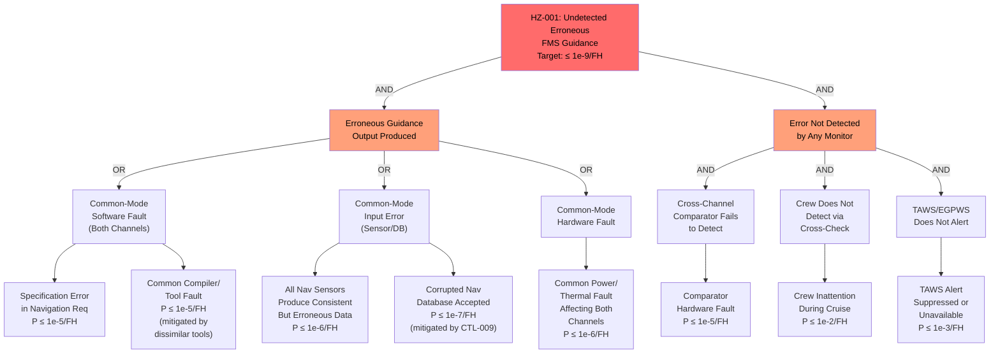

# Hazard Analysis

## Methodology

This hazard analysis follows ARP4761A (Guidelines and Methods for Conducting the Safety Assessment Process on Civil Airborne Systems and Equipment). The scope covers the Integrated Flight Management System as defined in the system boundary (README.md), analyzed across all operating modes (MODE-001 through MODE-005).

The analysis progresses through:
- **Functional Hazard Assessment (FHA)**: Identification and classification of failure conditions at the aircraft/system function level.
- **Preliminary System Safety Assessment (PSSA)**: Allocation of safety requirements to the architecture; fault tree analysis for top-level failure conditions.
- **System Safety Assessment (SSA)**: Verification that safety requirements are met in the implemented design (evidence referenced in traceability.md and assurance-evidence.md).
- **Common Mode Analysis (CMA)**: Assessment of common-cause failures, cascading failures, and zonal safety considerations.

## Terminology

| Term                | Definition (this system)                                                                 | Standard Reference       |
|---------------------|------------------------------------------------------------------------------------------|--------------------------|
| Failure Condition   | A condition with an effect on the aircraft and its occupants, both direct and consequential, caused or contributed to by one or more failures | ARP4761A Section 3.2 |
| Cause               | The failure event, external event, or combination thereof that produces the failure condition | ARP4761A Section 3.2 |
| Failure Mode        | The manner in which a component or function fails (e.g., erroneous output, loss of output, intermittent output) | ARP4761A Section 3.2 |
| Hazardous Situation | The aircraft state resulting from the failure condition in the context of the operational environment and flight phase | ARP4761A Section 3.2 |
| Harm                | Physical injury or damage to health resulting from the hazardous situation | ARP4761A Section 3.2 |
| Severity            | Classification of the failure condition effect: Catastrophic, Hazardous, Major, Minor, No Safety Effect (NSE) | ARP4761A Section 4.2 |

## Assumptions and Preconditions

| Assumption ID | Statement                                                                                          | Validity Basis                   |
|---------------|-----------------------------------------------------------------------------------------------------|----------------------------------|
| ASM-001       | The flight crew is trained and current on FMS operations including degraded-mode procedures.        | Operator training requirements per 14 CFR Part 121 |
| ASM-002       | The AFCS provides independent flight envelope protection (alpha, bank, speed) regardless of FMS guidance commands. | AFCS system design per 14 CFR 25.1329 |
| ASM-003       | Navigation sensor systems (IRS, GNSS, DME, VOR) are separate systems with independent failure modes from the FMS. | Aircraft architecture; sensors are independent LRUs with separate power sources |
| ASM-004       | The aircraft electrical power system provides regulated power within DO-160G tolerances under normal and emergency conditions. | Aircraft electrical system design per 14 CFR 25.1351 |
| ASM-005       | The maintenance organization follows approved maintenance procedures for data loading and LRU replacement. | Maintenance program per 14 CFR Part 43 |

## Hazard Log

| HZ ID   | Description                                                         | Cause(s)                                                       | Effect                                                                | MODE ID(s)       | Severity      | Likelihood | Initial Risk | CTL ID(s)           | Residual Risk | Owner / Acceptance Authority | REQ ID(s)                          |
|---------|---------------------------------------------------------------------|----------------------------------------------------------------|-----------------------------------------------------------------------|------------------|---------------|------------|--------------|---------------------|---------------|------------------------------|------------------------------------|
| HZ-001  | Undetected erroneous FMS guidance causing misleading flight path     | Common-mode software fault in both FMC channels producing identical erroneous guidance output | Aircraft deviates from intended path without crew awareness; potential CFIT or loss of separation | MODE-001         | Catastrophic  | Extremely Remote | High    | CTL-001, CTL-002    | Acceptable    | DER / FAA                    | REQ-SAF-001, REQ-SAF-002, REQ-SAF-003, REQ-SAF-010 |
| HZ-002  | Erroneous FMS guidance detected and annunciated                      | Single-channel software or hardware fault producing erroneous guidance on one channel | Crew receives annunciation; transitions to MODE-002 or hand-flies. Increased workload but safe flight maintained | MODE-001, MODE-002 | Major         | Remote     | Medium       | CTL-002, CTL-004    | Acceptable    | DER / FAA                    | REQ-SAF-001, REQ-SAF-002          |
| HZ-003  | Undetected erroneous navigation position (sensor fault)              | Faulty navigation sensor input accepted by FMS without detection/exclusion | Erroneous position drives guidance toward wrong path; potential terrain conflict or airspace violation | MODE-001         | Hazardous     | Remote     | High         | CTL-003             | Acceptable    | DER / FAA                    | REQ-FUN-008, REQ-FUN-009          |
| HZ-004  | Total loss of FMS navigation function                                | Dual-channel FMC failure, or loss of all navigation sensor inputs | No computed navigation solution; crew must revert to raw sensor data and manual navigation | MODE-001         | Hazardous     | Extremely Remote | Medium | CTL-004             | Acceptable    | DER / FAA                    | REQ-SAF-004                        |
| HZ-005  | Partition violation: DAL C function corrupts DAL A function           | ARINC 653 partition isolation failure allowing performance partition to overwrite navigation memory | Navigation or guidance data corruption; potential erroneous guidance output | MODE-001         | Catastrophic  | Extremely Improbable | Medium | CTL-005 | Acceptable    | DER / FAA                    | REQ-SAF-005, REQ-SAF-006          |
| HZ-006  | Loss of FMS display capability                                       | DMC hardware failure, DMC software fault, or IFC-INT-002 bus failure | Flight crew loses FMS navigation display and CDU; reduced situation awareness | MODE-001, MODE-004 | Major         | Remote     | Medium       | CTL-006             | Acceptable    | DER / FAA                    | REQ-SAF-007                        |
| HZ-007  | Total loss of FMS function (both channels and display)               | Dual FMC failure combined with DMC failure (common-cause: power, environment) | Complete loss of FMS navigation, guidance, and display; crew reverts to standby instruments | MODE-001         | Hazardous     | Extremely Remote | Medium | CTL-001, CTL-008    | Acceptable    | DER / FAA                    | REQ-SAF-008                        |
| HZ-008  | FMC processor lockup undetected                                      | Software fault causing infinite loop or deadlock; hardware fault causing processor halt | Affected channel produces stale or no output; if undetected, other channel may inherit stale data | MODE-001         | Hazardous     | Remote     | High         | CTL-008             | Acceptable    | DER / FAA                    | REQ-SAF-009                        |
| HZ-009  | Corrupted navigation database accepted as valid                      | Maintenance data load error; storage media corruption; deliberate tampering | FMS sequences to wrong waypoints; potential for CFIT or airspace violation | MODE-005, MODE-001 | Hazardous    | Remote     | High         | CTL-009             | Acceptable    | DER / FAA                    | REQ-FUN-022, REQ-SEC-001           |
| HZ-010  | Malicious datalink message corrupts active flight plan               | Cyber attack via ACARS/FANS interface injecting malformed or falsified flight plan data | FMS modifies active plan based on attacker input; potential for erroneous lateral/vertical path | MODE-001         | Hazardous     | Remote     | High         | CTL-009, CTL-003    | Acceptable    | DER / FAA                    | REQ-SEC-003                        |
| HZ-011  | Erroneous vertical guidance during approach causing altitude deviation | Software error in VNAV descent computation; wind model error; performance data fault | Aircraft deviates from approach path vertically; potential terrain conflict during approach phase | MODE-001         | Hazardous     | Remote     | High         | CTL-007             | Acceptable    | DER / FAA                    | REQ-FUN-016, REQ-FUN-017          |
| HZ-012  | Misleading FMS display showing incorrect aircraft position            | DMC receives valid FMC data but renders incorrectly; display software fault | Crew makes operational decisions based on wrong position information; potential loss of separation | MODE-001, MODE-004 | Major         | Remote     | Medium       | CTL-006             | Acceptable    | DER / FAA                    | REQ-SAF-007                        |

## Risk Controls

| CTL ID   | HZ ID(s)            | Description                                                                                   | Type                  | REQ ID(s)                           | VER ID(s)                          | Residual Risk Contribution               |
|----------|----------------------|-----------------------------------------------------------------------------------------------|-----------------------|-------------------------------------|------------------------------------|------------------------------------------|
| CTL-001  | HZ-001, HZ-007       | Dissimilar dual-channel FMC with independent software builds to defeat common-mode software faults | Reduction            | REQ-SAF-003, REQ-SAF-008, REQ-SAF-010 | VER-A-001, VER-A-006, VER-A-007 | Reduces common-mode software fault probability to below 10^-9/FH |
| CTL-002  | HZ-001, HZ-002       | Hardware cross-channel comparator with cycle-by-cycle output comparison and automatic failover   | Reduction            | REQ-SAF-001, REQ-SAF-002, REQ-IFC-005 | VER-T-002, VER-T-003           | Provides detection of divergent outputs within one computation cycle |
| CTL-003  | HZ-003, HZ-010       | Navigation sensor fault detection and exclusion (FDE) algorithm with multi-sensor consistency checks | Reduction           | REQ-FUN-008, REQ-FUN-009, REQ-SEC-003 | VER-T-004, VER-A-002           | Detects and excludes faulty sensor inputs with P(detection) >= 0.999/FH |
| CTL-004  | HZ-002, HZ-004       | Automatic transition to degraded modes (MODE-002, MODE-003) with crew annunciation               | Protective measure   | REQ-SAF-004, REQ-FUN-014            | VER-T-005                          | Ensures crew awareness and guidance inhibition on failure |
| CTL-005  | HZ-005               | ARINC 653 spatial and temporal partition isolation with health monitoring                          | Reduction            | REQ-SAF-005, REQ-SAF-006            | VER-T-006, VER-A-003              | Prevents DAL C function from corrupting DAL A |
| CTL-006  | HZ-006, HZ-012       | FMC backup display path (MODE-004) providing essential navigation data on alternate display       | Protective measure   | REQ-SAF-007                          | VER-T-007                          | Maintains crew situational awareness on DMC loss |
| CTL-007  | HZ-011               | Vertical guidance cross-check against independent barometric altitude and TAWS terrain clearance  | Reduction            | REQ-FUN-016, REQ-FUN-017            | VER-T-008, VER-A-004              | Detects vertical path deviations exceeding tolerance |
| CTL-008  | HZ-007, HZ-008       | Independent hardware watchdog timer on each FMC channel with automatic channel declaration         | Reduction            | REQ-SAF-009                          | VER-T-009                          | Detects processor lockup within 500 ms |
| CTL-009  | HZ-009, HZ-010       | Cryptographic signature verification and CRC-32 integrity check for all data loads and datalink inputs | Reduction         | REQ-FUN-022, REQ-SEC-001, REQ-SEC-003 | VER-T-010, VER-T-011            | Prevents acceptance of corrupted or tampered data |
| CTL-010  | HZ-001 through HZ-012| Power-up and continuous BIT across all LRUs with fault reporting to crew and maintenance           | Information for safety | REQ-FUN-021                        | VER-T-012                          | Detects latent faults before they combine with active faults |

## Fault Analysis

### Fault Tree: Undetected Erroneous FMS Guidance (HZ-001)

This fault tree decomposes the Catastrophic failure condition of undetected erroneous FMS guidance to basic events with probability allocations. The top-level probability target is 1 x 10^-9 per flight hour per 14 CFR 25.1309.

**Cut set analysis:**

The top event requires BOTH an erroneous guidance output AND failure of all detection mechanisms. The dominant cut set is:

- Specification error (BE1) AND Comparator fails (BE6) AND Crew inattention (BE7) AND TAWS unavailable (BE8)
- P = 1e-5 x 1e-5 x 1e-2 x 1e-3 = 1e-15/FH (well below 1e-9 target)

The dissimilar software architecture (CTL-001) makes common-mode software faults (G1A) the primary concern, while the cross-channel comparator (CTL-002) and independent monitors (TAWS, crew) provide defense in depth. The quantitative analysis confirms the architecture meets the 1e-9/FH probability target with significant margin.

**Sensitivity:** The most sensitive parameter is the specification error rate (BE1). If the specification error rate increases to 1e-3/FH (e.g., due to inadequate requirements review), the dominant cut set probability rises to 1e-13/FH -- still within budget but with reduced margin. This drives the requirement for independent requirements review per DO-178C Table A-3 at Level A.

## PSSA / SSA Progression

### PSSA (Preliminary System Safety Assessment)

The PSSA was initiated at the system architecture definition phase and iterates as the architecture matures. Current PSSA outputs:

| Failure Condition (HZ ID) | Classification | Quantitative Target     | Allocated To                           | PSSA Method         |
|---------------------------|----------------|-------------------------|----------------------------------------|---------------------|
| HZ-001                    | Catastrophic   | ≤ 1e-9/FH              | CMP-FMC-01 (dual channel + comparator) | FTA (above)         |
| HZ-003                    | Hazardous      | ≤ 1e-7/FH              | CMP-FMC-01E/F (FDE algorithm)          | FTA, FMEA           |
| HZ-004                    | Hazardous      | ≤ 1e-7/FH              | CMP-FMC-01 (dual channel architecture) | Dependency Diagram  |
| HZ-005                    | Catastrophic   | ≤ 1e-9/FH              | CMP-FMC-01D (ARINC 653 RTOS)          | FTA                 |
| HZ-007                    | Hazardous      | ≤ 1e-7/FH              | CMP-FMC-01 + power system              | Dependency Diagram  |
| HZ-008                    | Hazardous      | ≤ 1e-7/FH              | CMP-FMC-01A/B (watchdog)              | FMEA                |
| HZ-009                    | Hazardous      | ≤ 1e-7/FH              | CMP-DCU-01 (data load validation)      | FMEA                |
| HZ-011                    | Hazardous      | ≤ 1e-7/FH              | CMP-FMC-01G (VNAV algorithm)           | FTA                 |

### SSA (System Safety Assessment)

SSA closure requires evidence that each PSSA-allocated target is met in the implemented design. Evidence status:

| HZ ID   | PSSA Target | SSA Evidence Required                                          | Current Status |
|---------|-------------|----------------------------------------------------------------|----------------|
| HZ-001  | ≤ 1e-9/FH  | FTA with hardware failure rates, dissimilarity evidence, comparator test results, CMA results | Planned (SOI #3) |
| HZ-003  | ≤ 1e-7/FH  | FDE algorithm test results, sensor fault injection test data   | Planned (SOI #3) |
| HZ-004  | ≤ 1e-7/FH  | Dual-channel reliability analysis, MTBF data                   | Planned (SOI #3) |
| HZ-005  | ≤ 1e-9/FH  | Partition test results, RTOS qualification evidence            | Planned (SOI #3) |
| HZ-007  | ≤ 1e-7/FH  | Power system failure analysis, zonal safety analysis           | Planned (SOI #3) |
| HZ-008  | ≤ 1e-7/FH  | Watchdog test results, lockup injection test data              | Planned (SOI #3) |
| HZ-009  | ≤ 1e-7/FH  | CRC and crypto signature test results, data load test data     | Planned (SOI #3) |
| HZ-011  | ≤ 1e-7/FH  | VNAV algorithm test results, approach path analysis            | Planned (SOI #3) |

### Common Mode Analysis

The CMA addresses independence claims critical to the safety argument:

| Independence Claim                          | Common-Mode Threat                        | Mitigation                                                | Status   |
|---------------------------------------------|-------------------------------------------|-----------------------------------------------------------|----------|
| FMC Channel A independent of Channel B       | Shared power supply                       | Independent power regulators per channel; power supply monitoring | Analysis planned |
| FMC Channel A independent of Channel B       | Shared requirements specification         | Independent requirements interpretation review; dissimilar algorithms | Review planned |
| FMC Channel A independent of Channel B       | Shared development environment            | Different compilers, different host tools per channel      | Evidence collected |
| FMC Channel A independent of Channel B       | Shared thermal environment                | Thermal analysis; channel separation within LRU enclosure | Analysis planned |
| Navigation partition independent of Perf partition | ARINC 653 RTOS failure                | RTOS qualified to DAL A; partition testing per ARINC 653 | Test planned |
| FMC independent of DCU                       | Shared AFDX network fault                 | AFDX virtual link isolation; FMC can operate on last-known data | Analysis planned |
| FMS independent of navigation sensors        | Shared aircraft power bus                 | FMS on essential bus; sensors on separate essential bus circuits | Design review |
