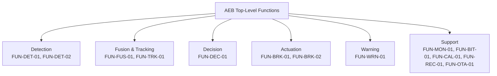
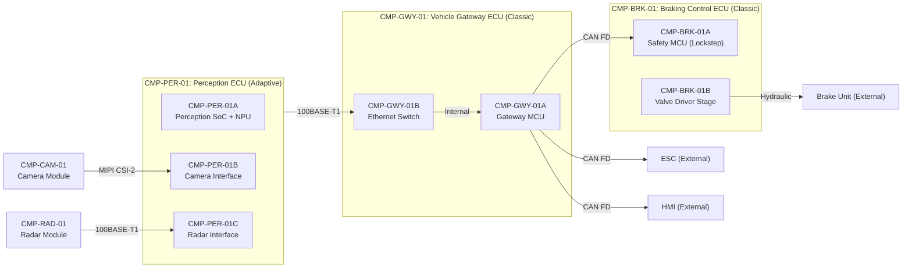

# Architecture

## System Context

```mermaid
graph TB
    subgraph AEB["Autonomous Emergency Braking System"]
        PER["CMP-PER-01<br/>Perception ECU<br/>(AUTOSAR Adaptive)"]
        BRK["CMP-BRK-01<br/>Braking Control ECU<br/>(AUTOSAR Classic)"]
        GWY["CMP-GWY-01<br/>Vehicle Gateway ECU<br/>(AUTOSAR Classic)"]
    end

    CAM["Front Camera Module<br/>(8 MP, inside boundary)"]
    RAD["Front Radar Module<br/>(77 GHz, inside boundary)"]
    ESC["Electronic Stability Control"]
    PCM["Powertrain Control Module"]
    HMI["Driver HMI<br/>(Cluster, HUD)"]
    WHL["Wheel Speed Sensors"]
    STR["Steering Angle Sensor"]
    OTA["OTA Update Backend"]
    V2X["V2X Communication Unit"]
    BHU["Electro-Hydraulic Brake Unit"]

    CAM -->|MIPI CSI-2| PER
    RAD -->|Automotive Ethernet| PER
    PER -->|Automotive Ethernet| GWY
    GWY -->|CAN FD| BRK
    GWY -->|CAN FD| HMI
    GWY -->|CAN FD| PCM
    BRK -->|Hydraulic control| BHU
    ESC -->|CAN FD| GWY
    WHL -->|CAN| GWY
    STR -->|CAN| GWY
    OTA -->|Ethernet (via TCU)| GWY
    V2X -->|CAN FD| GWY
    GWY -->|Ethernet| PER
```

## Functional Architecture

### System Functions

| FUN ID       | Function Name                    | Description                                                                   | Inputs                                 | Outputs                                | Dependencies         |
|--------------|----------------------------------|-------------------------------------------------------------------------------|----------------------------------------|----------------------------------------|----------------------|
| FUN-DET-01   | Object Detection (Camera)        | Detect and classify objects in camera images using DNN inference               | Camera image frames                    | 2D bounding boxes, class labels, confidence | None                |
| FUN-DET-02   | Object Detection (Radar)         | Detect objects via radar returns; range, range-rate, azimuth                   | Radar point cloud                      | Radar object list (range, velocity, angle) | None                |
| FUN-FUS-01   | Sensor Fusion                    | Fuse camera and radar detections into unified object list with position and velocity | Camera detections, radar detections, ego motion | Fused object list with 3D position, velocity, classification | FUN-DET-01, FUN-DET-02 |
| FUN-TRK-01   | Object Tracking and Prediction   | Track fused objects over time; predict future trajectories                     | Fused object list, ego motion          | Tracked object list with predicted paths | FUN-FUS-01           |
| FUN-DEC-01   | Collision Decision Logic         | Evaluate time-to-collision (TTC); determine warning, partial braking, or full braking | Tracked objects, ego speed, ego trajectory | Braking request (none/warn/partial/full), TTC | FUN-TRK-01      |
| FUN-BRK-01   | Brake Request Generation         | Convert braking decision into target deceleration and brake pressure command   | Braking request, vehicle dynamics      | Target deceleration, brake pressure command | FUN-DEC-01          |
| FUN-BRK-02   | Brake Actuation Control          | Control electro-hydraulic brake unit; manage ABS interaction and brake blending | Brake pressure command, ESC status     | Hydraulic valve commands, brake status  | FUN-BRK-01           |
| FUN-WRN-01   | Driver Warning Generation        | Generate visual and audible collision warnings to the driver HMI              | Braking request, TTC                   | Warning signals to HMI                 | FUN-DEC-01           |
| FUN-MON-01   | System Health Monitoring         | Monitor sensor health, ECU diagnostics, communication integrity               | Sensor status, ECU diagnostics, E2E counters | System health status, degradation flags | None                |
| FUN-BIT-01   | Built-In Test                    | Power-up and periodic self-test for all ECUs and sensors                       | BIT commands, health data              | Fault reports, readiness status        | None                 |
| FUN-CAL-01   | Sensor Calibration               | Camera and radar alignment verification and calibration                        | Calibration targets, sensor data       | Alignment parameters, calibration status | FUN-DET-01, FUN-DET-02 |
| FUN-REC-01   | Event Data Recording             | Record pre-event and event data for post-collision analysis                    | Object data, braking commands, vehicle state | Event data record (EDR)            | FUN-DEC-01, FUN-BRK-01 |
| FUN-OTA-01   | OTA Update Management            | Receive, validate, and install software updates for Perception ECU            | Signed update packages                 | Update status, rollback capability     | FUN-MON-01           |

### Functional Decomposition



## Physical Architecture

### Component Hierarchy

| CMP ID        | Component Name                           | Type     | Parent        | Description                                                           |
|---------------|------------------------------------------|----------|---------------|-----------------------------------------------------------------------|
| CMP-PER-01    | Perception ECU                           | ECU      | System        | AUTOSAR Adaptive; sensor fusion, DNN inference, object tracking       |
| CMP-PER-01A   | Perception SoC                           | Hardware | CMP-PER-01    | High-performance SoC with ARM Cortex-A76 + NPU (8 TOPS)              |
| CMP-PER-01B   | Camera Interface Module                  | Hardware | CMP-PER-01    | MIPI CSI-2 receiver and ISP front-end                                 |
| CMP-PER-01C   | Radar Interface Module                   | Hardware | CMP-PER-01    | Automotive Ethernet 100BASE-T1 PHY for radar data ingestion           |
| CMP-PER-01D   | Perception Adaptive Platform             | Software | CMP-PER-01    | AUTOSAR Adaptive ara::exec, ara::com, ara::diag runtime               |
| CMP-PER-01E   | Camera Detection Application             | Software | CMP-PER-01A   | DNN-based object detection and classification for camera path         |
| CMP-PER-01F   | Radar Detection Application              | Software | CMP-PER-01A   | Radar signal processing, CFAR detection, object list generation       |
| CMP-PER-01G   | Sensor Fusion Application                | Software | CMP-PER-01A   | Multi-sensor fusion, object tracking, trajectory prediction           |
| CMP-PER-01H   | Collision Decision Application           | Software | CMP-PER-01A   | TTC computation, braking decision logic, warning level determination  |
| CMP-PER-01J   | OTA Update Agent                         | Software | CMP-PER-01D   | Receives, validates, and installs signed update packages              |
| CMP-PER-01K   | Event Data Recorder Application          | Software | CMP-PER-01D   | Pre-event and event data buffering and storage                        |
| CMP-BRK-01    | Braking Control ECU                      | ECU      | System        | AUTOSAR Classic; brake actuation, ABS coordination, ESC interface     |
| CMP-BRK-01A   | Braking Microcontroller                  | Hardware | CMP-BRK-01    | Automotive safety MCU (lockstep cores, ECC RAM, hardware watchdog)    |
| CMP-BRK-01B   | Brake Valve Driver Stage                 | Hardware | CMP-BRK-01    | H-bridge drivers for electro-hydraulic brake valve solenoids          |
| CMP-BRK-01C   | Braking Classic Platform (AUTOSAR BSW)   | Software | CMP-BRK-01    | AUTOSAR Classic BSW: OS, COM, WdgM, E2E protection, SafeWdg          |
| CMP-BRK-01D   | Brake Request Manager                    | Software | CMP-BRK-01A   | Receives brake commands; arbitrates with ESC; generates valve commands |
| CMP-BRK-01E   | Brake Pressure Controller                | Software | CMP-BRK-01A   | Closed-loop brake pressure control with ABS interaction               |
| CMP-BRK-01F   | Safety Monitoring Function (SM)          | Software | CMP-BRK-01A   | Independent safety monitor: plausibility checks, safe state transition |
| CMP-GWY-01    | Vehicle Gateway ECU                      | ECU      | System        | AUTOSAR Classic; CAN FD / Ethernet bridging, message routing          |
| CMP-GWY-01A   | Gateway Microcontroller                  | Hardware | CMP-GWY-01    | Automotive MCU with CAN FD and Ethernet MAC                           |
| CMP-GWY-01B   | Ethernet Switch Module                   | Hardware | CMP-GWY-01    | Automotive Ethernet switch for Perception ECU and external connections |
| CMP-GWY-01C   | Gateway Classic Platform (AUTOSAR BSW)   | Software | CMP-GWY-01    | AUTOSAR Classic BSW: COM, PduR, E2E, firewall/IDS functions           |
| CMP-GWY-01D   | Message Router Application               | Software | CMP-GWY-01A   | Protocol translation CAN FD <-> Ethernet; message filtering and routing |
| CMP-GWY-01E   | Network Firewall / IDS                   | Software | CMP-GWY-01A   | Intrusion detection and CAN message filtering per ISO 21434           |
| CMP-CAM-01    | Front Camera Module                      | Sensor   | System        | 8 MP CMOS sensor with integrated ISP and MIPI CSI-2 output           |
| CMP-RAD-01    | Front Radar Module                       | Sensor   | System        | 77 GHz FMCW radar, 200 m range, +/- 30 deg azimuth FOV              |

### Physical Architecture Diagram



## Allocation

| FUN ID       | REQ ID(s)                                                | CMP ID(s)                                | Assurance Level | Rationale                                                         |
|--------------|----------------------------------------------------------|------------------------------------------|-----------------|-------------------------------------------------------------------|
| FUN-DET-01   | REQ-FUN-001, REQ-FUN-002                                | CMP-PER-01E, CMP-PER-01B, CMP-CAM-01    | ASIL B(D)       | Camera detection is SOTIF-critical; ASIL decomposed with radar    |
| FUN-DET-02   | REQ-FUN-003, REQ-FUN-004                                | CMP-PER-01F, CMP-PER-01C, CMP-RAD-01    | ASIL B(D)       | Radar detection is SOTIF-critical; ASIL decomposed with camera    |
| FUN-FUS-01   | REQ-FUN-005, REQ-FUN-006                                | CMP-PER-01G                              | ASIL D          | Fusion output drives braking decision; single point of function   |
| FUN-TRK-01   | REQ-FUN-007, REQ-FUN-008                                | CMP-PER-01G                              | ASIL D          | Tracking drives TTC computation; incorrect track = wrong decision |
| FUN-DEC-01   | REQ-FUN-009, REQ-FUN-010, REQ-FUN-011                   | CMP-PER-01H                              | ASIL D          | Decision directly triggers braking; erroneous decision is hazardous |
| FUN-BRK-01   | REQ-FUN-012, REQ-FUN-013                                | CMP-BRK-01D                              | ASIL D          | Brake request generation on safety-critical path                  |
| FUN-BRK-02   | REQ-FUN-014, REQ-FUN-015                                | CMP-BRK-01E, CMP-BRK-01B                | ASIL D          | Brake actuation directly controls vehicle deceleration            |
| FUN-WRN-01   | REQ-FUN-016                                              | CMP-PER-01H, CMP-GWY-01D                | ASIL A          | Warning is informational; driver retains control                  |
| FUN-MON-01   | REQ-FUN-017, REQ-FUN-018                                | CMP-PER-01D, CMP-BRK-01F, CMP-GWY-01C  | ASIL D          | Health monitoring supports fault detection and safe state         |
| FUN-BIT-01   | REQ-FUN-019                                              | CMP-PER-01, CMP-BRK-01, CMP-GWY-01     | ASIL D          | BIT coverage supports latent fault detection argument             |
| FUN-CAL-01   | REQ-FUN-020                                              | CMP-PER-01E, CMP-PER-01F                | QM              | Calibration is maintenance-only; no safety relevance in operation |
| FUN-REC-01   | REQ-FUN-021                                              | CMP-PER-01K                              | QM              | Post-event recording; no real-time safety function                |
| FUN-OTA-01   | REQ-FUN-022                                              | CMP-PER-01J, CMP-GWY-01E                | ASIL D          | Compromised update could disable AEB; security-safety interaction |

## Interfaces

### External Interfaces

| IFC ID       | Partner System                       | Data Item                              | Direction     | Protocol              | Timing                 |
|--------------|--------------------------------------|----------------------------------------|---------------|-----------------------|------------------------|
| IFC-EXT-001  | Electro-Hydraulic Brake Unit         | Brake valve solenoid commands          | Out           | Discrete / PWM        | 5 ms control cycle     |
| IFC-EXT-002  | Electronic Stability Control (ESC)   | ESC status, ABS status, brake pressure | Bidirectional | CAN FD                | 10 ms cycle            |
| IFC-EXT-003  | Driver HMI (Cluster/HUD)            | Collision warning level, AEB status    | Out           | CAN FD                | 20 ms cycle            |
| IFC-EXT-004  | Powertrain Control Module            | Torque reduction request               | Out           | CAN FD                | 20 ms cycle            |
| IFC-EXT-005  | Wheel Speed Sensors                  | Individual wheel speeds                | In            | CAN                   | 10 ms cycle            |
| IFC-EXT-006  | Steering Angle Sensor                | Steering wheel angle, rate             | In            | CAN                   | 10 ms cycle            |
| IFC-EXT-007  | OTA Update Backend (via TCU)         | Signed software update packages        | In            | Ethernet / TLS 1.3    | Event-driven           |
| IFC-EXT-008  | V2X Communication Unit               | Cooperative awareness messages (CAM)   | In            | CAN FD                | 100 ms cycle           |
| IFC-EXT-009  | Vehicle Diagnostic Interface (OBD)   | Diagnostic requests and responses      | Bidirectional | CAN (UDS over ISO-TP) | Event-driven           |

### Internal Interfaces

| IFC ID       | Source CMP ID  | Target CMP ID  | Data Item                                    | Mechanism             | Timing              |
|--------------|----------------|-----------------|----------------------------------------------|-----------------------|---------------------|
| IFC-INT-001  | CMP-CAM-01     | CMP-PER-01B     | Raw camera image frames                      | MIPI CSI-2 (4 lanes)  | 30 fps (33 ms)      |
| IFC-INT-002  | CMP-RAD-01     | CMP-PER-01C     | Radar point cloud and object list            | 100BASE-T1 Ethernet   | 20 ms cycle         |
| IFC-INT-003  | CMP-PER-01     | CMP-GWY-01      | Braking request, TTC, warning level, fused objects | 100BASE-T1 Ethernet (SOME/IP + E2E) | 20 ms cycle |
| IFC-INT-004  | CMP-GWY-01     | CMP-BRK-01      | Target deceleration, brake pressure command  | CAN FD (E2E Profile 7) | 10 ms cycle         |
| IFC-INT-005  | CMP-BRK-01     | CMP-GWY-01      | Brake status, actual deceleration, fault status | CAN FD (E2E Profile 7) | 10 ms cycle       |
| IFC-INT-006  | CMP-GWY-01     | CMP-PER-01      | Vehicle speed, yaw rate, steering angle, ESC status | 100BASE-T1 Ethernet (SOME/IP) | 20 ms cycle |
| IFC-INT-007  | CMP-GWY-01     | CMP-PER-01J     | OTA update packages (forwarded from TCU)     | Ethernet (TLS 1.3)    | Event-driven        |

## Failure Containment / Partitioning

### AUTOSAR Adaptive Freedom from Interference (Perception ECU)

The Perception ECU (CMP-PER-01) runs AUTOSAR Adaptive on a multi-core SoC. Safety-critical applications (sensor fusion, collision decision) and non-safety applications (event recording, OTA update) coexist on the same platform. Freedom from interference is achieved through:

**Partition assignments:**

| Partition / Process Group | Functions                                   | ASIL  | Rationale                                                    |
|---------------------------|---------------------------------------------|-------|--------------------------------------------------------------|
| PG-Safety                 | FUN-FUS-01, FUN-TRK-01, FUN-DEC-01, FUN-MON-01 | ASIL D | Safety-critical perception and decision path              |
| PG-Detection-Cam          | FUN-DET-01                                  | ASIL B(D) | Camera detection; decomposed ASIL                         |
| PG-Detection-Rad          | FUN-DET-02                                  | ASIL B(D) | Radar detection; decomposed ASIL                          |
| PG-NonSafety              | FUN-REC-01, FUN-OTA-01, FUN-CAL-01         | QM    | Non-safety functions isolated from safety path               |

**Isolation enforcement:**
- Spatial isolation via ARM TrustZone and MMU-enforced memory regions; each process group has private address space.
- Temporal isolation via AUTOSAR Adaptive execution management with static schedule for safety-critical process groups and best-effort scheduling for QM processes.
- Inter-process communication via ara::com with SOME/IP serialization; no shared writable memory between process groups.
- Hardware resource partitioning: NPU allocated exclusively to detection process groups during inference; DMA channels partitioned by process group.

**Evidence:** Freedom-from-interference analysis per ISO 26262-6 Annex D covering memory protection, timing protection, and communication protection. Interference testing demonstrates non-impact of QM process faults on ASIL D safety function execution.

### AUTOSAR Classic Safety Mechanisms (Braking Control ECU)

The Braking Control ECU (CMP-BRK-01) runs on a lockstep safety MCU meeting ASIL D random hardware fault metrics.

**Safety mechanisms:**
- Lockstep CPU cores with cycle-by-cycle comparison; mismatch triggers hardware reset.
- ECC on all RAM and flash; single-bit correction, double-bit detection.
- Watchdog Manager (WdgM) monitoring program flow with alive and deadline supervision.
- E2E protection (AUTOSAR E2E Profile 7) on all safety-relevant CAN FD messages.
- Independent Safety Monitor (CMP-BRK-01F) running on a separate core partition performing plausibility checks on brake commands.
- Safe state: If the Braking Control ECU detects a self-fault, it releases brake pressure and reverts to the driver-commanded braking path (ESC remains available).

### Network Isolation via Vehicle Gateway ECU

The Vehicle Gateway ECU (CMP-GWY-01) enforces domain separation:

1. **Ethernet domain** (Perception ECU) is isolated from **CAN FD domain** (braking, ESC, powertrain) through protocol translation and message filtering.
2. **Firewall/IDS** (CMP-GWY-01E) inspects all messages crossing domain boundaries against an allowlist of expected message IDs, sources, and rates.
3. **E2E protection** is maintained end-to-end from Perception ECU through Gateway to Braking Control ECU, even across protocol translation.
4. OTA update traffic is routed to the Perception ECU on a dedicated VLAN; it cannot reach the CAN FD domain.

## Architecture Decisions

### AD-01: Two-Sensor Fusion over Single-Sensor AEB

**Decision:** Use camera + radar fusion rather than a single-sensor (camera-only or radar-only) AEB design.

**Rationale:** Camera provides classification capability (distinguish pedestrians from signposts) but is degraded in adverse weather. Radar provides reliable range/velocity in all weather but has poor lateral resolution and no classification. Fusion achieves SOTIF residual risk acceptable under ISO 21448 by compensating for individual sensor limitations. UN R152 test scenarios (stationary target, crossing pedestrian) require both range accuracy (radar) and classification (camera). ASIL decomposition: ASIL D for the fused path decomposes to ASIL B(D) for each independent sensor path, reducing per-sensor hardware requirements.

**Trade-off:** Two sensors increase cost, wiring complexity, and calibration effort. Accepted because single-sensor designs cannot meet the SOTIF false-negative requirements for pedestrian detection in adverse conditions.

### AD-02: AUTOSAR Adaptive for Perception, Classic for Braking

**Decision:** Run the Perception ECU on AUTOSAR Adaptive (Linux-based, POSIX, dynamic scheduling) and the Braking Control ECU on AUTOSAR Classic (static schedule, deterministic timing).

**Rationale:** The perception workload (DNN inference on NPU, sensor fusion with variable-complexity tracking) requires a POSIX-capable runtime with dynamic memory management that AUTOSAR Classic cannot provide. The braking actuation requires deterministic cycle times (5-10 ms) with proven automotive safety mechanisms (WdgM, E2E, SafeOS) that AUTOSAR Classic provides out of the box. Mixing the two platforms exploits each platform's strengths.

**Trade-off:** Cross-platform E2E protection requires careful design of the SOME/IP-to-CAN-FD translation in the gateway, including E2E counter and CRC recalculation. The freedom-from-interference argument across the Adaptive/Classic boundary requires dedicated analysis. Accepted because neither platform alone satisfies both the perception and actuation requirements.

### AD-03: Dedicated Vehicle Gateway over Direct Perception-to-Braking Link

**Decision:** Route all Perception ECU outputs through a Vehicle Gateway ECU rather than directly connecting the Perception ECU to the CAN FD braking domain.

**Rationale:** The Gateway provides protocol translation (Ethernet SOME/IP to CAN FD), network isolation (firewall/IDS between domains), and a single integration point for vehicle-level signals (wheel speed, yaw rate, steering angle). Direct connection would expose the CAN FD safety domain to the Ethernet attack surface, complicating the ISO 21434 cybersecurity argument. The Gateway enables OTA traffic isolation on a dedicated VLAN.

**Trade-off:** Adds one ECU, increases cost, and adds ~5 ms communication latency. Accepted because the cybersecurity isolation and integration benefits outweigh the cost and latency penalty.

### AD-04: ASIL Decomposition for Sensor Detection Paths

**Decision:** Decompose the ASIL D system-level requirement to ASIL B(D) for each independent sensor detection path (camera, radar) per ISO 26262-9 clause 5.

**Rationale:** The camera and radar are physically independent sensors with different failure modes. Their detection paths run in separate process groups on the Perception ECU with no shared writable resources. The fusion algorithm (ASIL D) cross-checks both paths and can detect single-path failures. This decomposition reduces the hardware fault metric requirements for each sensor path from ASIL D to ASIL B, enabling the use of less expensive sensor components while maintaining system-level ASIL D integrity through redundancy.

**Trade-off:** Requires formal ASIL decomposition justification per ISO 26262-9, including proof of independence between sensor paths and proof that the ASIL D fusion layer can detect all relevant single-path failures. Accepted because the cost savings and design flexibility of ASIL B sensors are significant for a volume passenger vehicle application.

### AD-05: E2E Protection Profile 7 for Safety-Critical CAN FD Messages

**Decision:** Apply AUTOSAR E2E Protection Profile 7 (CRC-64 + 4-bit counter + data ID) to all safety-relevant CAN FD messages between the Gateway and Braking Control ECU.

**Rationale:** Profile 7 provides the strongest E2E protection available in the AUTOSAR E2E library, with CRC-64 detection of data corruption and a rolling counter for detection of message loss, repetition, and reordering. The CAN FD payload supports the additional overhead. Profile 7 meets the diagnostic coverage requirements for ASIL D communication faults per ISO 26262-6 Annex D.

**Trade-off:** CRC-64 computation requires more CPU cycles than CRC-8 (Profile 1). Accepted because the Braking Control MCU has sufficient processing margin and the ASIL D classification demands the highest available E2E protection level.
