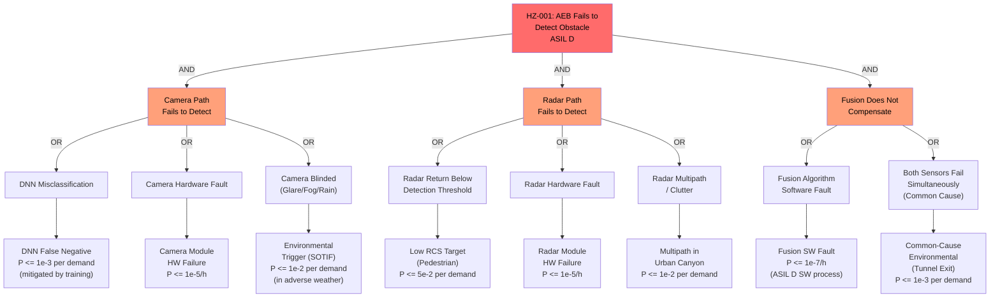

# Hazard Analysis

## Methodology

This hazard analysis follows ISO 26262 Part 3 (Concept Phase) and Part 4 (Product Development at the System Level). The scope covers the Autonomous Emergency Braking system as defined in the system boundary (README.md), analyzed across all operating modes (MODE-001 through MODE-005).

The analysis progresses through:
- **Hazard Analysis and Risk Assessment (HARA)**: Identification of hazardous events and ASIL classification using Severity (S0-S3), Exposure (E0-E4), and Controllability (C0-C3) per ISO 26262-3 clause 7.
- **Safety Goals**: Top-level safety requirements derived from the HARA.
- **SOTIF Analysis**: Triggering conditions and performance limitations per ISO 21448 covering perception system inadequacies.
- **Fault Analysis**: Fault tree analysis for safety goals, FMEA excerpt for critical subsystems.

## Terminology

| Term                | Definition (this system)                                                                    | Standard Reference          |
|---------------------|---------------------------------------------------------------------------------------------|-----------------------------|
| Hazardous Event     | A combination of a hazard and an operational situation, involving a vehicle-level harm       | ISO 26262-3 clause 3.75     |
| Malfunction         | An unintended behavior of a safety-related function or element                               | ISO 26262-1 clause 3.84     |
| Failure Mode        | The manner in which a component or function fails (e.g., false activation, missed detection) | ISO 26262-1 clause 3.50     |
| ASIL                | Automotive Safety Integrity Level; risk classification from QM to ASIL D                     | ISO 26262-1 clause 3.6      |
| Triggering Condition| A specific condition of a triggering event that serves as an initiator for a potentially hazardous behavior of the intended functionality | ISO 21448 clause 3.16 |
| Safe State          | Operating condition of an item without an unreasonable level of risk                         | ISO 26262-1 clause 3.131    |

## Assumptions and Preconditions

| Assumption ID | Statement                                                                                              | Validity Basis                        |
|---------------|--------------------------------------------------------------------------------------------------------|---------------------------------------|
| ASM-001       | The driver is alert and capable of overriding AEB via strong accelerator pedal input.                 | Driver is responsible for vehicle control per Vienna Convention on Road Traffic |
| ASM-002       | The ESC system provides independent ABS and stability control regardless of AEB commands.              | ESC is a separate E/E architecture with independent safety case |
| ASM-003       | Vehicle speed and dynamics sensor data (wheel speed, yaw rate, steering angle) are correct within their specified accuracy. | Sensors have independent safety mechanisms; AEB consumes but does not own these sensors |
| ASM-004       | The electro-hydraulic brake unit applies the commanded pressure within its specified response time.    | Brake unit has independent safety qualification per ISO 26262 |
| ASM-005       | The vehicle OEM provides correct and complete vehicle parameters (mass, braking characteristics) during integration. | OEM integration responsibility per ISO 26262-8 |

## HARA Table

| HZ ID   | Hazardous Event Description                                            | Operational Situation              | S   | E   | C   | ASIL  |
|---------|------------------------------------------------------------------------|------------------------------------|-----|-----|-----|-------|
| HZ-001  | AEB fails to detect an obstacle; no braking intervention occurs         | Highway driving, preceding vehicle decelerating | S3  | E4  | C2  | ASIL D |
| HZ-002  | AEB fails to detect a pedestrian crossing the road                      | Urban driving, pedestrian at crosswalk | S3  | E4  | C2  | ASIL D |
| HZ-003  | AEB falsely activates braking when no obstacle is present               | Highway driving, no actual threat  | S2  | E4  | C3  | ASIL B |
| HZ-004  | AEB applies insufficient braking force for actual collision scenario    | Urban driving, stationary obstacle | S3  | E3  | C2  | ASIL C |
| HZ-005  | AEB applies excessive braking force causing loss of vehicle stability   | Highway driving, wet road          | S3  | E3  | C2  | ASIL C |
| HZ-006  | AEB activates braking with excessive delay, reducing stopping distance  | Highway driving, sudden cut-in     | S3  | E3  | C2  | ASIL C |
| HZ-007  | AEB braking continues after obstacle clears (stuck-in-braking)          | Urban driving, crossing vehicle has passed | S2  | E3  | C3  | ASIL A |
| HZ-008  | AEB fails to transition to degraded mode when sensor is faulty          | Any driving, sensor fault undetected | S3  | E3  | C2  | ASIL C |
| HZ-009  | Corrupted OTA update disables AEB function                              | Any driving after update           | S3  | E4  | C0  | ASIL D |
| HZ-010  | CAN bus injection causes unauthorized braking command                    | Any driving                        | S3  | E3  | C2  | ASIL C |
| HZ-011  | Perception failure due to SOTIF triggering condition (rain/fog/glare)    | Highway, heavy rain, low visibility | S3  | E3  | C2  | ASIL C |
| HZ-012  | Both sensors provide consistent but incorrect data (common-cause SOTIF)  | Tunnel exit into direct sunlight   | S3  | E2  | C2  | ASIL B |

## Safety Goals

| SG ID  | Safety Goal                                                                                         | ASIL  | Source HZ ID(s) |
|--------|-----------------------------------------------------------------------------------------------------|-------|-----------------|
| SG-001 | The AEB system shall detect all relevant obstacles with sufficient time and accuracy to avoid or mitigate a collision. | ASIL D | HZ-001, HZ-002 |
| SG-002 | The AEB system shall not falsely activate braking in the absence of a genuine collision threat.      | ASIL B | HZ-003          |
| SG-003 | The AEB system shall apply the correct braking force proportional to the collision threat.           | ASIL C | HZ-004, HZ-005  |
| SG-004 | The AEB system shall complete the braking intervention within the specified latency budget.          | ASIL C | HZ-006          |
| SG-005 | The AEB system shall detect its own faults and transition to a safe state within the specified time. | ASIL D | HZ-008, HZ-009  |

## Hazard Log

| HZ ID   | Description                                                          | Cause(s)                                                                    | Effect                                                               | MODE ID(s)        | Severity | Likelihood | Initial Risk | CTL ID(s)              | Residual Risk | Owner / Acceptance Authority | REQ ID(s)                                        |
|---------|----------------------------------------------------------------------|-----------------------------------------------------------------------------|----------------------------------------------------------------------|-------------------|----------|------------|--------------|------------------------|---------------|------------------------------|--------------------------------------------------|
| HZ-001  | AEB fails to detect obstacle (vehicle); no braking                   | Sensor fusion failure; DNN misclassification; tracking loss                 | Rear-end collision at driving speed; serious injury or death         | MODE-001          | S3       | Remote     | High         | CTL-001, CTL-002       | Acceptable    | OEM / Type Approval          | REQ-FUN-005, REQ-SAF-001, REQ-SAF-002           |
| HZ-002  | AEB fails to detect pedestrian; no braking                           | Camera DNN fails to classify pedestrian; radar returns below threshold      | Vehicle strikes pedestrian; serious injury or death                  | MODE-001          | S3       | Remote     | High         | CTL-001, CTL-002       | Acceptable    | OEM / Type Approval          | REQ-FUN-001, REQ-FUN-005, REQ-SAF-001           |
| HZ-003  | AEB false activation (phantom braking)                               | DNN false positive; radar ghost return; sensor fusion misassociation        | Unexpected deceleration; following vehicle collision risk            | MODE-001          | S2       | Remote     | Medium       | CTL-003                | Acceptable    | OEM / Type Approval          | REQ-SAF-003, REQ-FUN-010                         |
| HZ-004  | AEB applies insufficient braking force                               | TTC computation error; brake request under-commanded; ESC blending error    | Collision at reduced but insufficient speed; moderate to serious injury | MODE-002       | S3       | Remote     | High         | CTL-004                | Acceptable    | OEM / Type Approval          | REQ-FUN-012, REQ-FUN-014, REQ-SAF-004           |
| HZ-005  | AEB applies excessive braking force causing instability              | Brake pressure overcommand; failure to account for road surface; ESC conflict | Vehicle skid or spin; potential multi-vehicle accident              | MODE-002          | S3       | Remote     | High         | CTL-004, CTL-005       | Acceptable    | OEM / Type Approval          | REQ-FUN-015, REQ-SAF-005                         |
| HZ-006  | AEB braking intervention too late (excessive latency)                | Processing pipeline stall; communication timeout; DNN inference overrun     | Collision not avoided; reduced speed but impact still severe         | MODE-001, MODE-002| S3       | Remote     | High         | CTL-006                | Acceptable    | OEM / Type Approval          | REQ-PRF-001, REQ-PRF-002, REQ-SAF-006           |
| HZ-007  | AEB stuck in braking after threat clears                             | Object tracking persistence error; brake release command lost               | Unnecessary prolonged braking; driver confusion; following vehicle risk | MODE-002, MODE-005 | S2    | Remote     | Medium       | CTL-007                | Acceptable    | OEM / Type Approval          | REQ-FUN-011, REQ-SAF-007                         |
| HZ-008  | AEB fails to detect sensor fault; operates on degraded data          | Health monitoring gap; sensor provides plausible but incorrect data         | Incorrect braking decision based on faulty sensor data               | MODE-001          | S3       | Remote     | High         | CTL-008                | Acceptable    | OEM / Type Approval          | REQ-FUN-017, REQ-FUN-018, REQ-SAF-008           |
| HZ-009  | Corrupted OTA update disables AEB                                    | Malicious or corrupted software package accepted by OTA agent               | AEB non-functional; driver unaware of missing ADAS protection       | MODE-001          | S3       | Remote     | High         | CTL-009                | Acceptable    | OEM / Type Approval          | REQ-FUN-022, REQ-SEC-001, REQ-SEC-002           |
| HZ-010  | CAN bus injection causes unauthorized braking                        | Attacker injects brake command on CAN FD bus; gateway firewall bypassed     | Unexpected braking; following vehicle collision risk                 | MODE-001          | S3       | Remote     | High         | CTL-010                | Acceptable    | OEM / Type Approval          | REQ-SEC-003, REQ-SEC-004, REQ-SEC-005           |
| HZ-011  | Perception failure in adverse weather (SOTIF)                        | Heavy rain attenuates camera; radar multipath; fusion confidence drops      | Missed detection or late detection; collision not avoided            | MODE-001, MODE-003| S3       | Occasional | High         | CTL-001, CTL-011       | Acceptable    | OEM / Type Approval          | REQ-SAF-001, REQ-SAF-009, REQ-SAF-010           |
| HZ-012  | Both sensors provide consistent but incorrect data (common-cause)    | Tunnel exit glare saturates camera and radar sidelobe; environmental SOTIF  | Fusion output is confidently wrong; braking decision based on phantom or missed object | MODE-001 | S3 | Remote | High | CTL-002, CTL-011 | Acceptable | OEM / Type Approval | REQ-SAF-002, REQ-SAF-010 |

## Risk Controls

| CTL ID   | HZ ID(s)              | Description                                                                                    | Type                | REQ ID(s)                                        | VER ID(s)                         | Residual Risk Contribution                                  |
|----------|-----------------------|------------------------------------------------------------------------------------------------|---------------------|--------------------------------------------------|-----------------------------------|-------------------------------------------------------------|
| CTL-001  | HZ-001, HZ-002, HZ-011 | Dual-sensor (camera + radar) fusion with independent detection paths to compensate for individual sensor limitations | Reduction          | REQ-FUN-005, REQ-SAF-001                         | VER-T-005, VER-T-023, VER-A-002 | Reduces single-sensor missed detection; dominant residual is common-cause SOTIF |
| CTL-002  | HZ-001, HZ-002, HZ-012 | Fusion confidence scoring with minimum confidence threshold for braking activation             | Reduction           | REQ-SAF-002, REQ-FUN-006                         | VER-T-006, VER-T-024            | Prevents low-confidence detections from triggering braking  |
| CTL-003  | HZ-003                | False positive suppression: multi-frame confirmation, radar range-rate cross-check, DNN confidence thresholds | Reduction | REQ-SAF-003, REQ-FUN-010                         | VER-T-010, VER-T-025, VER-A-003 | Reduces false activation rate to below 1 per 100,000 km    |
| CTL-004  | HZ-004, HZ-005        | Closed-loop brake pressure control with ESC coordination and road surface estimation           | Reduction           | REQ-FUN-014, REQ-FUN-015, REQ-SAF-004, REQ-SAF-005 | VER-T-014, VER-T-015, VER-T-026, VER-T-027 | Ensures correct brake force application within tolerance    |
| CTL-005  | HZ-005                | ESC stability override: ESC can modulate AEB brake pressure to maintain vehicle stability      | Protective measure  | REQ-SAF-005                                      | VER-T-027                        | ESC prevents loss of stability during AEB intervention      |
| CTL-006  | HZ-006                | End-to-end latency monitoring with watchdog timeout; system transitions to degraded mode if latency budget exceeded | Reduction | REQ-PRF-001, REQ-PRF-002, REQ-SAF-006           | VER-T-028, VER-T-044, VER-A-004, VER-A-007 | Prevents stale perception data from driving brake commands  |
| CTL-007  | HZ-007                | Brake release timeout: AEB intervention automatically releases after 3 seconds or when object tracking clears | Protective measure | REQ-FUN-011, REQ-SAF-007                         | VER-T-011                        | Prevents stuck-in-braking condition                         |
| CTL-008  | HZ-008                | Sensor health monitoring with diagnostic coverage; automatic transition to MODE-003 on sensor fault | Reduction        | REQ-FUN-017, REQ-FUN-018, REQ-SAF-008            | VER-T-017, VER-T-018, VER-A-001, VER-A-005 | Detects sensor faults and limits AEB operation to healthy sensor range |
| CTL-009  | HZ-009                | OTA update cryptographic signature verification and rollback capability                        | Reduction           | REQ-FUN-022, REQ-SEC-001, REQ-SEC-002            | VER-T-022, VER-T-032, VER-T-033 | Prevents installation of tampered or corrupted software     |
| CTL-010  | HZ-010                | Gateway firewall/IDS with CAN message allowlist; E2E protection on all safety CAN FD messages  | Reduction           | REQ-SEC-003, REQ-SEC-004, REQ-SEC-005            | VER-T-034, VER-T-035, VER-T-036 | Detects and blocks unauthorized CAN messages                |
| CTL-011  | HZ-011, HZ-012        | SOTIF-aware degradation: perception confidence threshold triggers MODE-003 with extended TTC thresholds and driver warning | Reduction | REQ-SAF-009, REQ-SAF-010                         | VER-T-030, VER-T-031, VER-A-006 | Limits AEB operation when perception confidence is insufficient |

## Fault Analysis

### Fault Tree: AEB Fails to Detect Obstacle (HZ-001)

This fault tree decomposes the ASIL D safety goal (SG-001) of reliable obstacle detection. The target is ASIL D per the HARA.

**Cut set analysis:**

The top event requires BOTH sensor paths AND fusion to fail simultaneously. The dominant cut sets are:
- Common-cause environmental (BE8: tunnel exit) AND fusion SW fault (BE7): P = 1e-3 x 1e-7 = 1e-10/demand (acceptable)
- Camera blinded (BE3) AND radar low-RCS (BE4) AND fusion fails to compensate (BE7): P = 1e-2 x 5e-2 x 1e-7 = 5e-11/demand (acceptable)

The ASIL decomposition (camera ASIL B(D) + radar ASIL B(D), fusion ASIL D) ensures that single-sensor failures do not propagate to hazardous outcomes. The dominant residual risk is the SOTIF common-cause scenario (HZ-012), which is addressed by CTL-011 (SOTIF-aware degradation).

### ASIL Decomposition Rationale

The system-level ASIL D safety goal (SG-001) is decomposed per ISO 26262-9 clause 5:

| Element          | Decomposed ASIL | Independence Argument                                                      |
|------------------|-----------------|----------------------------------------------------------------------------|
| Camera detection path | ASIL B(D)  | Physically separate sensor; different failure modes from radar; separate process group on Perception ECU |
| Radar detection path  | ASIL B(D)  | Physically separate sensor; different technology and failure modes; separate process group |
| Sensor fusion layer   | ASIL D     | Receives both paths; cross-checks consistency; no ASIL decomposition       |
| Braking actuation     | ASIL D     | Single braking path; no decomposition possible; hardware safety mechanisms required |

**Independence evidence:**
- Camera and radar share no common hardware (different sensor technologies, different mounting locations, different power regulators).
- Detection algorithms run in separate process groups (PG-Detection-Cam, PG-Detection-Rad) with MMU-enforced isolation.
- Common-cause analysis addresses shared power supply (separate regulators), shared thermal environment (different mounting locations), and shared specification errors (mitigated by independent detection algorithm development).

### SOTIF Analysis (ISO 21448)

| TC ID    | Triggering Condition                     | Affected Sensor(s) | Detection Impact                               | Mitigation                                                  | Residual Acceptability |
|----------|------------------------------------------|---------------------|-------------------------------------------------|-------------------------------------------------------------|------------------------|
| TC-001   | Heavy rain (> 30 mm/h)                   | Camera (primary)    | Image degradation; DNN accuracy drops 15-20%   | Radar compensation in fusion; extended TTC threshold (CTL-011) | Acceptable with MODE-003 |
| TC-002   | Dense fog (visibility < 100 m)           | Camera, Radar (both) | Camera unusable > 50 m; radar range reduced     | MODE-003 activation; reduced AEB operating speed (CTL-011)  | Acceptable with speed limit |
| TC-003   | Direct sunlight glare into camera         | Camera (primary)    | Saturation of image region; missed detections   | ISP auto-exposure adaptation; radar provides primary detection (CTL-001) | Acceptable |
| TC-004   | Tunnel exit into bright sunlight          | Camera and Radar    | Camera saturation; radar sidelobe from tunnel wall | SOTIF-aware confidence drop; MODE-003 for 2 seconds (CTL-011) | Acceptable with transition time |
| TC-005   | Low-RCS target (pedestrian, cyclist)      | Radar (primarily)   | Radar return may be below detection threshold   | Camera provides primary classification; fusion requires one-sensor confirm (CTL-001) | Acceptable |
| TC-006   | Overhanging infrastructure (bridge, sign) | Radar (primarily)   | Stationary overhead radar return                | Camera height classification; radar ground-plane filter (CTL-003) | Acceptable |
| TC-007   | Night driving with no street lighting     | Camera (primary)    | Reduced detection range; pedestrian detection limited | Headlight illumination zone constraint; radar extended range (CTL-001) | Acceptable with range limit |
