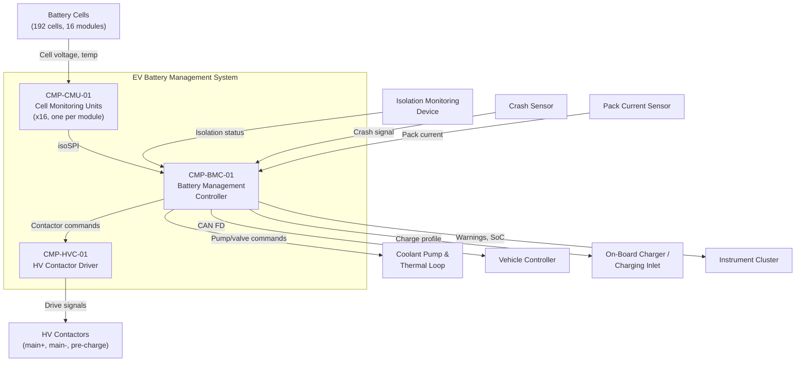

# Architecture

## System Context

## Functional Architecture

| FUN ID       | Function Name                    | Description                                                                   | Inputs                                       | Outputs                                       | Dependencies         |
|--------------|----------------------------------|-------------------------------------------------------------------------------|----------------------------------------------|-----------------------------------------------|----------------------|
| FUN-MON-01   | Cell Voltage Monitoring          | Measure individual cell voltages across all 16 modules                        | Cell voltage signals                         | Cell voltage array (192 values)               | None                 |
| FUN-MON-02   | Cell Temperature Monitoring      | Measure cell/module temperatures across all 16 modules                        | Thermistor signals                           | Temperature array (32 values)                 | None                 |
| FUN-EST-01   | State-of-Charge Estimation       | Estimate pack SoC using coulomb counting + model-based correction             | Cell voltages, pack current, temperatures    | Pack SoC (%), cell SoC array                  | FUN-MON-01, FUN-MON-02 |
| FUN-EST-02   | State-of-Health Estimation       | Estimate cell and pack SoH from impedance tracking and capacity fade          | Cell voltages, pack current, cycle history   | Pack SoH (%), cell SoH array                  | FUN-MON-01           |
| FUN-THM-01   | Thermal Management Control       | Control coolant pump and valve to maintain cell temperatures within limits     | Cell temperatures, ambient temperature       | Pump speed command, valve position command     | FUN-MON-02           |
| FUN-BAL-01   | Cell Balancing                   | Passive balancing of cell voltages during charging                            | Cell voltages, charge state                  | Balancing switch commands per cell             | FUN-MON-01           |
| FUN-CTR-01   | Contactor Sequencing             | Pre-charge, close, and open HV contactors per defined sequence                | Vehicle commands, fault status               | Contactor drive signals                       | FUN-MON-01, FUN-FLT-01 |
| FUN-FLT-01   | Fault Detection and Management   | Detect over-voltage, under-voltage, over-temperature, thermal runaway onset   | Cell voltages, temperatures, current         | Fault flags, mode transition commands         | FUN-MON-01, FUN-MON-02 |
| FUN-COM-01   | Vehicle Communication            | Report pack status to vehicle controller; receive charge/discharge commands   | Pack data, vehicle requests                  | CAN FD messages                               | FUN-EST-01           |

## Physical Architecture

| CMP ID        | Component Name                           | Type     | Parent        | Description                                                           |
|---------------|------------------------------------------|----------|---------------|-----------------------------------------------------------------------|
| CMP-CMU-01    | Cell Monitoring Unit (x16)               | Module   | System        | Per-module unit measuring cell voltages and temperatures              |
| CMP-CMU-01A   | Voltage Measurement ASIC                 | Hardware | CMP-CMU-01    | 12-channel ADC with +/- 1 mV accuracy for cell voltage measurement   |
| CMP-CMU-01B   | Temperature Measurement Circuit          | Hardware | CMP-CMU-01    | 2-channel thermistor interface per module                             |
| CMP-CMU-01C   | Cell Balancing Switches                  | Hardware | CMP-CMU-01    | MOSFET switches for passive balancing resistors per cell              |
| CMP-BMC-01    | Battery Management Controller            | ECU      | System        | Central BMS processor; SoC/SoH estimation, thermal control, fault management |
| CMP-BMC-01A   | BMC Microcontroller                      | Hardware | CMP-BMC-01    | Automotive safety MCU (lockstep cores, ECC RAM)                       |
| CMP-BMC-01B   | isoSPI Interface                         | Hardware | CMP-BMC-01    | Isolated SPI master for daisy-chained CMU communication               |
| CMP-BMC-01C   | Fault Manager Application                | Software | CMP-BMC-01A   | Over-voltage, under-voltage, thermal runaway detection logic          |
| CMP-BMC-01D   | State Estimation Application             | Software | CMP-BMC-01A   | Extended Kalman filter for SoC; impedance tracking for SoH           |
| CMP-BMC-01E   | Thermal Control Application              | Software | CMP-BMC-01A   | PID control of coolant pump speed and valve position                  |
| CMP-BMC-01F   | Vehicle Communication Application        | Software | CMP-BMC-01A   | CAN FD message encoding/decoding, E2E protection                     |
| CMP-HVC-01    | HV Contactor Driver                      | Module   | System        | Drives main+, main-, and pre-charge contactors                       |
| CMP-HVC-01A   | Contactor Driver Stage                   | Hardware | CMP-HVC-01    | MOSFET H-bridge drivers for contactor coils with weld detection       |
| CMP-HVC-01B   | Contactor Safety Monitor                 | Hardware | CMP-HVC-01    | Independent hardware watchdog and contactor feedback monitoring        |

## Allocation

| FUN ID       | REQ ID(s)                                    | CMP ID(s)                                    | Assurance Level | Rationale                                                          |
|--------------|----------------------------------------------|----------------------------------------------|-----------------|--------------------------------------------------------------------|
| FUN-MON-01   | REQ-FUN-001                                  | CMP-CMU-01, CMP-CMU-01A                     | ASIL C          | Cell voltage monitoring drives safety decisions but is not the actuation path |
| FUN-MON-02   | REQ-FUN-002                                  | CMP-CMU-01, CMP-CMU-01B                     | ASIL C          | Temperature monitoring drives thermal runaway detection            |
| FUN-EST-01   | REQ-FUN-003                                  | CMP-BMC-01, CMP-BMC-01D                     | QM              | SoC accuracy is a performance concern, not directly safety-relevant |
| FUN-EST-02   | REQ-FUN-003                                  | CMP-BMC-01, CMP-BMC-01D                     | QM              | SoH is used for lifetime management, not real-time safety          |
| FUN-THM-01   | REQ-FUN-004                                  | CMP-BMC-01, CMP-BMC-01E                     | ASIL C          | Thermal management failure could lead to conditions favoring runaway |
| FUN-BAL-01   | REQ-FUN-005                                  | CMP-CMU-01, CMP-CMU-01C                     | QM              | Cell balancing is a maintenance function during charging            |
| FUN-CTR-01   | REQ-SAF-001, REQ-SAF-003                     | CMP-BMC-01C, CMP-HVC-01, CMP-HVC-01A       | ASIL D          | Contactor control is the primary safety actuation for HV isolation  |
| FUN-FLT-01   | REQ-SAF-001, REQ-SAF-004                     | CMP-BMC-01C, CMP-CMU-01A                    | ASIL C          | Fault detection drives contactor commands; ASIL decomposed from ASIL D actuation path |
| FUN-COM-01   | REQ-FUN-006, REQ-IFC-002                     | CMP-BMC-01F                                  | QM              | Vehicle communication carries data but is not the safety actuation path |

## Interfaces

### External Interfaces

| IFC ID       | Partner System                       | Data Item                                    | Direction     | Protocol              | Timing                 |
|--------------|--------------------------------------|----------------------------------------------|---------------|-----------------------|------------------------|
| IFC-EXT-001  | Vehicle Controller                   | Pack voltage, current, SoC, SoH, power limits, fault status | Out     | CAN FD (E2E)          | 20 ms cycle (50 Hz)   |
| IFC-EXT-002  | On-Board Charger / Charging Inlet    | Charge current limit, charge voltage limit, charge enable | Out        | CAN FD                | 100 ms cycle           |
| IFC-EXT-003  | Coolant Pump and Valve               | Pump speed command, valve position command    | Out           | PWM / discrete        | 100 ms cycle           |
| IFC-EXT-004  | Crash Sensor                         | Crash signal (active high)                   | In            | Discrete (hardwired)  | Event-driven (<1 ms)   |
| IFC-EXT-005  | Isolation Monitoring Device (IMD)    | Isolation resistance, fault status           | In            | CAN                   | 1 s cycle              |
| IFC-EXT-006  | Instrument Cluster                   | SoC, range estimate, battery warnings        | Out           | CAN FD                | 200 ms cycle           |

### Internal Interfaces

| IFC ID       | Source CMP ID  | Target CMP ID  | Data Item                                      | Mechanism             | Timing              |
|--------------|----------------|-----------------|------------------------------------------------|-----------------------|---------------------|
| IFC-INT-001  | CMP-CMU-01     | CMP-BMC-01B     | Cell voltages (12 per CMU), cell temperatures (2 per CMU) | isoSPI daisy-chain   | 10 ms scan cycle    |
| IFC-INT-002  | CMP-BMC-01C    | CMP-HVC-01A     | Contactor open/close commands                  | Discrete GPIO (isolated) | Event-driven (<1 ms) |
| IFC-INT-003  | CMP-HVC-01B    | CMP-BMC-01C     | Contactor state feedback, weld detection status | Discrete GPIO (isolated) | 5 ms polling cycle  |

## Failure Containment / Partitioning

### HV/LV Galvanic Isolation

The BMS straddles the 800V HV domain and the 12V/48V LV domain. Galvanic isolation is enforced at every HV/LV boundary:

| Boundary                        | Isolation Mechanism                    | Creepage/Clearance      | Evidence                           |
|---------------------------------|----------------------------------------|-------------------------|------------------------------------|
| CMU to BMC (data)               | isoSPI with 2.5 kV isolation barrier   | >8 mm per IEC 62619     | Component datasheet, hipot test    |
| BMC to HV Contactor Driver      | Isolated gate drivers, optocouplers    | >8 mm per IEC 62619     | PCB layout review, hipot test      |
| Pack current sensor             | Hall-effect sensor (no galvanic path)  | Inherent air gap         | Sensor specification               |

### ASIL Decomposition: Monitoring (ASIL C) vs Actuation (ASIL D)

The BMS safety architecture separates monitoring from actuation:

- **Monitoring path (ASIL C):** CMU voltage and temperature measurement, fault detection logic in the BMC. A monitoring fault means delayed or missed detection of a hazardous condition, but does not directly cause a hazardous event.
- **Actuation path (ASIL D):** Contactor driver stage, contactor safety monitor, contactor feedback loop. A contactor control fault could fail to isolate the HV bus during a thermal event or crash, directly causing the hazard.

The contactor safety monitor (CMP-HVC-01B) operates as an independent hardware watchdog: if the BMC fails to send periodic alive signals, the safety monitor forces contactor opening without BMC involvement. This provides ASIL D diagnostic coverage for BMC failure modes on the contactor path.

## Architecture Decisions

### AD-01: isoSPI Daisy-Chain over CAN for CMU Communication

**Decision:** Use isoSPI daisy-chain for CMU-to-BMC communication rather than CAN bus.

**Rationale:** isoSPI provides inherent galvanic isolation at each link in the daisy chain, eliminating the need for separate isolation components at each CMU. The daisy-chain topology reduces wiring harness weight and cost compared to a CAN star/bus topology for 16 modules. The battery cell measurement ASIC vendor provides integrated isoSPI interfaces, enabling single-chip per-module design.

**Trade-off:** Daisy-chain creates a single point of failure: a broken link isolates all downstream CMUs. Mitigated by dual-direction scan capability (scan from both ends of the chain) and fault detection for open/short links. Accepted because the wiring and isolation benefits outweigh the fault-tolerance complexity.

### AD-02: Independent Contactor Safety Monitor

**Decision:** Implement a hardware-independent contactor safety monitor (CMP-HVC-01B) separate from the BMC software.

**Rationale:** The ASIL D contactor control path requires hardware fault detection that is independent of the BMC software. If the BMC software hangs or its MCU fails, the safety monitor detects the loss of alive signals and forces contactor opening. This satisfies the ISO 26262-5 requirement for an independent safety mechanism and provides the diagnostic coverage needed for ASIL D hardware fault metrics without requiring ASIL D software on the BMC.

**Trade-off:** Adds hardware cost and complexity. Accepted because it enables the BMC software to be developed at ASIL C (for monitoring functions) rather than ASIL D, significantly reducing software development cost and certification effort.

### AD-03: Passive Cell Balancing over Active Balancing

**Decision:** Use passive cell balancing (dissipative resistor per cell) rather than active balancing (charge transfer between cells).

**Rationale:** Passive balancing is simpler, lower cost, and more reliable than active balancing topologies. The 800V architecture with 192 cells has sufficient total energy that the balancing energy loss (heating) is negligible relative to pack capacity. Active balancing would add complexity, cost, and additional failure modes without meaningful range improvement for this pack size.

**Trade-off:** Passive balancing dissipates energy as heat rather than redistributing it. For very large cell-to-cell imbalances, balancing time is longer. Accepted for cost and reliability reasons in a volume passenger vehicle application.
