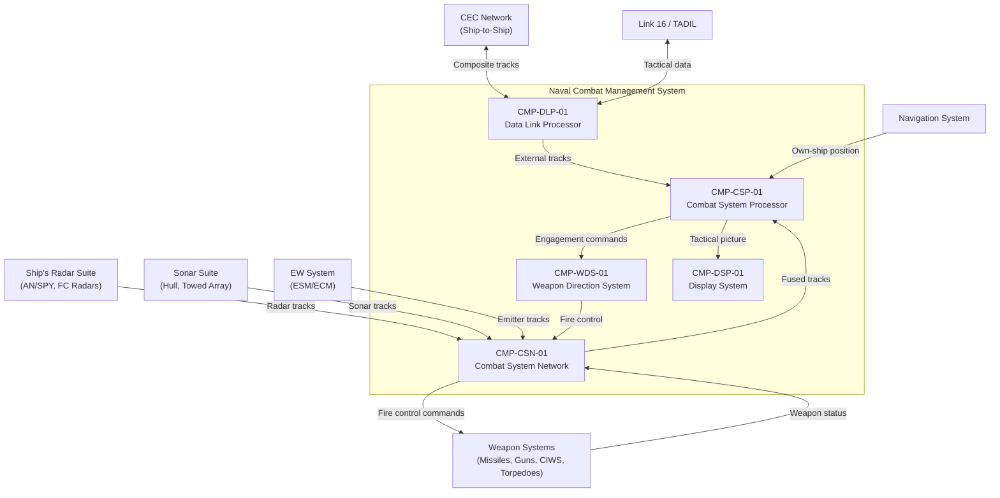

# Architecture

## System Context

## Functional Architecture

### System Functions

| FUN ID       | Function Name                      | Description                                                                      | Inputs                                      | Outputs                                     | Dependencies         |
|--------------|------------------------------------|----------------------------------------------------------------------------------|---------------------------------------------|---------------------------------------------|----------------------|
| FUN-TRK-01   | Multi-Sensor Track Fusion          | Receive and fuse tracks from radar, sonar, EW, and CEC into composite track file | Sensor track reports, CEC data              | Composite track file, track quality metrics | None                 |
| FUN-TRK-02   | Track Correlation                  | Correlate tracks across sensor types using weighted confidence algorithm          | Multi-sensor track data                     | Correlated tracks, identity resolution      | FUN-TRK-01           |
| FUN-TRK-03   | Threat Evaluation                  | Classify and prioritize threats based on track behavior, identity, and engagement doctrine | Correlated tracks, ROE table               | Threat priority list, threat classification | FUN-TRK-02           |
| FUN-WPN-01   | Weapon Assignment (TEWA)           | Recommend weapon-target pairings based on engagement envelope and ROE             | Threat priorities, weapon inventory, ROE    | Weapon-target recommendations               | FUN-TRK-03           |
| FUN-WPN-02   | Weapon Direction                   | Manage engagement sequence: designation, arming, firing authority, firing command | TAO authorization, weapon-target pair       | Fire control commands, weapon status        | FUN-WPN-01           |
| FUN-WPN-03   | Engagement Assessment              | Evaluate engagement effectiveness and recommend re-engagement or ceasefire       | Post-engagement sensor data, weapon status  | Kill assessment, re-engage recommendation   | FUN-WPN-02, FUN-TRK-01 |
| FUN-DL-01    | Data Link Processing               | Process Link 16 and CEC data exchange for cooperative tactical picture           | Link 16 messages, CEC composite data        | External tracks, forwarded own-ship tracks  | None                 |
| FUN-DSP-01   | Tactical Display                   | Present composite tactical picture and engagement status to operators             | Composite tracks, engagement state          | Operator display output, alerts             | FUN-TRK-01, FUN-WPN-02 |
| FUN-BIT-01   | Built-In Test                      | Power-up and continuous BIT for all CMS subsystems                               | BIT commands, health data                   | Fault reports, subsystem status             | None                 |
| FUN-DLD-01   | Data Load / Configuration          | Software loads, tactical database updates, ROE table configuration               | Maintenance commands, update media          | Load status, configuration ID               | FUN-BIT-01           |

## Physical Architecture

### Component Hierarchy

| CMP ID        | Component Name                          | Type     | Parent        | Description                                                          |
|---------------|-----------------------------------------|----------|---------------|----------------------------------------------------------------------|
| CMP-CSP-01    | Combat System Processor                 | Subsystem| System        | Track fusion, threat evaluation, engagement planning                 |
| CMP-CSP-01A   | Track Fusion Engine                     | Module   | CMP-CSP-01    | Real-time multi-sensor track correlation and fusion                  |
| CMP-CSP-01B   | Track Correlation Processor             | Software | CMP-CSP-01    | Cross-sensor weighted correlation algorithm                          |
| CMP-CSP-01C   | TEWA Engine                             | Software | CMP-CSP-01    | Threat evaluation and weapon assignment computation                  |
| CMP-WDS-01    | Weapon Direction System                 | Subsystem| System        | Weapon control, fire control interface, engagement sequencing        |
| CMP-WDS-01A   | Weapon Direction Processor              | Module   | CMP-WDS-01    | Engagement sequence management, fire control command generation      |
| CMP-WDS-01B   | Weapon Safety Interlock Controller      | Hardware | CMP-WDS-01    | Hardware-backed weapon inhibit and safety state enforcement          |
| CMP-DSP-01    | Display System                          | Subsystem| System        | Operator consoles, tactical plot, alert management                   |
| CMP-DSP-01A   | Tactical Display Processor              | Module   | CMP-DSP-01    | Track rendering, engagement status display, operator input           |
| CMP-DLP-01    | Data Link Processor                     | Subsystem| System        | Link 16, CEC, coalition data link processing                        |
| CMP-DLP-01A   | CEC / Link 16 Interface Processor       | Module   | CMP-DLP-01    | External data link message handling, track exchange                  |
| CMP-CSN-01    | Combat System Network                   | Subsystem| System        | GigE backbone with MIL-STD-1553 bridge for legacy interfaces        |
| CMP-CSN-01A   | GigE Network Switch                     | Hardware | CMP-CSN-01    | Managed Ethernet switch for CMS internal backbone                    |
| CMP-CSN-01B   | 1553-to-GigE Protocol Bridge            | Module   | CMP-CSN-01    | Bidirectional protocol translation between legacy 1553 and GigE     |

## Allocation

| FUN ID       | REQ ID(s)                          | CMP ID(s)                            | Assurance Level | Rationale                                                       |
|--------------|------------------------------------|--------------------------------------|-----------------|------------------------------------------------------------------|
| FUN-TRK-01   | REQ-FUN-001, REQ-FUN-002          | CMP-CSP-01A, CMP-CSP-01B            | SIL 3           | Track quality drives engagement decision accuracy                |
| FUN-TRK-02   | REQ-FUN-002, REQ-FUN-004          | CMP-CSP-01A, CMP-CSP-01B, CMP-DLP-01A | SIL 3        | Correlation errors create phantom or missed threats               |
| FUN-TRK-03   | REQ-FUN-003                        | CMP-CSP-01C                          | SIL 3           | Threat priority drives weapon assignment                         |
| FUN-WPN-01   | REQ-FUN-003                        | CMP-CSP-01C                          | SIL 3           | Weapon assignment quality affects engagement effectiveness       |
| FUN-WPN-02   | REQ-FUN-005, REQ-SAF-001, REQ-SAF-002, REQ-SAF-003 | CMP-WDS-01A, CMP-WDS-01B | SIL 4    | Weapon direction is highest safety criticality; controls weapon firing |
| FUN-WPN-03   | REQ-FUN-005                        | CMP-CSP-01A, CMP-WDS-01A            | SIL 2           | Assessment is post-engagement; does not directly control weapons |
| FUN-DL-01    | REQ-FUN-004                        | CMP-DLP-01A                          | SIL 2           | Data link processing is mission-critical                         |
| FUN-DSP-01   | REQ-FUN-006                        | CMP-DSP-01A                          | SIL 2           | Display is presentation; does not directly command weapons        |
| FUN-BIT-01   | —                                  | All CMP-                             | SIL 1           | BIT supports fault detection                                     |
| FUN-DLD-01   | —                                  | CMP-CSP-01, CMP-WDS-01              | SIL 2           | Configuration loading is operational support                     |

## Interfaces

### External Interfaces

| IFC ID       | Partner System                   | Data Item                             | Direction     | Protocol               | Timing              |
|--------------|----------------------------------|---------------------------------------|---------------|------------------------|----------------------|
| IFC-EXT-001  | Ship's Radar Suite               | Radar track data, designation commands | Bidirectional | MIL-STD-1553 / GigE   | 1 s update rate      |
| IFC-EXT-002  | Sonar Suite                      | Underwater track data                 | In            | MIL-STD-1553 / GigE   | 2 s update rate      |
| IFC-EXT-003  | Weapon Systems                   | Fire control commands, weapon status  | Bidirectional | MIL-STD-1553 / GigE   | 200 ms command rate  |
| IFC-EXT-004  | CEC Network                      | CEC composite track data              | Bidirectional | CEC datalink           | 1 s update rate      |
| IFC-EXT-005  | Link 16 / TADIL                  | Tactical data link messages           | Bidirectional | Link 16 (TADIL-J)     | Per TDMA cycle       |
| IFC-EXT-006  | EW System (ESM/ECM)              | Emitter tracks, ECM status            | In            | GigE                   | Event-driven         |
| IFC-EXT-007  | Navigation System                | Own-ship position, heading, speed     | In            | NMEA 0183 / GigE      | 1 Hz                 |

### Internal Interfaces

| IFC ID       | Source CMP ID  | Target CMP ID  | Data Item                              | Mechanism           | Timing              |
|--------------|----------------|-----------------|----------------------------------------|---------------------|----------------------|
| IFC-INT-001  | CMP-CSN-01     | CMP-CSP-01      | Sensor track data (radar, sonar, EW)   | GigE backbone       | Per sensor rate      |
| IFC-INT-002  | CMP-CSP-01     | CMP-WDS-01      | Engagement commands, weapon-target pairs | GigE backbone      | Event-driven         |
| IFC-INT-003  | CMP-WDS-01     | CMP-CSN-01      | Fire control commands to weapons       | GigE / 1553 bridge  | 200 ms               |
| IFC-INT-004  | CMP-DLP-01     | CMP-CSP-01      | CEC and Link 16 track data             | GigE backbone       | Per link cycle       |
| IFC-INT-005  | CMP-CSP-01     | CMP-DSP-01      | Composite tactical picture, alerts     | GigE backbone       | 2 Hz                 |
| IFC-INT-006  | CMP-DSP-01     | CMP-CSP-01      | Operator commands, TAO authorization   | GigE backbone       | Event-driven         |
| IFC-INT-007  | CMP-CSN-01B    | CMP-CSN-01A     | Protocol-bridged legacy sensor/weapon data | Internal bridge  | Per 1553 bus cycle   |

## Failure Containment / Partitioning

### Weapon Safety Partitioning

The weapon direction path is the highest-criticality failure domain. The Weapon Direction System (CMP-WDS-01) is partitioned from the Combat System Processor to ensure that a CSP fault (track corruption, TEWA algorithm error) cannot directly cause an uncommanded weapon firing.

**Weapon safety architecture:**
- The Weapon Safety Interlock Controller (CMP-WDS-01B) is a hardware module independent of the Weapon Direction Processor (CMP-WDS-01A). It enforces weapon SAFE/READY state via hardware logic that is not programmable by WDS software.
- A weapon firing command from CMP-WDS-01A must pass through CMP-WDS-01B, which verifies that: (a) the weapon is in READY state, (b) TAO authorization has been received, and (c) the fire control designation does not violate own-ship or friendly force keep-out zones.
- If any safety check fails, CMP-WDS-01B blocks the firing command and reports a safety inhibit to the operator.

**Evidence**: MIL-STD-882E safety assessment verifies that no single CMS failure can result in uncommanded weapon firing.

### Legacy/Modern Interface Isolation

The 1553-to-GigE Protocol Bridge (CMP-CSN-01B) isolates legacy MIL-STD-1553 interfaces from the GigE backbone. A fault on the 1553 bus (bus contention, RT failure) does not propagate to the GigE backbone or corrupt other CMS functions. Conversely, GigE network congestion does not affect 1553 bus timing.

### Subsystem Independence

Each major CMS subsystem runs on independent processing hardware connected by the GigE backbone. A failure in any one subsystem degrades but does not eliminate combat capability:
- CSP failure: Track fusion and TEWA lost. Operators revert to raw sensor displays and manual engagement planning.
- WDS failure: Weapon direction lost. Weapons can be directed manually via local weapon control panels (backup mode outside CMS boundary).
- DLP failure: CEC and Link 16 data lost. CMS operates on own-ship sensors only.
- DSP failure: Operator displays lost. CMS data is available on backup terminals.

## Architecture Decisions

### AD-01: GigE Backbone with 1553 Bridge over Full 1553 Replacement

**Decision:** Implement a GigE internal backbone with a protocol bridge to legacy MIL-STD-1553 interfaces rather than requiring all sensors and weapons to upgrade to GigE simultaneously.

**Rationale:** Full 1553 replacement requires coordinated upgrades across independently managed weapon and sensor programs, which is not feasible within a single modernization cycle. The protocol bridge approach allows incremental migration: as each sensor or weapon is modernized, its 1553 connection is replaced with a native GigE connection while the bridge handles remaining legacy equipment. The GigE backbone provides sufficient bandwidth (1 Gbps) for current and future track and video data requirements.

**Trade-off:** The protocol bridge introduces translation latency (typically 5-10 ms per message) and is a potential single point of failure for legacy interfaces. Mitigated by dual-redundant bridge modules and sizing the bridge for worst-case legacy bus traffic.

### AD-02: Hardware Weapon Safety Interlock over Software-Only Safety

**Decision:** Implement the weapon safety interlock as a dedicated hardware module (CMP-WDS-01B) independent of the Weapon Direction Processor software rather than implementing safety checks in software only.

**Rationale:** MIL-STD-882E severity analysis rates uncommanded weapon firing as Catastrophic. A software-only safety check is vulnerable to software faults, memory corruption, or timing errors that could bypass the check. The hardware interlock provides an independent safety barrier that cannot be defeated by a software fault in the Weapon Direction Processor. This is consistent with Navy weapon safety philosophy requiring hardware-backed interlocks on all weapon release paths.

**Trade-off:** Hardware interlock adds cost and limits the flexibility to modify safety checks via software update. Accepted because the safety argument demands independence from software faults, and safety check changes require formal safety assessment regardless of implementation.

### AD-03: Weighted CEC Track Integration over Equal-Quality Fusion

**Decision:** Apply quality weighting to CEC (off-board) tracks during fusion rather than treating all tracks with equal confidence regardless of source.

**Rationale:** CEC tracks originate from another ship's sensors with potentially different accuracy, calibration, and update rates. Treating CEC tracks with the same confidence as own-ship sensor tracks could degrade composite track quality when off-board data is less accurate. Quality weighting allows the track fusion algorithm to appropriately weight own-ship high-confidence data while still benefiting from CEC's extended detection range.

**Trade-off:** Quality weighting adds algorithmic complexity and requires CEC track quality metadata that may not be fully available from all CEC participants. Accepted because the engagement accuracy improvement justifies the additional fusion complexity, and degraded-quality CEC data is flagged for operator awareness.
