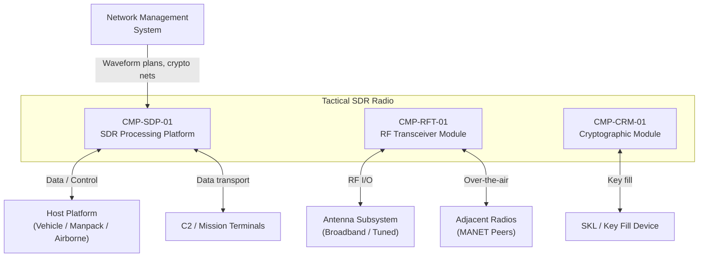

# Architecture

## System Context

## Functional Architecture

### System Functions

| FUN ID       | Function Name                      | Description                                                                      | Inputs                                      | Outputs                                     | Dependencies         |
|--------------|------------------------------------|----------------------------------------------------------------------------------|---------------------------------------------|---------------------------------------------|----------------------|
| FUN-WFM-01   | Waveform Execution                 | Host and execute SCA 4.1 waveform applications on independent channels           | Waveform binaries, channel configuration    | Modulated baseband signals, demodulated data | FUN-RF-01            |
| FUN-WFM-02   | Waveform Management                | Load, verify, deploy, start, stop waveform applications via SCA Core Framework   | Waveform media, operator commands           | Waveform deployment status                  | None                 |
| FUN-RF-01    | RF Processing                      | Multi-band transmit/receive, digital IF, automatic gain control, antenna tuning  | Baseband from FUN-WFM-01, RF from antenna   | RF output to antenna, baseband to FUN-WFM-01 | None                 |
| FUN-RF-02    | Spectrum Management                | Channel assignment, cross-channel isolation, spurious emission control            | Channel plan, waveform RF parameters        | Frequency assignments, power levels         | FUN-RF-01            |
| FUN-CRY-01   | COMSEC Encryption/Decryption       | Type 1 encryption of red data to black, decryption of black data to red          | Plaintext data, active crypto keys          | Ciphertext data, plaintext data             | FUN-WFM-01           |
| FUN-CRY-02   | Key Management                     | Key fill, OTAR, key update, key selection per crypto net assignment              | SKL key fill, OTAR messages                 | Active key state, key status                | None                 |
| FUN-CRY-03   | Emergency Zeroization              | Destroy all key material on operator command or tamper detection                  | Zeroize command, tamper sensor              | Zeroization confirmation, all keys destroyed | None                 |
| FUN-NET-01   | MANET Networking                   | Self-forming, self-healing mesh networking with dynamic routing                  | Network topology, data packets              | Routed packets, topology updates            | FUN-WFM-01, FUN-CRY-01 |
| FUN-BIT-01   | Built-In Test                      | Power-up and continuous BIT for all radio subsystems                              | BIT commands, health data                   | Fault reports, subsystem status             | None                 |
| FUN-DLD-01   | Data Load / Configuration          | Load waveform software, configuration data, and crypto net plans                 | External media, network management data     | Load status, configuration ID               | FUN-BIT-01           |

## Physical Architecture

### Component Hierarchy

| CMP ID        | Component Name                          | Type     | Parent        | Description                                                          |
|---------------|-----------------------------------------|----------|---------------|----------------------------------------------------------------------|
| CMP-SDP-01    | SDR Processing Platform                 | Subsystem| System        | SCA 4.1 Core Framework host, waveform execution, host interface      |
| CMP-SDP-01A   | SCA Core Framework Processor            | Module   | CMP-SDP-01    | General-purpose processor running SCA Core Framework and waveform apps |
| CMP-SDP-01B   | DSP Coprocessor Array                   | Hardware | CMP-SDP-01    | Dedicated DSP engines for waveform baseband processing               |
| CMP-SDP-01C   | SCA Security Service                    | Software | CMP-SDP-01    | API mediator for waveform access to crypto services; enforces waveform sandboxing |
| CMP-SDP-01D   | FACE Host Interface Module              | Module   | CMP-SDP-01    | FACE 3.1 TSS/PSSS providing host platform data transport             |
| CMP-RFT-01    | RF Transceiver Module                   | Subsystem| System        | Multi-band RF front end, digital IF, power amplifier                 |
| CMP-RFT-01A   | Multi-Band RF Front End                 | Hardware | CMP-RFT-01    | Wideband receiver, frequency synthesizer, power amplifier            |
| CMP-RFT-01B   | Antenna Interface Unit                  | Hardware | CMP-RFT-01    | Antenna matching, VSWR protection, coupler for multi-band operation  |
| CMP-CRM-01    | Cryptographic Module                    | Subsystem| System        | NSA Type 1 COMSEC/TRANSEC, key storage, zeroization                  |
| CMP-CRM-01A   | Type 1 Crypto Engine                    | Hardware | CMP-CRM-01    | Tamper-resistant crypto processor with key storage and zeroization    |

## Allocation

| FUN ID       | REQ ID(s)                          | CMP ID(s)                            | Assurance Level | Rationale                                                       |
|--------------|------------------------------------|--------------------------------------|-----------------|------------------------------------------------------------------|
| FUN-WFM-01   | REQ-FUN-001                        | CMP-SDP-01A, CMP-SDP-01B            | SIL 2           | Waveform execution is mission-critical but not safety-critical   |
| FUN-WFM-02   | REQ-FUN-002                        | CMP-SDP-01A, CMP-SDP-01C            | SIL 3           | Waveform trust verification protects crypto boundary             |
| FUN-RF-01    | REQ-FUN-006                        | CMP-RFT-01A, CMP-RFT-01B            | SIL 2           | RF processing is mission-critical                                |
| FUN-RF-02    | REQ-SAF-003                        | CMP-RFT-01A                          | SIL 3           | Spectrum management prevents harmful interference                |
| FUN-CRY-01   | REQ-FUN-004, REQ-FUN-005          | CMP-CRM-01A                          | SIL 4           | COMSEC is the highest-criticality function; key compromise affects entire net |
| FUN-CRY-02   | REQ-FUN-004                        | CMP-CRM-01A                          | SIL 4           | Key management integrity underpins all COMSEC operations         |
| FUN-CRY-03   | REQ-SAF-001                        | CMP-CRM-01A                          | SIL 4           | Zeroization failure under capture risk compromises the crypto net |
| FUN-NET-01   | REQ-FUN-003                        | CMP-SDP-01B                          | SIL 2           | MANET networking is mission-critical                             |
| FUN-BIT-01   | —                                  | All CMP-                             | SIL 1           | BIT supports fault detection                                     |
| FUN-DLD-01   | REQ-FUN-002                        | CMP-SDP-01A                          | SIL 2           | Waveform loading is operational support                          |

## Interfaces

### External Interfaces

| IFC ID       | Partner System                   | Data Item                             | Direction     | Protocol               | Timing              |
|--------------|----------------------------------|---------------------------------------|---------------|------------------------|----------------------|
| IFC-EXT-001  | Antenna Subsystem                | RF signal (HF/VHF/UHF/L-band)        | Bidirectional | Analog RF              | Continuous           |
| IFC-EXT-002  | SKL / Key Fill Device            | Cryptographic key material            | In            | DS-102 / SCI fill      | On demand            |
| IFC-EXT-003  | Host Platform / C2 Terminals     | Data transport (IP, voice, PLI)       | Bidirectional | GigE (FACE 3.1 TSS)   | Continuous           |
| IFC-EXT-004  | Network Management System        | Waveform plans, crypto net config     | In            | Ethernet / SNMP        | On demand            |
| IFC-EXT-005  | Adjacent Radios (MANET Peers)    | Over-the-air waveform data            | Bidirectional | Waveform-dependent OTA | Per waveform spec    |
| IFC-EXT-006  | Host Platform Power              | DC power (28V nominal)                | In            | MIL-STD-1275 power     | Continuous           |

### Internal Interfaces

| IFC ID       | Source CMP ID  | Target CMP ID  | Data Item                              | Mechanism           | Timing              |
|--------------|----------------|-----------------|----------------------------------------|---------------------|----------------------|
| IFC-INT-001  | CMP-SDP-01     | CMP-RFT-01      | Baseband I/Q samples                   | High-speed serial   | Continuous           |
| IFC-INT-002  | CMP-RFT-01     | CMP-SDP-01      | Received baseband I/Q samples          | High-speed serial   | Continuous           |
| IFC-INT-003  | CMP-SDP-01     | CMP-CRM-01      | Red (plaintext) data for encryption    | Red-side bus        | Continuous           |
| IFC-INT-004  | CMP-CRM-01     | CMP-SDP-01      | Red (plaintext) data from decryption   | Red-side bus        | Continuous           |
| IFC-INT-005  | CMP-CRM-01     | CMP-RFT-01      | Black (ciphertext) for transmission    | Black-side bus      | Continuous           |
| IFC-INT-006  | CMP-RFT-01     | CMP-CRM-01      | Black (ciphertext) from reception      | Black-side bus      | Continuous           |

## Failure Containment / Partitioning

### SCA 4.1 Waveform / Platform Partitioning

The SCA 4.1 architecture provides the primary software partitioning boundary. Waveform application software executes within the SCA Core Framework as managed components. The Core Framework enforces resource limits and prevents waveform applications from directly accessing hardware, crypto module internals, or other waveform instances.

**Waveform sandboxing:**
- Each waveform application runs in an isolated process space managed by the SCA Core Framework.
- Waveform access to crypto services is mediated through the SCA Security Service (CMP-SDP-01C). No direct waveform-to-crypto-module interface exists.
- A misbehaving waveform can be terminated by the Core Framework without affecting other active waveforms or the crypto module state.

### Red/Black Crypto Boundary

The crypto boundary is the highest-integrity partitioning boundary in the system. The cryptographic module (CMP-CRM-01) physically separates red (plaintext) and black (ciphertext) data domains.

**Boundary enforcement:**
- Red-side and black-side buses are physically separate conductors. No shared memory or shared bus segment exists between red and black domains.
- The crypto module hardware enforces unidirectional data flow: red data enters the encryption path and exits as black data, or black data enters the decryption path and exits as red data. No bypass path exists in hardware.
- Tamper detection circuitry triggers automatic zeroization if physical penetration of the crypto boundary is detected.

**Evidence**: NSA Type 1 evaluation provides formal evidence of red/black separation. Additional MIL-STD-882E safety analysis verifies that no single fault (hardware or software) can breach the crypto boundary.

### RF Output Protection

The RF Transceiver Module (CMP-RFT-01) includes hardware interlocks that inhibit RF output when no antenna is detected (open VSWR) or when output power exceeds configured limits. This prevents transceiver damage and unintended RF emissions.

## Architecture Decisions

### AD-01: SCA 4.1 Core Framework over Proprietary Radio OS

**Decision:** Adopt SCA 4.1 Core Framework as the waveform execution environment rather than a proprietary radio operating system.

**Rationale:** SCA 4.1 conformance is mandated for JTRS programs and enables waveform portability across radio platforms from different vendors. The SCA framework provides standardized waveform lifecycle management, device abstraction, and security service interfaces that reduce per-platform waveform porting effort.

**Trade-off:** SCA middleware introduces processing overhead compared to bare-metal waveform execution. Mitigated by dedicating DSP coprocessors (CMP-SDP-01B) for hard-real-time baseband processing while the SCA framework runs on the general-purpose processor (CMP-SDP-01A).

### AD-02: Hardware-Enforced Red/Black Separation over Software Isolation

**Decision:** Implement the COMSEC red/black boundary using physically separate buses and a tamper-resistant crypto module rather than software-only isolation within a shared processing environment.

**Rationale:** NSA Type 1 certification requires hardware-enforced red/black separation. Software-only isolation is vulnerable to software faults, buffer overflows, or compromised waveform code that could leak plaintext to the black side. Hardware enforcement provides a certification-grade boundary that is immune to software-class failures.

**Trade-off:** Hardware separation increases board complexity and constrains data throughput at the crypto boundary. Accepted because Type 1 certification is a non-negotiable requirement and the crypto module throughput is sized to support four simultaneous waveform channels.

### AD-03: Dedicated DSP Coprocessors for Baseband Processing

**Decision:** Provide dedicated DSP coprocessor hardware (CMP-SDP-01B) for waveform baseband processing rather than performing all processing on the general-purpose SCA host processor.

**Rationale:** Waveform baseband processing (modulation, demodulation, channel coding, frequency hopping) has hard real-time requirements measured in microseconds. The SCA Core Framework on the general-purpose processor cannot guarantee microsecond-level determinism. Dedicated DSP hardware provides deterministic baseband processing while the SCA framework handles waveform management, networking, and host interface functions on the general-purpose processor.

**Trade-off:** Dual-processor architecture increases power consumption and design complexity. Accepted because real-time baseband performance is non-negotiable for waveform compliance, and the SCA framework cannot be hosted on DSP hardware due to its POSIX/CORBA runtime requirements.
