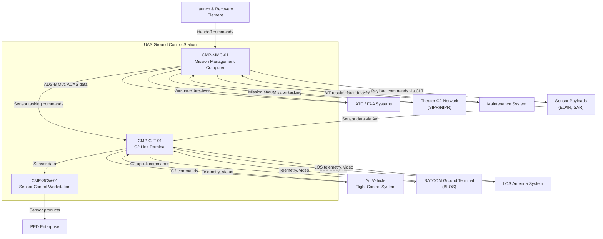
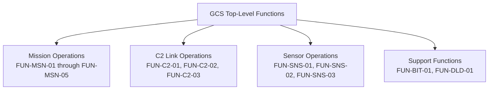

# Architecture

## System Context



## Functional Architecture

### System Functions

| FUN ID       | Function Name                      | Description                                                                      | Inputs                                       | Outputs                                      | Dependencies         |
|--------------|------------------------------------|----------------------------------------------------------------------------------|----------------------------------------------|----------------------------------------------|----------------------|
| FUN-MSN-01   | Mission Planning                   | Create, validate, and modify mission routes, waypoints, and loiter patterns      | Operator inputs, theater data, terrain data   | Mission plan, waypoint sequence, ATO correlation | None                 |
| FUN-MSN-02   | Flight Management                  | Monitor air vehicle state, issue flight commands, manage handoffs between GCS     | AV telemetry, mission plan                    | Flight commands, AV state display             | FUN-C2-01            |
| FUN-MSN-03   | Lost Link Management               | Detect C2 link loss, initiate lost link procedures, coordinate ATC notification  | Link status from FUN-C2-01, timer data        | Lost link declaration, ATC alerts, reconnect commands | FUN-C2-01, FUN-MSN-02 |
| FUN-MSN-04   | Emergency Flight Termination       | Authenticate and transmit flight termination command on operator authority        | Two-operator authentication                   | Flight termination command via C2 link        | FUN-C2-01            |
| FUN-MSN-05   | Airspace Integration               | Generate ADS-B Out position reports and process ACAS Xu advisories               | AV position, ACAS inputs                      | ADS-B reports, deconfliction advisories       | FUN-MSN-02           |
| FUN-C2-01    | C2 Link Management                 | Manage LOS and BLOS data link sessions, bandwidth allocation, link health        | RF status, modem telemetry                    | Link status, bandwidth allocation, data routing | None                 |
| FUN-C2-02    | COMSEC Management                  | Manage cryptographic key lifecycle, OTAR, key fill, zeroization                  | Key fill device, OTAR messages                | Encrypted/decrypted C2 data streams           | FUN-C2-01            |
| FUN-C2-03    | Multi-Vehicle Routing              | Route C2 data streams for up to four simultaneous air vehicles                   | Vehicle registration, link assignments        | Per-vehicle data routing tables               | FUN-C2-01            |
| FUN-SNS-01   | Sensor Tasking                     | Command EO/IR/SAR sensor pointing, modes, and collection parameters              | Operator commands, target coordinates         | Sensor control commands via C2 link           | FUN-C2-01            |
| FUN-SNS-02   | Sensor Display Processing          | Receive, decode, and render sensor video and imagery for operator display         | Sensor video stream, metadata                 | Rendered video, imagery overlays              | FUN-C2-01            |
| FUN-SNS-03   | Target Mensuration                 | Compute target coordinates from sensor pointing data and AV position             | Sensor LOS angles, AV position, DEM data      | Target coordinates with CEP                   | FUN-SNS-01, FUN-MSN-02 |
| FUN-BIT-01   | Built-In Test                      | Power-up, continuous, and initiated BIT for all GCS subsystems                   | BIT commands, health data                     | Fault reports, subsystem status               | None                 |
| FUN-DLD-01   | Data Load Management               | Manage software loads, configuration data, and mission data transfers            | Maintenance commands, load media              | Load status, configuration ID                 | FUN-BIT-01           |

### Functional Decomposition



## Physical Architecture

### Component Hierarchy

| CMP ID        | Component Name                          | Type     | Parent        | Description                                                          |
|---------------|-----------------------------------------|----------|---------------|----------------------------------------------------------------------|
| CMP-MMC-01    | Mission Management Computer             | Subsystem| System        | Flight management, mission planning, C2 orchestration, airspace integration |
| CMP-MMC-01A   | MMC Flight Management Processor         | Module   | CMP-MMC-01    | AV state management, flight command generation, handoff logic        |
| CMP-MMC-01B   | MMC Mission Planning Application        | Software | CMP-MMC-01    | Route planning, waypoint management, ATO correlation                 |
| CMP-MMC-01C   | MMC Airspace Integration Module         | Module   | CMP-MMC-01    | ADS-B Out generation, ACAS Xu processing, ATC interface              |
| CMP-MMC-01D   | MMC Operator Display Unit               | Hardware | CMP-MMC-01    | Primary operator display with moving map and AV status               |
| CMP-MMC-01E   | MMC FACE TSS Runtime                    | Software | CMP-MMC-01    | FACE Transport Services Segment providing POSIX and data transport APIs |
| CMP-MMC-01F   | MMC Lost Link Manager                   | Software | CMP-MMC-01    | Lost link detection, timer management, reconnect sequencing          |
| CMP-CLT-01    | C2 Link Terminal                        | Subsystem| System        | LOS/BLOS data link operations, COMSEC, antenna control               |
| CMP-CLT-01A   | CLT LOS Transceiver                     | Hardware | CMP-CLT-01    | Line-of-sight C2 data link radio and modem                           |
| CMP-CLT-01B   | CLT BLOS Modem                          | Hardware | CMP-CLT-01    | Beyond-line-of-sight satellite modem and interface processor         |
| CMP-CLT-01C   | CLT COMSEC Module                       | Hardware | CMP-CLT-01    | Type 1 cryptographic module for all C2 link encryption/decryption    |
| CMP-CLT-01D   | CLT Link Controller                     | Software | CMP-CLT-01    | Bandwidth management, link health monitoring, multi-vehicle routing   |
| CMP-CLT-01E   | CLT Antenna Control Unit                | Hardware | CMP-CLT-01    | LOS antenna pointing and tracking controller                         |
| CMP-CLT-01F   | CLT FACE PSSS Adapter                   | Software | CMP-CLT-01    | FACE Platform-Specific Services bridging FACE APIs to legacy MIL-STD-1553 |
| CMP-SCW-01    | Sensor Control Workstation              | Subsystem| System        | Sensor payload tasking, video display, target mensuration            |
| CMP-SCW-01A   | SCW Sensor Display Processor            | Module   | CMP-SCW-01    | Video decode, rendering, and imagery overlay processing              |
| CMP-SCW-01B   | SCW Sensor Tasking Application          | Software | CMP-SCW-01    | Sensor pointing, mode control, collection parameter management       |
| CMP-SCW-01C   | SCW Target Mensuration Engine           | Software | CMP-SCW-01    | Coordinate computation from sensor geometry and DEM data             |
| CMP-SCW-01D   | SCW Operator Display Unit               | Hardware | CMP-SCW-01    | High-resolution sensor imagery display with annotation tools         |

### Physical Architecture Diagram

```mermaid
graph LR
    subgraph MMC["CMP-MMC-01: Mission Management Computer"]
        FMP["CMP-MMC-01A<br/>Flight Mgmt Processor"]
        MPA["CMP-MMC-01B<br/>Mission Planning App"]
        AIM["CMP-MMC-01C<br/>Airspace Integration"]
        ODU_M["CMP-MMC-01D<br/>Operator Display"]
        TSS["CMP-MMC-01E<br/>FACE TSS Runtime"]
        LLM["CMP-MMC-01F<br/>Lost Link Manager"]
    end

    subgraph CLT["CMP-CLT-01: C2 Link Terminal"]
        LOS["CMP-CLT-01A<br/>LOS Transceiver"]
        BLOS["CMP-CLT-01B<br/>BLOS Modem"]
        COMSEC["CMP-CLT-01C<br/>COMSEC Module"]
        LC["CMP-CLT-01D<br/>Link Controller"]
        ACU["CMP-CLT-01E<br/>Antenna Control"]
        PSSS["CMP-CLT-01F<br/>FACE PSSS Adapter"]
    end

    subgraph SCW["CMP-SCW-01: Sensor Control Workstation"]
        SDP["CMP-SCW-01A<br/>Sensor Display Proc"]
        STA["CMP-SCW-01B<br/>Sensor Tasking App"]
        TME["CMP-SCW-01C<br/>Target Mensuration"]
        ODU_S["CMP-SCW-01D<br/>Operator Display"]
    end

    MMC -->|GCS LAN (Ethernet)| CLT
    CLT -->|GCS LAN (Ethernet)| SCW
    MMC -->|GCS LAN (Ethernet)| SCW
    CLT -->|MIL-STD-1553 / RS-422| LOS_EXT["LOS Antenna (External)"]
    CLT -->|Ethernet| SATCOM_EXT["SATCOM Terminal (External)"]
```

## Allocation

| FUN ID       | REQ ID(s)                                            | CMP ID(s)                                | Assurance Level | Rationale                                                       |
|--------------|-------------------------------------------------------|------------------------------------------|-----------------|------------------------------------------------------------------|
| FUN-MSN-01   | REQ-FUN-001, REQ-FUN-002                              | CMP-MMC-01B                              | SIL 2           | Mission planning is operationally critical but not flight-safety |
| FUN-MSN-02   | REQ-FUN-003, REQ-FUN-004, REQ-FUN-005                | CMP-MMC-01A                              | SIL 4           | Flight management directly commands AV; erroneous commands are Catastrophic |
| FUN-MSN-03   | REQ-FUN-006, REQ-FUN-007, REQ-SAF-001, REQ-SAF-002  | CMP-MMC-01F                              | SIL 4           | Lost link detection is highest-risk safety function              |
| FUN-MSN-04   | REQ-FUN-008, REQ-SAF-003                              | CMP-MMC-01A                              | SIL 4           | Flight termination is irreversible safety-critical action        |
| FUN-MSN-05   | REQ-FUN-009, REQ-FUN-010                              | CMP-MMC-01C                              | SIL 3           | Airspace integration affects mid-air collision risk              |
| FUN-C2-01    | REQ-FUN-011, REQ-FUN-012, REQ-FUN-013               | CMP-CLT-01D, CMP-CLT-01A, CMP-CLT-01B  | SIL 4           | C2 link is sole command path to AV; link loss is Hazardous       |
| FUN-C2-02    | REQ-FUN-014                                           | CMP-CLT-01C                              | SIL 4           | COMSEC failure exposes C2 to intercept or spoofing               |
| FUN-C2-03    | REQ-FUN-015                                           | CMP-CLT-01D                              | SIL 3           | Mis-routing could send commands to wrong AV                      |
| FUN-SNS-01   | REQ-FUN-016, REQ-FUN-017                              | CMP-SCW-01B                              | SIL 2           | Sensor tasking is mission-critical but not flight-safety         |
| FUN-SNS-02   | REQ-FUN-018                                           | CMP-SCW-01A                              | SIL 1           | Display processing is presentation only                          |
| FUN-SNS-03   | REQ-FUN-019                                           | CMP-SCW-01C                              | SIL 2           | Target coordinates drive downstream PED accuracy                 |
| FUN-BIT-01   | REQ-FUN-020                                           | CMP-MMC-01, CMP-CLT-01, CMP-SCW-01      | SIL 3           | BIT coverage supports fault detection safety argument            |
| FUN-DLD-01   | REQ-FUN-021                                           | CMP-MMC-01, CMP-CLT-01                   | SIL 2           | Incorrect software load could corrupt flight-critical functions  |

## Interfaces

### External Interfaces

| IFC ID       | Partner System                   | Data Item                            | Direction     | Protocol            | Timing              |
|--------------|----------------------------------|--------------------------------------|---------------|---------------------|----------------------|
| IFC-EXT-001  | Air Vehicle Flight Control System| Flight commands (waypoint, heading, altitude) | Out     | CDL / STANAG 4586   | 100 ms command rate  |
| IFC-EXT-002  | Air Vehicle Flight Control System| Telemetry (position, attitude, engine) | In          | CDL / STANAG 4586   | 100 ms update rate   |
| IFC-EXT-003  | Sensor Payloads (via AV)         | Sensor control commands (pointing, mode) | Out       | CDL / STANAG 4586   | 200 ms command rate  |
| IFC-EXT-004  | Sensor Payloads (via AV)         | Sensor video, imagery, metadata      | In            | CDL (MPEG-TS / MISB)| Continuous stream    |
| IFC-EXT-005  | SATCOM Ground Terminal           | BLOS uplink/downlink data            | Bidirectional | Ethernet (IP/UDP)   | Per link allocation  |
| IFC-EXT-006  | LOS Antenna System               | LOS RF uplink/downlink               | Bidirectional | MIL-STD-1553 / RS-422 | Per link allocation |
| IFC-EXT-007  | ATC / FAA Systems                | ADS-B Out position reports           | Out           | 1090ES (via relay)  | 1 Hz                |
| IFC-EXT-008  | ATC / FAA Systems                | ACAS Xu advisories                   | In            | 1090ES (via relay)  | Event-driven         |
| IFC-EXT-009  | Theater C2 Network (SIPR)        | Mission status, tasking orders       | Bidirectional | TCP/IP (SIPR)       | On demand            |
| IFC-EXT-010  | PED Enterprise                   | Sensor products (imagery, FMV clips) | Out           | TCP/IP (SIPR)       | On demand            |
| IFC-EXT-011  | Maintenance System               | SW loads, key fill, BIT commands     | Bidirectional | Ethernet (discrete) | On demand            |
| IFC-EXT-012  | Launch & Recovery Element        | Handoff commands, AV state           | Bidirectional | Ethernet (GCS LAN)  | Event-driven         |

### Internal Interfaces

| IFC ID       | Source CMP ID  | Target CMP ID  | Data Item                              | Mechanism         | Timing              |
|--------------|----------------|-----------------|----------------------------------------|-------------------|----------------------|
| IFC-INT-001  | CMP-MMC-01     | CMP-CLT-01      | Flight commands, sensor tasking        | GCS LAN (Ethernet)| 50 ms               |
| IFC-INT-002  | CMP-CLT-01     | CMP-MMC-01      | AV telemetry, link status              | GCS LAN (Ethernet)| 50 ms               |
| IFC-INT-003  | CMP-CLT-01     | CMP-SCW-01      | Sensor video stream, metadata          | GCS LAN (Ethernet)| Continuous           |
| IFC-INT-004  | CMP-SCW-01     | CMP-CLT-01      | Sensor control commands                | GCS LAN (Ethernet)| 200 ms               |
| IFC-INT-005  | CMP-MMC-01     | CMP-SCW-01      | AV position for mensuration            | GCS LAN (Ethernet)| 100 ms               |
| IFC-INT-006  | CMP-SCW-01     | CMP-MMC-01      | Target coordinates, sensor products    | GCS LAN (Ethernet)| On demand            |
| IFC-INT-007  | CMP-CLT-01C    | CMP-CLT-01D     | Decrypted C2 data streams              | Internal bus       | Continuous           |

## Failure Containment / Partitioning

### FACE 3.1 Layered Partitioning

The GCS software architecture follows FACE 3.1 segment partitioning to provide both portability and failure containment. Each FACE segment operates with defined API boundaries that serve as containment barriers.

**Segment assignments:**

| FACE Segment                 | Components                         | SIL   | Rationale                                              |
|------------------------------|------------------------------------|-------|--------------------------------------------------------|
| Operating System Segment (OSS) | POSIX OS, device drivers          | SIL 4 | Foundation for all safety-critical applications        |
| Transport Services Segment (TSS) | CMP-MMC-01E (FACE TSS Runtime) | SIL 4 | Data transport APIs used by flight-critical functions  |
| Platform-Specific Services (PSSS) | CMP-CLT-01F (PSSS Adapter)    | SIL 3 | Bridges FACE APIs to legacy MIL-STD-1553; non-portable |
| Portable Components Segment (PCS) | FUN-MSN-01 through FUN-SNS-03 apps | Varies | Application software portable across FACE platforms |

**Isolation enforcement:**
- FACE segment boundaries enforce API-only communication. No application directly accesses hardware or OS internals.
- TSS data transport provides typed, validated message passing between applications. Malformed messages are rejected at the TSS boundary.
- PSSS adapter isolates legacy interface peculiarities from portable application code. A PSSS failure does not corrupt PCS application state.
- Memory protection via OS process isolation prevents one application from corrupting another. Each FACE PCS application runs in a separate process address space.

**Evidence**: FACE conformance testing per FACE Conformance Test Suite (CTS) verifies segment boundary integrity. Additional partition testing injects faults in non-safety applications and verifies non-interference with SIL 4 functions.

### C2 Link Redundancy

The CLT provides dual-path C2 link capability (LOS via CMP-CLT-01A and BLOS via CMP-CLT-01B). The link controller (CMP-CLT-01D) manages automatic failover between paths.

**Independence argument:**
- LOS and BLOS use different frequency bands, different RF propagation paths, and different ground infrastructure. A single-point RF failure cannot take out both links simultaneously.
- The COMSEC module (CMP-CLT-01C) processes both link paths but uses independent cryptographic contexts per link. A key compromise on one link does not expose the other.
- Common-mode analysis addresses shared power supply (mitigated by independent power regulators per transceiver) and shared link controller software (mitigated by watchdog monitoring and automatic restart).

**Failure response:**
- Loss of one link path triggers transition to MODE-002 (Degraded C2) with automatic failover and operator annunciation.
- Loss of both link paths triggers transition to MODE-003 (Lost Link) with AV executing pre-programmed lost link profile.

### Subsystem Independence

The MMC, CLT, and SCW are physically separate subsystems connected via a GCS LAN Ethernet backbone. A failure in any one subsystem does not corrupt the others.

- SCW failure: Sensor operations lost, but flight management and C2 link remain operational. Mission can continue with degraded sensor capability.
- CLT failure: All C2 links lost. This is the most severe subsystem failure, triggering MODE-003 for all controlled vehicles.
- MMC failure: Flight management and mission planning lost. If CLT remains operational, pre-loaded AV missions continue autonomously, but no new commands can be issued.

## Architecture Decisions

### AD-01: FACE 3.1 Layered Architecture over Monolithic Design

**Decision:** Adopt FACE 3.1 segment architecture with defined portability profiles rather than a monolithic GCS software design.

**Rationale:** The MOSA mandate (10 USC 4401) requires modular open architecture for ACAT II programs. FACE 3.1 provides a DoD-approved software architecture standard with conformance testing infrastructure. The layered approach enables competitive procurement of individual software components and provides a migration path for future capability upgrades without full system redesign.

**Trade-off:** FACE compliance introduces overhead in API abstraction and conformance testing. Accepted because the lifecycle cost savings from competitive procurement and incremental upgrade capability outweigh the initial compliance burden.

### AD-02: Dual-Path C2 Link (LOS + BLOS) over Single-Path

**Decision:** Provide both LOS and BLOS C2 link paths as primary operational capability rather than relying on a single path with ground-based backup.

**Rationale:** Group 4/5 UAS operations span from LOS range (launch/recovery, local operations) through BLOS range (transit, distant operations). A single link path creates a single point of failure for the most critical system interface. Dual-path provides both operational flexibility and safety-critical redundancy. The MIL-STD-882E hazard analysis identifies C2 link loss as Severity I (Catastrophic) for certain scenarios, requiring redundant mitigation.

**Trade-off:** Dual-path increases CLT complexity, size, weight, and power. Accepted because the operational requirement and safety analysis demand link redundancy.

### AD-03: Separate SCW Subsystem over Integrated Sensor-on-MMC

**Decision:** Implement sensor control as a separate Sensor Control Workstation rather than integrating sensor functions into the Mission Management Computer.

**Rationale:** Sensor video processing (H.264/MPEG-TS at up to 1080p) consumes significant processing and display bandwidth. Separating sensor operations onto a dedicated workstation prevents sensor load from competing with flight-critical MMC functions. This separation also supports a two-operator crew concept (pilot at MMC, sensor operator at SCW) consistent with current MQ-9 CONOPS.

**Trade-off:** Additional subsystem adds cost and integration complexity. Accepted because processing isolation and crew concept alignment justify the separation.

### AD-04: FACE PSSS Bridge for Legacy MIL-STD-1553

**Decision:** Use a FACE PSSS adapter to bridge legacy MIL-STD-1553 C2 link equipment rather than requiring all link equipment to be FACE-conformant.

**Rationale:** The LOS transceiver (CMP-CLT-01A) uses a legacy MIL-STD-1553 interface that cannot be economically replaced. The PSSS adapter isolates the non-conformant interface behind a FACE-compliant API boundary, maintaining portability for all PCS application software while accommodating existing hardware. This supports the MOSA incremental modernization strategy.

**Trade-off:** The PSSS adapter is platform-specific and non-portable. Accepted as a deliberate architectural decision: legacy interface accommodation is explicitly the PSSS's role in the FACE architecture.

### AD-05: Two-Operator Authentication for Flight Termination

**Decision:** Require two-operator authentication (pilot and sensor operator) for emergency flight termination commands rather than single-operator authority.

**Rationale:** Flight termination is an irreversible command that destroys the air vehicle. Inadvertent or unauthorized termination could result in loss of a high-value asset and potential ground casualties if the AV impacts in an unplanned area. The two-operator requirement provides a human-in-the-loop safety barrier against accidental or compromised termination commands, consistent with nuclear weapon safety two-person integrity concepts.

**Trade-off:** Two-operator requirement increases time to termination. Accepted because the consequences of inadvertent termination outweigh the response time cost; time-critical scenarios use the pre-programmed lost link profile instead.
