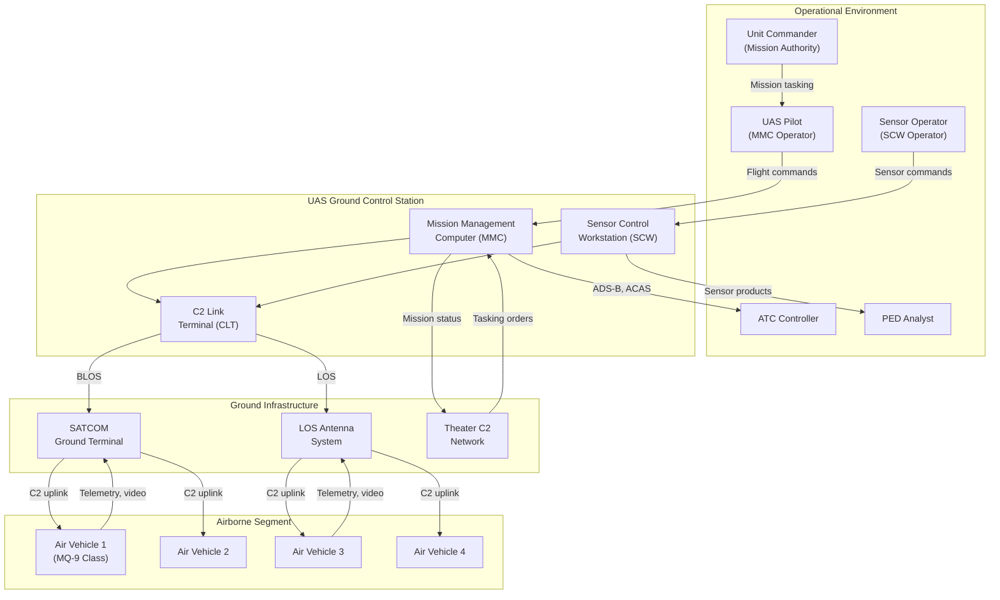

# DoDAF / UAF Architecture Views

## Viewpoint Selection Rationale

The following DoDAF 2.02 viewpoints are selected based on the ACAT II milestone decision review requirements and the program's architecture governance needs. Operational views (OV) establish the mission context and stakeholder information exchanges. Systems views (SV) map the physical architecture to operational activities. Data and information views (DIV) define the logical data model for inter-subsystem communication. Each view maps to a specific DI-SESS CDRL and technical review gate.

| Viewpoint | View Product | Rationale for Selection                                                 | Review Gate |
|-----------|-------------|-------------------------------------------------------------------------|-------------|
| OV        | OV-1        | High-level operational concept required for SRR and all milestone reviews | SRR         |
| OV        | OV-5b       | Activity model traces mission functions to requirements                  | PDR         |
| SV        | SV-1        | Systems interface description maps architecture to operational nodes     | PDR         |
| SV        | SV-4        | Systems functionality traces GCS functions to system components          | CDR         |
| DIV       | DIV-2       | Logical data model defines inter-subsystem message semantics             | PDR         |

## Operational Viewpoint (OV)

### OV-1: High-Level Operational Concept

**OV-1 Narrative:**

The GCS operates as the ground segment of a multi-vehicle UAS system supporting ISR and strike missions. The UAS pilot at the MMC manages flight operations for up to four air vehicles simultaneously, issuing waypoint, heading, and altitude commands through the C2 link terminal. The sensor operator at the SCW controls EO/IR/SAR payloads for target acquisition and tracking. The CLT manages both LOS (within 150 NM) and BLOS (SATCOM) data links, providing redundant C2 paths.

Mission authority flows from the unit commander through the pilot. ATC coordination is managed by the MMC through ADS-B Out position reports and ACAS Xu advisories. Sensor products are disseminated to the PED enterprise for intelligence exploitation. Theater C2 network integration provides mission tasking and status reporting to higher headquarters.

### OV-5b: Operational Activity Model

| Activity ID | Activity Name                    | Input(s)                                    | Output(s)                                  | Performer          | REQ ID(s)                        |
|-------------|----------------------------------|---------------------------------------------|--------------------------------------------|--------------------|---------------------------------|
| OA-001      | Plan Mission                     | Commander intent, ATO, airspace data         | Validated mission plan                     | UAS Pilot (MMC)    | REQ-FUN-001, REQ-FUN-002        |
| OA-002      | Execute Flight Management        | AV telemetry, mission plan                   | Flight commands, AV state display          | UAS Pilot (MMC)    | REQ-FUN-003, REQ-FUN-004, REQ-FUN-005 |
| OA-003      | Manage C2 Links                  | RF environment, link status                  | Active link sessions, bandwidth allocation | GCS (CLT)          | REQ-FUN-011, REQ-FUN-012, REQ-FUN-013 |
| OA-004      | Manage Lost Link                 | Link loss detection                          | Lost link declaration, ATC notification    | GCS (MMC auto)     | REQ-FUN-006, REQ-FUN-007, REQ-SAF-001 |
| OA-005      | Execute Emergency Termination    | Two-operator authentication                  | Flight termination command                 | UAS Pilot + SO     | REQ-FUN-008, REQ-SAF-003        |
| OA-006      | Integrate Airspace               | AV position, ACAS advisories                 | ADS-B Out reports, deconfliction guidance  | GCS (MMC)          | REQ-FUN-009, REQ-FUN-010        |
| OA-007      | Control Sensor Payloads          | Operator commands, target data               | Sensor pointing, mode, collection commands | Sensor Operator (SCW) | REQ-FUN-016, REQ-FUN-017     |
| OA-008      | Process Sensor Imagery           | Sensor video stream, metadata                | Rendered video, imagery overlays           | SCW auto           | REQ-FUN-018                     |
| OA-009      | Mensurate Targets                | Sensor LOS, AV position, DEM data            | Target coordinates with CEP                | Sensor Operator (SCW) | REQ-FUN-019                  |
| OA-010      | Disseminate Sensor Products      | Target coordinates, imagery clips            | Sensor products to PED enterprise          | Sensor Operator (SCW) | — (external interface)       |
| OA-011      | Manage COMSEC                    | Key fill device, OTAR messages               | Encrypted C2 data streams                  | Maintenance / CLT  | REQ-FUN-014                     |
| OA-012      | Perform Built-In Test            | BIT commands, health data                    | Fault reports, subsystem status            | GCS auto           | REQ-FUN-020                     |
| OA-013      | Load Software and Configuration  | Software media, maintenance commands         | Validated software loads                   | Maintenance        | REQ-FUN-021                     |

## Systems Viewpoint (SV)

### SV-1: Systems Interface Description

| System Node          | CMP ID       | Interface Partner            | IFC ID      | Data Item                              | Protocol            |
|----------------------|--------------|------------------------------|-------------|----------------------------------------|---------------------|
| Mission Mgmt Computer| CMP-MMC-01   | C2 Link Terminal             | IFC-INT-001 | Flight commands, sensor tasking        | GCS LAN (Ethernet)  |
| C2 Link Terminal     | CMP-CLT-01   | Mission Mgmt Computer        | IFC-INT-002 | AV telemetry, link status              | GCS LAN (Ethernet)  |
| C2 Link Terminal     | CMP-CLT-01   | Sensor Control Workstation   | IFC-INT-003 | Sensor video stream, metadata          | GCS LAN (Ethernet)  |
| Sensor Control Wkst  | CMP-SCW-01   | C2 Link Terminal             | IFC-INT-004 | Sensor control commands                | GCS LAN (Ethernet)  |
| Mission Mgmt Computer| CMP-MMC-01   | Sensor Control Workstation   | IFC-INT-005 | AV position for mensuration            | GCS LAN (Ethernet)  |
| Sensor Control Wkst  | CMP-SCW-01   | Mission Mgmt Computer        | IFC-INT-006 | Target coordinates, sensor products    | GCS LAN (Ethernet)  |
| COMSEC Module        | CMP-CLT-01C  | Link Controller              | IFC-INT-007 | Decrypted C2 data streams              | Internal bus        |
| C2 Link Terminal     | CMP-CLT-01   | Air Vehicle FCS              | IFC-EXT-001 | Flight commands                        | CDL / STANAG 4586   |
| C2 Link Terminal     | CMP-CLT-01   | Air Vehicle FCS              | IFC-EXT-002 | AV telemetry                           | CDL / STANAG 4586   |
| C2 Link Terminal     | CMP-CLT-01   | Sensor Payloads (via AV)     | IFC-EXT-003 | Sensor control commands                | CDL / STANAG 4586   |
| C2 Link Terminal     | CMP-CLT-01   | Sensor Payloads (via AV)     | IFC-EXT-004 | Sensor video, imagery                  | CDL (MPEG-TS/MISB)  |
| C2 Link Terminal     | CMP-CLT-01   | SATCOM Ground Terminal       | IFC-EXT-005 | BLOS uplink/downlink data              | Ethernet (IP/UDP)   |
| C2 Link Terminal     | CMP-CLT-01   | LOS Antenna System           | IFC-EXT-006 | LOS RF uplink/downlink                 | MIL-STD-1553/RS-422 |
| Mission Mgmt Computer| CMP-MMC-01   | ATC / FAA Systems            | IFC-EXT-007 | ADS-B Out position reports             | 1090ES (via relay)  |
| Mission Mgmt Computer| CMP-MMC-01   | ATC / FAA Systems            | IFC-EXT-008 | ACAS Xu advisories                     | 1090ES (via relay)  |

### SV-4: Systems Functionality Description

| FUN ID       | Function Name                | System Node          | CMP ID(s)                            | Operational Activity (OA) |
|--------------|------------------------------|----------------------|--------------------------------------|---------------------------|
| FUN-MSN-01   | Mission Planning             | MMC                  | CMP-MMC-01B                          | OA-001                    |
| FUN-MSN-02   | Flight Management            | MMC                  | CMP-MMC-01A                          | OA-002                    |
| FUN-MSN-03   | Lost Link Management         | MMC                  | CMP-MMC-01F                          | OA-004                    |
| FUN-MSN-04   | Emergency Flight Termination | MMC                  | CMP-MMC-01A                          | OA-005                    |
| FUN-MSN-05   | Airspace Integration         | MMC                  | CMP-MMC-01C                          | OA-006                    |
| FUN-C2-01    | C2 Link Management           | CLT                  | CMP-CLT-01D, CMP-CLT-01A, CMP-CLT-01B | OA-003                 |
| FUN-C2-02    | COMSEC Management            | CLT                  | CMP-CLT-01C                          | OA-011                    |
| FUN-C2-03    | Multi-Vehicle Routing        | CLT                  | CMP-CLT-01D                          | OA-003                    |
| FUN-SNS-01   | Sensor Tasking               | SCW                  | CMP-SCW-01B                          | OA-007                    |
| FUN-SNS-02   | Sensor Display Processing    | SCW                  | CMP-SCW-01A                          | OA-008                    |
| FUN-SNS-03   | Target Mensuration           | SCW                  | CMP-SCW-01C                          | OA-009                    |
| FUN-BIT-01   | Built-In Test                | MMC, CLT, SCW        | CMP-MMC-01, CMP-CLT-01, CMP-SCW-01  | OA-012                    |
| FUN-DLD-01   | Data Load Management         | MMC, CLT             | CMP-MMC-01, CMP-CLT-01              | OA-013                    |

## Data and Information Viewpoint (DIV)

### DIV-2: Logical Data Model

| Data Entity               | Attributes                                                              | Source CMP ID  | Consumer CMP ID(s) | Update Rate  |
|---------------------------|-------------------------------------------------------------------------|----------------|---------------------|--------------|
| Air Vehicle State         | Vehicle ID, position (lat/lon/alt), heading, airspeed, engine status, fuel state | CMP-CLT-01     | CMP-MMC-01, CMP-SCW-01 | 10 Hz    |
| Flight Command            | Vehicle ID, command type (waypoint/heading/altitude/speed), parameters, timestamp, sequence number | CMP-MMC-01     | CMP-CLT-01          | 10 Hz        |
| C2 Link Status            | Link ID, path (LOS/BLOS), BER, signal strength, latency, status (active/degraded/lost) | CMP-CLT-01     | CMP-MMC-01          | 1 Hz         |
| Sensor Video Frame        | Vehicle ID, sensor type, frame data (H.264/MPEG-TS), MISB metadata, timestamp | CMP-CLT-01     | CMP-SCW-01          | Continuous   |
| Sensor Control Command    | Vehicle ID, sensor ID, azimuth, elevation, mode (EO/IR/SAR), collection params | CMP-SCW-01     | CMP-CLT-01          | 5 Hz         |
| Target Mensuration Report | Target ID, coordinates (lat/lon/alt), CEP, sensor source, timestamp    | CMP-SCW-01     | CMP-MMC-01          | On demand    |
| Lost Link Event           | Vehicle ID, link lost timestamp, last known position, lost link profile ID, ATC notification status | CMP-MMC-01     | Operator display     | Event-driven |
| Mission Plan              | Plan ID, waypoint sequence, loiter patterns, altitude constraints, geofence boundaries | CMP-MMC-01     | CMP-CLT-01 (for AV) | On demand    |
| ADS-B Out Report          | Vehicle ID, ICAO address, position, altitude, velocity, heading        | CMP-MMC-01     | IFC-EXT-007 (ATC)   | 1 Hz         |
| BIT Result                | Subsystem ID, test ID, pass/fail, fault code, timestamp                | Each subsystem | CMP-MMC-01          | On demand    |

## View-to-Deliverable Mapping

| View   | DI-SESS CDRL             | Review Gate | Consumer                        |
|--------|--------------------------|-------------|----------------------------------|
| OV-1   | DI-SESS-81785A (SSAR)   | SRR         | PEO, DASD(SE), milestone review  |
| OV-5b  | DI-SESS-81785A (SSAR)   | PDR         | Systems engineering review board  |
| SV-1   | DI-SESS-81785A (SSAR)   | PDR         | PEO, interface control working group |
| SV-4   | DI-SESS-81785A (SSAR)   | CDR         | Systems engineering review board  |
| DIV-2  | DI-SESS-81785A (SSAR)   | PDR         | Software architecture review      |

## Traceability to Architecture

| DoDAF Element             | architecture.md Entity        | ID                                |
|---------------------------|-------------------------------|-----------------------------------|
| OV-1 GCS System Node      | GCS system context diagram    | CMP-MMC-01, CMP-CLT-01, CMP-SCW-01 |
| OV-5b Activity OA-001     | FUN-MSN-01 (Mission Planning) | FUN-MSN-01                        |
| OV-5b Activity OA-002     | FUN-MSN-02 (Flight Management)| FUN-MSN-02                        |
| OV-5b Activity OA-003     | FUN-C2-01 (C2 Link Management)| FUN-C2-01                        |
| OV-5b Activity OA-004     | FUN-MSN-03 (Lost Link Mgmt)  | FUN-MSN-03                        |
| OV-5b Activity OA-005     | FUN-MSN-04 (Emergency FT)    | FUN-MSN-04                        |
| OV-5b Activity OA-006     | FUN-MSN-05 (Airspace Integration) | FUN-MSN-05                   |
| OV-5b Activity OA-007     | FUN-SNS-01 (Sensor Tasking)  | FUN-SNS-01                        |
| OV-5b Activity OA-009     | FUN-SNS-03 (Target Mensuration) | FUN-SNS-03                     |
| SV-1 MMC-to-CLT Interface | IFC-INT-001                   | IFC-INT-001                       |
| SV-1 CLT-to-AV Interface  | IFC-EXT-001                   | IFC-EXT-001                       |
| SV-1 MMC-to-ATC Interface | IFC-EXT-007                   | IFC-EXT-007                       |
| DIV-2 Flight Command      | Flight command data flow      | IFC-INT-001, IFC-EXT-001         |
| DIV-2 AV State            | Telemetry data flow           | IFC-EXT-002, IFC-INT-002         |
