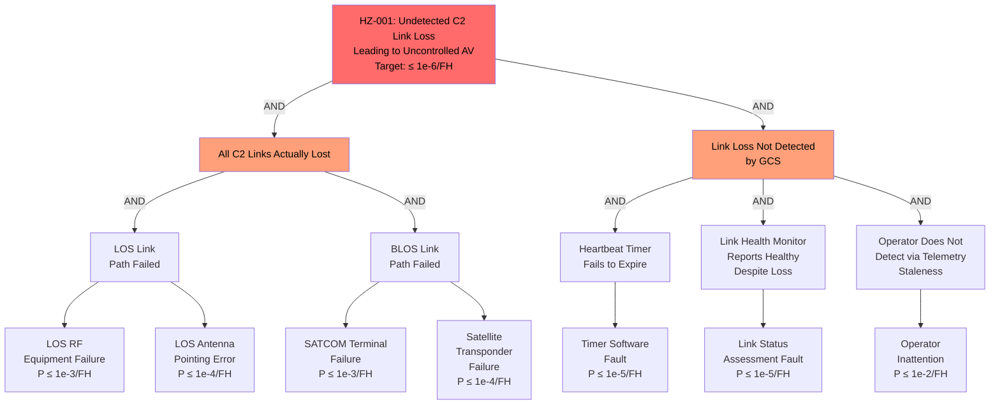

# Hazard Analysis

## Methodology

This hazard analysis follows MIL-STD-882E (Department of Defense Standard Practice: System Safety). The scope covers the UAS Ground Control Station as defined in the system boundary (README.md), analyzed across all operating modes (MODE-001 through MODE-005). The analysis applies the MIL-STD-882E hazard risk assessment process including hazard identification, initial risk assessment, hazard risk reduction, residual risk assessment, and risk acceptance.

## Terminology

| Term                | Definition (this system)                                                                    | Standard Reference       |
|---------------------|---------------------------------------------------------------------------------------------|--------------------------|
| Hazard              | A real or potential condition that could lead to an unplanned event resulting in death, injury, occupational illness, damage to or loss of equipment or property, or damage to the environment | MIL-STD-882E Section 3.7 |
| Mishap              | An unplanned event or series of events resulting in death, injury, occupational illness, damage to or loss of equipment or property, or damage to the environment | MIL-STD-882E Section 3.12 |
| Mishap Risk         | An expression of the impact and possibility of a mishap in terms of potential mishap severity and probability of occurrence | MIL-STD-882E Section 3.14 |
| Hazardous Situation | The exposure of personnel, equipment, or the environment to a hazard                        | MIL-STD-882E Section 3.8 |
| Harm                | Death, injury, occupational illness, damage to or loss of equipment or property, or damage to the environment | MIL-STD-882E Section 3.6 |
| Risk Acceptance Authority | The individual or organization responsible for accepting risk at the level assessed  | MIL-STD-882E Section 4.6 |

## MIL-STD-882E Risk Assessment Matrix

### Severity Categories

| Category | Description | Definition (this system)                                                                    |
|----------|-------------|---------------------------------------------------------------------------------------------|
| I        | Catastrophic| Could result in one or more deaths or loss of the air vehicle with ground impact in populated area |
| II       | Critical    | Could result in permanent partial disability, temporary total disability, major air vehicle damage, or major property damage |
| III      | Marginal    | Could result in minor injury, minor air vehicle damage, or minor property damage            |
| IV       | Negligible  | Could result in less than minor injury, less than minor equipment damage, or less than minor property damage |

### Probability Levels

| Level | Description        | Definition                                                  | Quantitative Guidance        |
|-------|--------------------|-------------------------------------------------------------|------------------------------|
| A     | Frequent           | Likely to occur often in the life of the system             | > 10^-1 per flight hour      |
| B     | Probable           | Will occur several times in the life of the system          | 10^-1 to 10^-2 per FH       |
| C     | Occasional         | Likely to occur sometime in the life of the system          | 10^-2 to 10^-3 per FH       |
| D     | Remote             | Unlikely but possible to occur in the life of the system    | 10^-3 to 10^-6 per FH       |
| E     | Improbable         | So unlikely, it can be assumed occurrence may not be experienced | < 10^-6 per FH           |

### Risk Assessment Matrix

| Severity \ Probability | A (Frequent) | B (Probable) | C (Occasional) | D (Remote) | E (Improbable) |
|------------------------|-------------|-------------|----------------|-----------|----------------|
| I (Catastrophic)       | High        | High        | Serious        | Medium    | Low            |
| II (Critical)          | High        | Serious     | Medium         | Medium    | Low            |
| III (Marginal)         | Serious     | Medium      | Medium         | Low       | Low            |
| IV (Negligible)        | Medium      | Low         | Low            | Low       | Low            |

### Risk Acceptance Authority

| Risk Level | Acceptance Authority                                              |
|------------|-------------------------------------------------------------------|
| High       | DASD(SE) or as delegated by Component Acquisition Executive (CAE) |
| Serious    | Program Executive Officer (PEO)                                   |
| Medium     | Program Manager (PM)                                              |
| Low        | As delegated by PM                                                |

## Assumptions and Preconditions

| Assumption ID | Statement                                                                                              | Validity Basis                       |
|---------------|--------------------------------------------------------------------------------------------------------|--------------------------------------|
| ASM-001       | The UAS operator crew is trained and current on GCS operations including lost link and emergency procedures. | Operator training per JUAS CoO       |
| ASM-002       | The air vehicle implements a pre-programmed lost link profile that maintains the AV within approved airspace until recovery or controlled disposal. | AV flight control system design; AV system safety assessment |
| ASM-003       | The SATCOM ground terminal and LOS antenna system are separate systems with independent failure modes from the GCS. | Ground infrastructure design; separate power and facilities |
| ASM-004       | Ground power system provides regulated power within MIL-STD-704 tolerances under normal and generator-backup conditions. | Shelter power system design |
| ASM-005       | ATC coordination procedures for UAS lost link events are established and followed by the controlling airspace authority. | FAA UAS operating procedures; LOA |

## Hazard Log

| HZ ID   | Description                                                         | Cause(s)                                                          | Effect                                                                      | MODE ID(s)        | Severity | Probability | Initial Risk | CTL ID(s)            | Residual Risk | Owner / Acceptance Authority | REQ ID(s)                               |
|---------|---------------------------------------------------------------------|-------------------------------------------------------------------|-----------------------------------------------------------------------------|-------------------|----------|-------------|--------------|----------------------|---------------|------------------------------|-----------------------------------------|
| HZ-001  | Undetected loss of all C2 links to air vehicle                      | C2 link monitoring failure; heartbeat timer fault; software fault in link status assessment | AV continues on last command without GCS awareness; AV may deviate into restricted airspace or populated area | MODE-001          | I        | D           | Medium       | CTL-001              | Low           | PM                           | REQ-FUN-006, REQ-SAF-001, REQ-SAF-004, REQ-SAF-006 |
| HZ-002  | Detected C2 link loss with delayed lost link procedure execution     | Software fault in lost link sequencing; operator overload delays ATC notification | AV executing autonomous profile but ATC not notified; mid-air collision risk with manned traffic | MODE-001, MODE-003 | I        | D           | Medium       | CTL-001, CTL-002     | Low           | PM                           | REQ-FUN-007, REQ-SAF-001, REQ-SAF-002 |
| HZ-003  | ACAS Xu advisory not presented or presented too late                 | Software fault in ACAS processing; C2 link latency exceeds deconfliction time window; display failure | UAS fails to execute avoidance maneuver; potential mid-air collision with cooperative or non-cooperative traffic | MODE-001          | I        | D           | Medium       | CTL-003              | Low           | PM                           | REQ-FUN-010                             |
| HZ-004  | Flight-safety commands starved by sensor video bandwidth             | Bandwidth allocation algorithm failure; QoS misconfiguration; sensor stream consumes all available bandwidth | Flight commands delayed or dropped; AV does not receive timely altitude/heading changes | MODE-001          | II       | D           | Medium       | CTL-006              | Low           | PM                           | REQ-FUN-013                             |
| HZ-005  | Inadvertent or unauthorized flight termination command               | Single-operator error; authentication bypass; software fault in termination logic | AV destroyed; potential ground casualties from unplanned impact location | MODE-001, MODE-005 | I        | D           | Medium       | CTL-005              | Low           | PM                           | REQ-FUN-008, REQ-SAF-003               |
| HZ-006  | Flight command routed to wrong air vehicle                           | Vehicle ID mismatch in routing table; software fault in multi-vehicle routing logic | Unintended AV executes command meant for different vehicle; potential airspace violation or collision | MODE-001          | II       | D           | Medium       | CTL-007              | Low           | PM                           | REQ-FUN-015, REQ-SAF-007               |
| HZ-007  | UAS exits approved geofence boundary                                | Geofence enforcement failure; operator overrides geofence; lost link profile does not respect geofence | AV enters restricted airspace or populated area; mid-air collision risk or ground impact risk | MODE-001, MODE-003 | I        | D           | Medium       | CTL-008              | Low           | PM                           | REQ-FUN-017, REQ-SAF-005               |
| HZ-008  | Corrupted mission plan accepted and transmitted to air vehicle       | Software fault in plan validation; data corruption in mission planning database | AV executes plan with invalid waypoints; potential terrain collision or airspace violation | MODE-001          | II       | D           | Medium       | CTL-008              | Low           | PM                           | REQ-FUN-002                             |
| HZ-009  | Loss of all GCS BIT detection allowing dispatch with latent faults   | BIT software fault; health monitoring covers insufficient fault modes | GCS operates with undetected faults that combine with active faults during mission; reduced safety margins | MODE-004, MODE-001 | III      | C           | Medium       | CTL-009              | Low           | PM                           | REQ-FUN-020                             |
| HZ-010  | Corrupted or tampered software loaded onto GCS                       | Maintenance error; media corruption; supply chain compromise | GCS operates with compromised flight-critical software; erroneous commands possible | MODE-004, MODE-001 | II       | D           | Medium       | CTL-010              | Low           | PM                           | REQ-FUN-021                             |
| HZ-011  | COMSEC failure exposes C2 link to interception or spoofing           | Cryptographic key compromise; COMSEC module failure; key management error | Adversary intercepts or injects commands on C2 link; AV executes adversary commands | MODE-001          | I        | E           | Low          | CTL-011              | Low           | Delegated by PM              | REQ-FUN-014                             |
| HZ-012  | Erroneous target coordinates transmitted downstream from mensuration | Software fault in coordinate computation; DEM data error; AV position error exceeds budget | Incorrect target location provided to PED/engagement chain; potential fratricide or collateral damage | MODE-001          | I        | D           | Medium       | CTL-012              | Low           | PM                           | REQ-FUN-019                             |

## Risk Controls

| CTL ID   | HZ ID(s)            | Description                                                                                       | Type                  | REQ ID(s)                                   | VER ID(s)                  | Residual Risk Contribution                    |
|----------|----------------------|---------------------------------------------------------------------------------------------------|-----------------------|---------------------------------------------|----------------------------|-----------------------------------------------|
| CTL-001  | HZ-001, HZ-002       | Dual-path C2 link heartbeat monitoring with independent timers and automatic lost link declaration | Reduction            | REQ-FUN-006, REQ-SAF-001, REQ-SAF-004, REQ-SAF-006 | VER-T-001, VER-T-002, VER-A-001 | Reduces undetected link loss probability to < 1e-6/FH |
| CTL-002  | HZ-002               | Automatic ATC notification on lost link declaration with pre-formatted message templates            | Protective measure   | REQ-FUN-007, REQ-SAF-002                    | VER-T-003                  | Ensures ATC notification within 60 seconds     |
| CTL-003  | HZ-003               | Dedicated ACAS processing pipeline with priority scheduling and latency budget enforcement          | Reduction            | REQ-FUN-010                                  | VER-T-004                  | Constrains ACAS advisory latency to < 2 seconds |
| CTL-004  | HZ-002               | Automatic C2 link failover from active to backup path within 5 seconds                              | Reduction            | REQ-FUN-011, REQ-SAF-002                    | VER-T-005                  | Minimizes single-path failure impact            |
| CTL-005  | HZ-005               | Two-operator authentication with physical key-turn and confirmation sequence for flight termination | Reduction            | REQ-FUN-008, REQ-SAF-003                    | VER-T-006                  | Prevents single-point human or software error causing termination |
| CTL-006  | HZ-004               | Guaranteed minimum bandwidth reservation for flight-critical command channel with QoS enforcement   | Reduction            | REQ-FUN-013                                  | VER-T-007, VER-A-002       | Ensures commands are never starved by sensor data |
| CTL-007  | HZ-006               | Vehicle ID validation on every outbound command with routing table cross-check                       | Reduction            | REQ-FUN-015, REQ-SAF-007                    | VER-T-008                  | Prevents command mis-routing to wrong AV        |
| CTL-008  | HZ-007, HZ-008       | Geofence boundary enforcement with plan validation and airspace deconfliction check                 | Reduction            | REQ-FUN-002, REQ-FUN-017, REQ-SAF-005       | VER-T-009, VER-T-010       | Prevents AV from entering unauthorized airspace |
| CTL-009  | HZ-009               | Power-up and continuous BIT with fault reporting to operator and mission recorder                    | Information for safety | REQ-FUN-020, REQ-SAF-008                   | VER-T-011                  | Detects latent faults before mission start      |
| CTL-010  | HZ-010               | Cryptographic hash verification of all software loads before operational acceptance                  | Reduction            | REQ-FUN-021                                  | VER-T-012                  | Prevents corrupted/tampered software from executing |
| CTL-011  | HZ-011               | Type 1 COMSEC with NSA-approved algorithms and OTAR key management                                  | Reduction            | REQ-FUN-014                                  | VER-T-013                  | Protects C2 link against interception and spoofing |
| CTL-012  | HZ-012               | Target mensuration cross-check against DEM data bounds and CEP validation against accuracy budget   | Reduction            | REQ-FUN-019                                  | VER-T-014, VER-A-003       | Constrains mensuration error to 10 m CEP budget  |

## Fault Analysis

### Fault Tree: Undetected C2 Link Loss Leading to Uncontrolled AV (HZ-001)

This fault tree decomposes the Catastrophic failure condition of undetected C2 link loss to basic events. The top-level probability target is 1 x 10^-6 per flight hour per the MIL-STD-882E risk assessment.

**Cut set analysis:**

The top event requires BOTH actual link loss AND failure of all detection mechanisms. The dominant cut set is:

- LOS failure (BE1) AND BLOS failure (BE3) AND Timer fault (BE5) AND Monitor fault (BE6) AND Operator inattention (BE7)
- P = 1e-3 x 1e-3 x 1e-5 x 1e-5 x 1e-2 = 1e-18/FH (well below 1e-6 target)

The dual-path C2 link architecture (CTL-001) combined with independent heartbeat monitoring and operator cross-check provides defense in depth. The quantitative analysis confirms the architecture meets the risk target with significant margin.

**Sensitivity:** The most sensitive parameters are the link path failure rates (BE1, BE3). If both link paths experience correlated failure (e.g., common power supply), the effective probability increases. Common-mode analysis addresses shared power (mitigated by independent power regulators) and shared ground infrastructure (mitigated by separate LOS and SATCOM facilities).

## MIL-STD-882E Risk Acceptance

### Risk Acceptance Summary

| HZ ID   | Initial Risk | Residual Risk | Acceptance Authority | Acceptance Status |
|---------|-------------|---------------|----------------------|-------------------|
| HZ-001  | Medium      | Low           | PM                   | Pending CDR       |
| HZ-002  | Medium      | Low           | PM                   | Pending CDR       |
| HZ-003  | Medium      | Low           | PM                   | Pending CDR       |
| HZ-004  | Medium      | Low           | PM                   | Pending CDR       |
| HZ-005  | Medium      | Low           | PM                   | Pending CDR       |
| HZ-006  | Medium      | Low           | PM                   | Pending CDR       |
| HZ-007  | Medium      | Low           | PM                   | Pending CDR       |
| HZ-008  | Medium      | Low           | PM                   | Pending CDR       |
| HZ-009  | Medium      | Low           | PM                   | Pending CDR       |
| HZ-010  | Medium      | Low           | PM                   | Pending CDR       |
| HZ-011  | Low         | Low           | Delegated by PM      | Pending CDR       |
| HZ-012  | Medium      | Low           | PM                   | Pending CDR       |

All risk acceptance is pending CDR review, where the System Safety Assessment Report (SSAR) will be presented to the risk acceptance authority chain. Post-CDR acceptance feeds into the TRR evidence package and the Test & Evaluation Master Plan (TEMP).

### Risk Acceptance Authority Chain

The MIL-STD-882E risk acceptance authority chain for this ACAT II program:

1. **Program Manager (PM)**: Accepts Medium and Low risks with documented rationale.
2. **Program Executive Officer (PEO)**: Accepts Serious risks; reviews PM risk acceptance decisions.
3. **DASD(SE)**: Accepts High risks; reviews PEO risk acceptance for Serious risks at milestone reviews.
4. **Component Acquisition Executive (CAE)**: Final authority for High risks not delegated by DASD(SE).

All risk acceptance decisions are documented in the System Safety Assessment Report (SSAR) per DI-SESS-81785A and presented at the CDR and TRR technical review gates.
