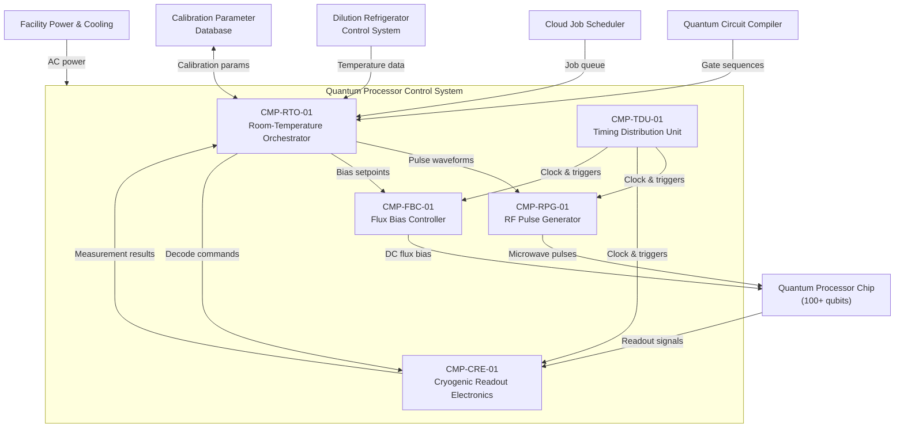
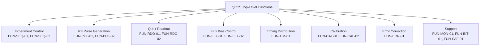

# Architecture

## System Context



## Functional Architecture

### System Functions

| FUN ID       | Function Name                      | Description                                                                  | Inputs                                | Outputs                              | Dependencies        |
|--------------|------------------------------------|------------------------------------------------------------------------------|---------------------------------------|--------------------------------------|----------------------|
| FUN-SEQ-01   | Experiment Sequencing              | Execute compiled quantum gate sequences as timed control pulses              | Gate sequences from compiler          | Pulse schedules to RPG, bias commands to FBC | FUN-TIM-01          |
| FUN-SEQ-02   | Job Queue Management               | Accept, prioritize, and dispatch quantum computation jobs from cloud queue   | Job descriptors from cloud scheduler  | Sequenced jobs to FUN-SEQ-01         | None                 |
| FUN-PUL-01   | RF Pulse Generation                | Generate shaped microwave waveforms at calibrated frequencies and amplitudes | Pulse parameters from RTO             | Analog RF pulses to qubit chip       | FUN-TIM-01           |
| FUN-PUL-02   | Pulse Amplitude Limiting           | Enforce hardware limits on RF output power to prevent qubit damage           | Pulse waveforms (pre-output)          | Power-limited waveforms, limit violation flags | None              |
| FUN-RDO-01   | Qubit State Readout                | Acquire and digitize readout resonator signals; discriminate qubit states    | Analog readout signals from chip      | Digitized IQ data, state discrimination results | FUN-TIM-01      |
| FUN-RDO-02   | Multiplexed Readout Processing     | Simultaneously read out multiple qubits via frequency-multiplexed signals    | Multiplexed readout signal            | Per-qubit state assignments          | FUN-RDO-01           |
| FUN-FLX-01   | Flux Bias Control                  | Set and maintain precision DC current for qubit frequency tuning             | Bias setpoints from RTO               | Regulated DC current to qubit chip   | FUN-TIM-01           |
| FUN-FLX-02   | Flux Bias Current Limiting         | Enforce hardware limits on bias current to prevent Josephson junction damage | Bias current (pre-output)             | Current-limited output, limit violation flags | None              |
| FUN-TIM-01   | Clock and Trigger Distribution     | Distribute phase-coherent clock and synchronization triggers to all subsystems | Reference oscillator input           | Distributed clock, trigger pulses    | None                 |
| FUN-CAL-01   | Automated Calibration Sequencing   | Execute calibration protocols (Rabi, Ramsey, T1, T2, randomized benchmarking) | Calibration protocol definitions     | Updated qubit parameters             | FUN-SEQ-01, FUN-RDO-01, FUN-PUL-01 |
| FUN-CAL-02   | Parameter Validation               | Validate calibrated parameters against physical bounds before acceptance     | Candidate parameters from FUN-CAL-01  | Validated parameters, rejection flags | None                |
| FUN-ERR-01   | Real-Time Error Correction Decoding| Decode syndrome measurements and compute correction operations within latency budget | Syndrome data from CRE        | Correction pulse commands to RPG     | FUN-RDO-01, FUN-PUL-01 |
| FUN-MON-01   | System Health Monitoring           | Monitor cryostat temperature, subsystem status, and performance metrics      | Temperature sensors, BIT results      | Health status, alarm flags           | None                 |
| FUN-BIT-01   | Built-In Test                      | Power-up and continuous self-test for all subsystems                         | Diagnostic commands                   | Fault reports, subsystem status      | None                 |
| FUN-SAF-01   | Safety Interlock Enforcement       | Enforce hardware-backed safety limits on RF power and flux bias current      | Limit threshold configuration         | Hardware interlock signals, trip logs | None                |

### Functional Decomposition



## Physical Architecture

### Component Hierarchy

| CMP ID        | Component Name                         | Type     | Parent        | Description                                                        |
|---------------|----------------------------------------|----------|---------------|--------------------------------------------------------------------|
| CMP-RTO-01    | Room-Temperature Orchestrator          | Subsystem| System        | Rack-mounted server running orchestration, calibration, and error correction software |
| CMP-RTO-01A   | Orchestration Software                 | Software | CMP-RTO-01    | Experiment sequencing engine and job queue manager                  |
| CMP-RTO-01B   | Calibration Automation Software        | Software | CMP-RTO-01    | Automated calibration protocol execution and parameter management  |
| CMP-RTO-01C   | Error Correction Decoder               | Software | CMP-RTO-01    | Real-time syndrome decoder with hardware acceleration (GPU/FPGA)   |
| CMP-RTO-01D   | Safety Monitor Software                | Software | CMP-RTO-01    | SIL 2 safety function monitoring and limit enforcement software    |
| CMP-RTO-01E   | Sequence Formal Verifier               | Software | CMP-RTO-01    | Formally verified control sequence checker                         |
| CMP-RPG-01    | RF Pulse Generator                     | Subsystem| System        | Multi-channel arbitrary waveform generator for microwave pulse synthesis |
| CMP-RPG-01A   | AWG Channel Cards                      | Hardware | CMP-RPG-01    | DAC-based waveform generation cards (14-bit, 2.4 GSPS per channel) |
| CMP-RPG-01B   | RF Upconversion Module                 | Hardware | CMP-RPG-01    | IQ mixer and local oscillator for baseband-to-microwave conversion |
| CMP-RPG-01C   | Output Power Limiter                   | Hardware | CMP-RPG-01    | Hardware-enforced RF power ceiling with analog comparator trip      |
| CMP-RPG-01D   | Pulse Sequencer FPGA                   | Hardware | CMP-RPG-01    | FPGA controlling waveform memory and real-time pulse scheduling    |
| CMP-CRE-01    | Cryogenic Readout Electronics          | Subsystem| System        | FPGA-based readout at 4 K stage for qubit state discrimination    |
| CMP-CRE-01A   | 4K Readout FPGA                        | Hardware | CMP-CRE-01    | Cryogenic-rated FPGA performing digitization and state discrimination |
| CMP-CRE-01B   | ADC Front-End                          | Hardware | CMP-CRE-01    | Analog-to-digital conversion at 4 K (1 GSPS, 12-bit)             |
| CMP-CRE-01C   | Signal Conditioning Module             | Hardware | CMP-CRE-01    | Amplification and filtering at 4 K stage                          |
| CMP-CRE-01D   | Readout Discrimination Firmware        | Firmware | CMP-CRE-01A   | State discrimination algorithm implemented in FPGA fabric         |
| CMP-FBC-01    | Flux Bias Controller                   | Subsystem| System        | Precision DC current sources for qubit frequency tuning           |
| CMP-FBC-01A   | Precision DAC Modules                  | Hardware | CMP-FBC-01    | 20-bit DACs with sub-nA current noise for flux bias generation    |
| CMP-FBC-01B   | Current Limiter Circuit                | Hardware | CMP-FBC-01    | Hardware current clamp preventing junction-damaging bias levels   |
| CMP-FBC-01C   | Bias Sequencer FPGA                    | Hardware | CMP-FBC-01    | FPGA managing DAC update sequencing and real-time bias control    |
| CMP-TDU-01    | Timing Distribution Unit               | Subsystem| System        | Clock synthesizer and trigger distribution network                |
| CMP-TDU-01A   | Reference Oscillator                   | Hardware | CMP-TDU-01    | Ultra-low-phase-noise 10 GHz reference oscillator (OCXO-disciplined) |
| CMP-TDU-01B   | Clock Distribution Network             | Hardware | CMP-TDU-01    | Fanout buffers and matched-length cabling for phase-coherent distribution |
| CMP-TDU-01C   | Trigger Sequencer FPGA                 | Hardware | CMP-TDU-01    | FPGA generating programmable trigger patterns with <50 ps jitter  |
| CMP-SAF-01    | Safety Interlock Module                | Subsystem| System        | Independent hardware safety system enforcing RF and flux limits   |
| CMP-SAF-01A   | Safety PLC                             | Hardware | CMP-SAF-01    | IEC 61508 SIL 2 rated programmable logic controller               |
| CMP-SAF-01B   | Analog Comparator Trip Circuits        | Hardware | CMP-SAF-01    | Hardware-level analog comparators for RF power and flux current monitoring |

### Physical Architecture Diagram

```mermaid
graph TB
    subgraph ROOM["Room Temperature (300 K)"]
        RTO["CMP-RTO-01<br/>Orchestrator Server"]
        RPG["CMP-RPG-01<br/>RF Pulse Generator"]
        FBC["CMP-FBC-01<br/>Flux Bias Controller"]
        TDU["CMP-TDU-01<br/>Timing Distribution"]
        SAF["CMP-SAF-01<br/>Safety Interlock"]
    end

    subgraph CRYO4K["Cryogenic (4 K Stage)"]
        CRE["CMP-CRE-01<br/>Readout Electronics"]
    end

    subgraph CRYO20MK["Cryogenic (20 mK Stage)"]
        CHIP["Qubit Chip<br/>(External)"]
    end

    RTO -->|PCIe / Ethernet| RPG
    RTO -->|PCIe / Ethernet| FBC
    RTO -->|Ethernet| CRE
    TDU -->|Clock & triggers| RPG
    TDU -->|Clock & triggers| CRE
    TDU -->|Clock & triggers| FBC
    SAF -->|Interlock signals| RPG
    SAF -->|Interlock signals| FBC
    SAF -->|Status| RTO
    RPG -->|RF coax (attenuated)| CHIP
    FBC -->|DC wiring (filtered)| CHIP
    CHIP -->|Readout coax| CRE
    CRE -->|Ethernet / optical| RTO
```

## Allocation

| FUN ID       | REQ ID(s)                                          | CMP ID(s)                             | Assurance Level | Rationale                                                    |
|--------------|-----------------------------------------------------|---------------------------------------|-----------------|--------------------------------------------------------------|
| FUN-SEQ-01   | REQ-FUN-001, REQ-FUN-002, REQ-FUN-003              | CMP-RTO-01A                           | Non-SIL         | Experiment sequencing is operational; damage prevented by independent safety interlock |
| FUN-SEQ-02   | REQ-FUN-004                                         | CMP-RTO-01A                           | Non-SIL         | Job management is operational scheduling                     |
| FUN-PUL-01   | REQ-FUN-005, REQ-FUN-006                            | CMP-RPG-01A, CMP-RPG-01B, CMP-RPG-01D| Non-SIL         | Pulse generation is operational; power limits enforced by CMP-RPG-01C |
| FUN-PUL-02   | REQ-FUN-007, REQ-SAF-001, REQ-SAF-002              | CMP-RPG-01C, CMP-SAF-01A, CMP-SAF-01B| SIL 2           | Hardware power limiting is safety-critical (qubit damage prevention) |
| FUN-RDO-01   | REQ-FUN-008, REQ-FUN-009                            | CMP-CRE-01A, CMP-CRE-01B, CMP-CRE-01D| Non-SIL        | Readout quality affects experiment results but is not safety-critical |
| FUN-RDO-02   | REQ-FUN-010                                         | CMP-CRE-01A, CMP-CRE-01D             | Non-SIL         | Multiplexed readout is a performance optimization            |
| FUN-FLX-01   | REQ-FUN-011, REQ-FUN-012                            | CMP-FBC-01A, CMP-FBC-01C             | Non-SIL         | Flux bias setting is operational; current limits enforced by CMP-FBC-01B |
| FUN-FLX-02   | REQ-FUN-013, REQ-SAF-003, REQ-SAF-004              | CMP-FBC-01B, CMP-SAF-01A, CMP-SAF-01B| SIL 2           | Hardware current limiting is safety-critical (junction damage prevention) |
| FUN-TIM-01   | REQ-FUN-014, REQ-FUN-015                            | CMP-TDU-01A, CMP-TDU-01B, CMP-TDU-01C| Non-SIL        | Timing accuracy affects gate fidelity but is not safety-critical |
| FUN-CAL-01   | REQ-FUN-016, REQ-FUN-017                            | CMP-RTO-01B                           | SIL 2           | Calibration sequences can drive outputs into unsafe regions  |
| FUN-CAL-02   | REQ-FUN-018, REQ-SAF-005                            | CMP-RTO-01B, CMP-RTO-01D             | SIL 2           | Parameter validation prevents unsafe calibration results     |
| FUN-ERR-01   | REQ-FUN-019, REQ-FUN-020                            | CMP-RTO-01C                           | Non-SIL         | Error correction is performance-critical but not safety-critical |
| FUN-MON-01   | REQ-FUN-021, REQ-FUN-022                            | CMP-RTO-01D                           | SIL 2           | Health monitoring detects safety-relevant conditions          |
| FUN-BIT-01   | REQ-FUN-023                                         | CMP-RTO-01, CMP-RPG-01, CMP-CRE-01, CMP-FBC-01, CMP-TDU-01 | Non-SIL | Self-test supports maintenance but is not itself safety-critical |
| FUN-SAF-01   | REQ-SAF-006, REQ-SAF-007, REQ-SAF-008, REQ-SAF-009, REQ-SAF-010 | CMP-SAF-01A, CMP-SAF-01B | SIL 2  | Independent safety interlock is the primary safety barrier   |

## Interfaces

### External Interfaces

| IFC ID       | Partner System                    | Data Item                           | Direction     | Protocol          | Timing                 |
|--------------|-----------------------------------|-------------------------------------|---------------|-------------------|------------------------|
| IFC-EXT-001  | Quantum Circuit Compiler          | Compiled gate sequences             | In            | REST API / gRPC   | Per job submission      |
| IFC-EXT-002  | Cloud Job Scheduler               | Job descriptors, priority, status   | Bidirectional | REST API          | Event-driven            |
| IFC-EXT-003  | Dilution Refrigerator Control     | Temperature readings, cryostat status | In          | Ethernet (Modbus TCP) | 1 Hz polling         |
| IFC-EXT-004  | Quantum Processor Chip            | Microwave control pulses            | Out           | RF coaxial (analog) | Pulse-timed (ns-scale) |
| IFC-EXT-005  | Quantum Processor Chip            | DC flux bias currents               | Out           | DC wiring (filtered) | Continuous / step-updated |
| IFC-EXT-006  | Quantum Processor Chip            | Readout resonator signals           | In            | RF coaxial (analog) | Pulse-timed (us-scale) |
| IFC-EXT-007  | Calibration Parameter Database    | Qubit parameters (frequencies, T1, T2, gate params) | Bidirectional | Filesystem / REST API | Per calibration cycle |
| IFC-EXT-008  | Facility Power System             | AC mains power                      | In            | Electrical (120/240V) | Continuous            |

### Internal Interfaces

| IFC ID       | Source CMP ID  | Target CMP ID  | Data Item                                | Mechanism           | Timing               |
|--------------|----------------|-----------------|------------------------------------------|---------------------|----------------------|
| IFC-INT-001  | CMP-RTO-01A    | CMP-RPG-01D     | Pulse waveform parameters and schedules  | PCIe Gen3 / Ethernet| Per sequence (<1 ms) |
| IFC-INT-002  | CMP-RTO-01A    | CMP-FBC-01C     | Flux bias setpoint vectors               | PCIe Gen3 / Ethernet| Per sequence (<1 ms) |
| IFC-INT-003  | CMP-CRE-01A    | CMP-RTO-01C     | Syndrome measurement results             | Ethernet / optical  | Per measurement cycle (<1 us) |
| IFC-INT-004  | CMP-RTO-01C    | CMP-RPG-01D     | Error correction pulse commands          | PCIe direct / shared memory | <1 us round-trip    |
| IFC-INT-005  | CMP-TDU-01A    | CMP-RPG-01D     | Reference clock (10 GHz)                 | RF coaxial          | Continuous            |
| IFC-INT-006  | CMP-TDU-01C    | CMP-RPG-01D     | Trigger pulses                           | LVDS / coaxial      | <50 ps jitter         |
| IFC-INT-007  | CMP-TDU-01C    | CMP-CRE-01A     | Trigger pulses                           | LVDS / optical      | <50 ps jitter         |
| IFC-INT-008  | CMP-TDU-01C    | CMP-FBC-01C     | Trigger pulses                           | LVDS / coaxial      | <50 ps jitter         |
| IFC-INT-009  | CMP-SAF-01A    | CMP-RPG-01C     | RF power interlock (enable/trip)         | Hardwired discrete  | <10 us response       |
| IFC-INT-010  | CMP-SAF-01A    | CMP-FBC-01B     | Flux current interlock (enable/trip)     | Hardwired discrete  | <10 us response       |
| IFC-INT-011  | CMP-SAF-01A    | CMP-RTO-01D     | Safety status and trip log               | Ethernet            | 10 ms polling         |
| IFC-INT-012  | CMP-RTO-01B    | CMP-RTO-01D     | Calibration parameter candidates         | Internal API        | Per calibration step  |
| IFC-INT-013  | CMP-RTO-01E    | CMP-RTO-01A     | Sequence verification result (pass/fail) | Internal API        | Per job (<100 ms)     |

## Failure Containment / Partitioning

### Cryogenic / Room-Temperature Boundary

The physical separation between room-temperature electronics (300 K) and cryogenic electronics (4 K) provides natural failure containment. The cryogenic boundary enforces:

- **Thermal isolation.** A failure in room-temperature electronics (e.g., RPG power supply fault) cannot directly raise the 4 K stage temperature. The cryostat thermal mass and cryocooler provide independent thermal regulation. However, sustained RF power through the cryogenic wiring can deposit heat at the mixing chamber stage.
- **Signal isolation.** The cryogenic coaxial cables include calibrated attenuators at each temperature stage. These attenuators limit the maximum power deliverable to the 20 mK stage regardless of room-temperature electronics behavior. This provides a passive safety barrier independent of the active interlock system.
- **Access isolation.** The CRE firmware cannot be updated without a cryostat warmup cycle, making firmware tampering during operation impractical.

### Safety Interlock Independence

The Safety Interlock Module (CMP-SAF-01) is architecturally independent of the control path:

- **Separate hardware.** The safety PLC (CMP-SAF-01A) is a dedicated IEC 61508 SIL 2 rated controller with no shared processing, memory, or power supply with the RTO or any other control subsystem.
- **Hardwired trip circuits.** The analog comparator trip circuits (CMP-SAF-01B) operate on analog signals tapped directly from the RPG output and FBC output stages. These circuits function even if the safety PLC itself fails, providing a defense-in-depth layer.
- **Independent sensing.** The safety system uses its own analog sense points for RF power and flux current measurement, independent of the measurements used by the control software for calibration.

### Software Partitioning within RTO

The RTO server hosts multiple software components with different criticality levels:

| Partition          | Components                          | Criticality | Isolation Mechanism                        |
|--------------------|-------------------------------------|-------------|--------------------------------------------|
| Safety Monitor     | CMP-RTO-01D                         | SIL 2       | Separate process with OS-level memory protection; watchdog-supervised |
| Calibration Engine | CMP-RTO-01B                         | SIL 2       | Separate process; communicates with Safety Monitor via validated IPC |
| Orchestration      | CMP-RTO-01A                         | Non-SIL     | Standard process isolation; cannot bypass Safety Monitor limits |
| Error Correction   | CMP-RTO-01C                         | Non-SIL     | Real-time priority process; cannot modify safety parameters |
| Formal Verifier    | CMP-RTO-01E                         | Non-SIL     | Stateless verification; no persistent state or hardware access |

## Architecture Decisions

### AD-01: Independent Hardware Safety Interlock over Software-Only Limits

**Decision:** Implement RF power and flux bias current limits as independent hardware interlocks (CMP-SAF-01) rather than relying solely on software enforcement in the orchestration or calibration software.

**Rationale:** The primary safety hazard is qubit array damage from out-of-range control signals. Software-only limits can be defeated by software bugs, misconfiguration, or race conditions during calibration. A hardware interlock with analog comparator trip circuits provides a defense layer that operates independently of all software, meeting the IEC 61508 SIL 2 architectural constraint for a safety function that relies on independence from the control function.

**Trade-off:** Additional hardware cost and complexity. The hardware interlock introduces a small insertion loss in the RF signal path (<0.5 dB) and adds a potential failure mode (spurious trip). Accepted because hardware independence is the standard approach for SIL 2 safety functions in process control systems.

### AD-02: 4 K FPGA for Readout over Room-Temperature Digitization

**Decision:** Place the readout FPGA (CMP-CRE-01A) and ADC (CMP-CRE-01B) at the 4 K stage inside the cryostat rather than routing analog readout signals to room-temperature digitization.

**Rationale:** Routing analog readout signals from the 20 mK stage to room temperature introduces cable loss, thermal noise from higher-temperature stages, and bandwidth limitations from cryogenic cable attenuation. Digitizing at 4 K preserves signal-to-noise ratio and enables real-time state discrimination close to the qubit, reducing the round-trip latency critical for error correction. The 4 K stage has sufficient cooling power (1.5 W typical from a pulse-tube cryocooler) to support low-power FPGA operation within the thermal budget.

**Trade-off:** The CRE firmware cannot be updated without a cryostat warmup/cooldown cycle (48+ hours). Component selection is limited to parts qualified for 4 K operation. Accepted because the SNR and latency benefits are essential for high-fidelity readout of 100+ qubits.

### AD-03: Centralized Timing Distribution over Per-Subsystem Clocking

**Decision:** Use a centralized Timing Distribution Unit (CMP-TDU-01) with a single reference oscillator and distributed clock/trigger network rather than allowing each subsystem to use independent clock sources synchronized via PTP or similar protocols.

**Rationale:** Two-qubit gates require sub-nanosecond relative timing between RF pulse channels. Network-based synchronization protocols (IEEE 1588 PTP) achieve microsecond-level accuracy at best, three orders of magnitude too coarse. A centralized reference oscillator with matched-length clock distribution achieves <100 ps channel-to-channel skew, meeting the timing requirements for high-fidelity gate operations.

**Trade-off:** Single point of failure for timing. If the TDU reference oscillator fails, all qubit control is lost. Mitigated by oscillator redundancy monitoring (FUN-MON-01) and the fact that a timing failure causes gate fidelity degradation (detectable) rather than equipment damage (the safety interlock is independent of timing).

### AD-04: Formal Verification of Control Sequences

**Decision:** Require formal verification of compiled gate sequences (CMP-RTO-01E) before execution rather than relying solely on runtime bounds checking.

**Rationale:** Quantum gate sequences can contain hundreds of thousands of pulses with complex timing dependencies. Runtime bounds checking alone cannot verify global properties like absence of frequency collisions, adherence to qubit-specific power budgets, or timing constraint satisfaction across all channels simultaneously. Formal verification using model checking or SMT solvers can prove these properties hold for the entire sequence before any hardware is activated.

**Trade-off:** Formal verification adds latency to the job pipeline (up to 100 ms for large circuits). Accepted because the verification latency is small compared to typical job compilation time, and the consequence of executing an invalid sequence ranges from wasted experiment time to potential qubit damage (if the sequence exploits a gap in runtime bounds checking).

### AD-05: GPU-Accelerated Error Correction Decoder

**Decision:** Implement the real-time error correction decoder (CMP-RTO-01C) on a GPU accelerator rather than a dedicated FPGA decoder board.

**Rationale:** Surface code decoding algorithms (minimum-weight perfect matching, union-find) are computationally intensive and evolving rapidly. GPU implementation provides flexibility to swap decoder algorithms without hardware redesign, leverages the massive parallelism of modern GPUs for large code distances, and benefits from the mature GPU software ecosystem. The PCIe Gen4 interface between the GPU and the RTO server provides sufficient bandwidth for syndrome data transfer within the latency budget.

**Trade-off:** GPU decoding introduces non-deterministic latency jitter from the GPU scheduler and PCIe bus. For the target code distance (d=5 to d=7), the worst-case decode latency on a modern GPU is <500 ns, within the 1 us budget. For future scaling to higher code distances, a dedicated FPGA decoder may be required.
