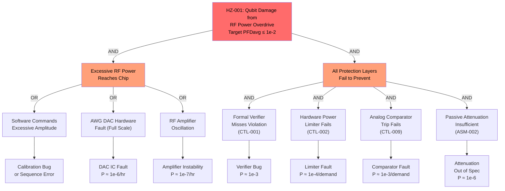

# Hazard Analysis

## Methodology

This hazard analysis follows IEC 61508 (Functional Safety of Electrical/Electronic/Programmable Electronic Safety-Related Systems) Parts 1-7 with FMEA/FMECA at the component level per IEC 60812. The scope covers the Quantum Processor Control System as defined in the system boundary (README.md), analyzed across all operating modes (MODE-001 through MODE-005).

The analysis progresses through:
- **Hazard and Risk Analysis**: Identification and classification of hazardous events and hazardous situations at the system level per IEC 61508 Part 1 Section 7.4.
- **FMEA/FMECA**: Failure mode, effects, and criticality analysis at the component level for safety-relevant subsystems per IEC 60812.
- **SIL Determination**: Assignment of Safety Integrity Level based on risk reduction required per IEC 61508 Part 5.
- **Safety Function Definition**: Specification of safety instrumented functions (SIFs) and their SIL targets.

## Terminology

| Term                | Definition (this system)                                                                 | Standard Reference       |
|---------------------|------------------------------------------------------------------------------------------|--------------------------|
| Hazard              | Source of potential damage to the quantum processor chip, cryogenic hardware, or personnel through electrical overstress | IEC 61508 Part 4 Section 3.1.2 |
| Cause               | The failure event, external event, or combination thereof that produces the hazardous event | IEC 61508 Part 4 Section 3.1.3 |
| Failure Mode        | The manner in which a component or function fails (e.g., output high, output stuck, loss of output, erratic output) | IEC 60812 Section 3.2 |
| Hazardous Event     | The occurrence of the hazard in conjunction with the operational conditions that leads to harm | IEC 61508 Part 4 Section 3.1.4 |
| Harm                | Damage to quantum processor chip (Josephson junction failure), cryogenic hardware damage, or thermal excursion | IEC 61508 Part 4 Section 3.1.1 |
| Severity            | Classification of consequence: Catastrophic (chip destruction + cryostat damage), Critical (chip damage, recoverable), Marginal (experiment corruption), Negligible (no damage) | IEC 61508 Part 5 risk matrix |

## Assumptions and Preconditions

| Assumption ID | Statement                                                                                          | Validity Basis                   |
|---------------|-----------------------------------------------------------------------------------------------------|----------------------------------|
| ASM-001       | The dilution refrigerator provides independent thermal regulation and the cryostat will not reach temperatures above 4 K at the readout stage without independent alarm. | Cryostat manufacturer specifications; independent temperature monitoring system |
| ASM-002       | Cryogenic coaxial cable attenuation at each temperature stage limits maximum deliverable RF power to the chip to approximately -10 dBm even if room-temperature electronics output saturates. | Measured cable attenuation; attenuator specifications per cryostat wiring design |
| ASM-003       | The quantum processor chip can withstand RF power up to -15 dBm and flux bias current up to 8 mA without permanent damage, with safety margins of 5 dB and 2 mA respectively. | Chip manufacturer test data; Josephson junction critical current specifications |
| ASM-004       | Operators are trained in QPCS operation including emergency shutdown procedures and calibration safety protocols. | Operator training program; standard operating procedures |
| ASM-005       | The facility power system provides conditioned AC mains with UPS backup of at least 10 minutes, sufficient for a controlled shutdown sequence. | Facility infrastructure specification |

## Hazard Log

| HZ ID   | Description                                                              | Cause(s)                                                          | Effect                                                                         | MODE ID(s)            | Severity    | Likelihood    | Initial Risk | CTL ID(s)            | Residual Risk | Owner / Acceptance Authority | REQ ID(s)                                    |
|---------|--------------------------------------------------------------------------|-------------------------------------------------------------------|--------------------------------------------------------------------------------|-----------------------|-------------|---------------|--------------|----------------------|---------------|------------------------------|----------------------------------------------|
| HZ-001  | RF power overdrive damaging qubit Josephson junctions                    | Software commanding excessive pulse amplitude; AWG DAC fault producing full-scale output; RF amplifier oscillation | Permanent Josephson junction failure on affected qubits; partial or total chip loss | MODE-001, MODE-002    | Critical    | Occasional    | High         | CTL-001, CTL-002     | Acceptable    | Safety officer               | REQ-FUN-007, REQ-SAF-001, REQ-SAF-002       |
| HZ-002  | Flux bias current overdrive damaging Josephson junctions                 | Software commanding excessive current; DAC fault producing full-scale output; calibration exploring outside safe range | Permanent junction damage on affected qubits; qubit frequency shift or open circuit | MODE-001, MODE-002    | Critical    | Occasional    | High         | CTL-003, CTL-004     | Acceptable    | Safety officer               | REQ-FUN-013, REQ-SAF-003, REQ-SAF-004       |
| HZ-003  | Calibration sequence driving outputs into unsafe parameter region        | Calibration algorithm exploring beyond safe bounds; parameter database corruption providing wrong starting points | Transient or permanent qubit damage if hardware limits not triggered; wasted calibration time | MODE-002              | Critical    | Probable      | High         | CTL-005, CTL-002, CTL-003 | Acceptable | Safety officer               | REQ-SAF-005, REQ-FUN-018                     |
| HZ-004  | Cryogenic thermal excursion during active qubit control                  | Cryocooler compressor failure; helium leak; excessive heat load from control electronics at 4 K | Qubit coherence loss; thermal shock to chip and cryogenic components; potential helium contamination | MODE-001, MODE-004    | Catastrophic| Remote        | High         | CTL-006              | Acceptable    | Safety officer / cryogenic engineer | REQ-FUN-021                                  |
| HZ-005  | Safety interlock system failure leaving control outputs unprotected       | Safety PLC hardware fault; analog comparator drift; interlock wiring fault | Loss of safety barrier; subsequent control fault can cause HZ-001 or HZ-002 without detection | MODE-001, MODE-002, MODE-004 | Catastrophic | Improbable | High    | CTL-008, CTL-009     | Acceptable    | Safety officer               | REQ-SAF-006, REQ-SAF-007, REQ-SAF-008, REQ-SAF-009 |
| HZ-006  | Timing synchronization loss causing simultaneous multi-qubit damage      | TDU reference oscillator failure; clock distribution network fault; trigger sequencer FPGA fault | Multiple qubits receive out-of-sync pulses; potential frequency collision causing multi-qubit damage | MODE-001, MODE-004    | Critical    | Remote        | Medium       | CTL-007              | Acceptable    | Safety officer               | REQ-FUN-003                                  |
| HZ-007  | Formal verifier failure passing an unsafe sequence                       | Verifier software bug; model incomplete; timeout treated as pass | Sequence with power/frequency violations executes; potential for HZ-001 or HZ-002 | MODE-001              | Critical    | Improbable    | Medium       | CTL-001, CTL-002, CTL-003 | Acceptable | Safety officer               | REQ-FUN-003                                  |
| HZ-008  | Cryogenic readout electronics failure causing persistent high-power readout | CRE FPGA firmware fault; ADC stuck at full-scale output driving readout resonator continuously | Excessive microwave power at mixing chamber stage from readout channel; localized heating | MODE-001, MODE-004    | Marginal    | Remote        | Low          | CTL-006, CTL-010     | Acceptable    | Control electronics engineer | REQ-FUN-022                                  |
| HZ-009  | Unauthorized modification of safety interlock limits                     | Intentional or accidental modification of safety PLC parameters; calibration range override without proper authorization | Safety limits set too high, reducing protective margin; subsequent fault can cause damage | MODE-002, MODE-005    | Critical    | Improbable    | Medium       | CTL-009, CTL-011     | Acceptable    | Safety officer               | REQ-SAF-010                                  |
| HZ-010  | Power supply fault causing simultaneous loss of safety and control       | Common power supply failure affecting both RTO and safety PLC; facility power loss without proper UPS switchover | Control outputs may drive to undefined state during power transient; safety system unavailable to protect | MODE-001, MODE-002    | Critical    | Remote        | Medium       | CTL-008, CTL-012     | Acceptable    | Safety officer / facility ops | REQ-SAF-009                                  |

## Risk Controls

| CTL ID   | HZ ID(s)             | Description                                                                                     | Type                | REQ ID(s)                              | VER ID(s)                 | Residual Risk Contribution                  |
|----------|----------------------|-------------------------------------------------------------------------------------------------|---------------------|----------------------------------------|---------------------------|---------------------------------------------|
| CTL-001  | HZ-006, HZ-007       | Formal verification of gate sequences before execution, checking timing, power, and frequency constraints | Reduction          | REQ-FUN-003                            | VER-T-003, VER-FV-001     | Prevents known-unsafe sequences from reaching hardware |
| CTL-002  | HZ-001, HZ-003, HZ-007 | Hardware RF power limiter with analog comparator trip at -20 dBm at cryostat input flange    | Reduction           | REQ-FUN-007, REQ-SAF-001, REQ-SAF-002 | VER-T-001, VER-T-002      | Limits RF power regardless of software state |
| CTL-003  | HZ-002, HZ-003, HZ-007 | Hardware flux bias current limiter with analog clamp at 10 mA per channel                     | Reduction           | REQ-FUN-013, REQ-SAF-003, REQ-SAF-004 | VER-T-004, VER-T-005      | Limits current regardless of software state |
| CTL-004  | HZ-002               | Automatic detection and response to flux current trip events with operator acknowledgment required | Protective measure | REQ-SAF-004                            | VER-T-005                  | Ensures controlled response to current exceedance |
| CTL-005  | HZ-003               | Software-enforced calibration parameter validation against physical bounds with Safety Monitor approval | Reduction         | REQ-FUN-018, REQ-SAF-005              | VER-T-013, VER-T-014      | Catches calibration errors before they reach hardware limits |
| CTL-006  | HZ-004, HZ-008       | Cryostat temperature monitoring with automatic output inhibition on thermal excursion          | Protective measure  | REQ-FUN-021                            | VER-T-015                  | Prevents control during thermal event |
| CTL-007  | HZ-006               | TDU lock monitoring with automatic output inhibition on loss of timing synchronization         | Protective measure  | REQ-FUN-003, REQ-FUN-022              | VER-T-003, VER-T-017       | Prevents operation without valid timing reference |
| CTL-008  | HZ-005, HZ-010       | Safety PLC self-diagnostic with automatic safe-state transition on internal fault detection     | Reduction          | REQ-SAF-006, REQ-SAF-009              | VER-T-006, VER-T-007      | Detects safety system faults before they become dangerous |
| CTL-009  | HZ-005, HZ-009       | Analog comparator trip circuits operating independently of safety PLC with dedicated sense points | Reduction         | REQ-SAF-008                            | VER-T-008, VER-I-001      | Provides protection even if digital safety system fails |
| CTL-010  | HZ-008               | Continuous CRE health monitoring with automatic CRE power-down on anomaly detection            | Protective measure  | REQ-FUN-022                            | VER-T-017                  | Limits duration of CRE fault condition |
| CTL-011  | HZ-009               | Tamper-evident audit log with role-based access control for safety parameter changes            | Information for safety | REQ-SAF-010                         | VER-T-018, VER-I-002      | Detects unauthorized safety parameter modifications |
| CTL-012  | HZ-010               | Independent power supplies for safety PLC and control electronics with UPS backup               | Reduction          | REQ-SAF-009                            | VER-T-007                 | Prevents common power failure from disabling both control and safety |

## Fault Analysis

### FMEA: RF Pulse Generator (CMP-RPG-01) — Safety-Relevant Failure Modes

| Item | Failure Mode | Local Effect | System Effect | HZ ID | Severity | Detection Method | Detection Coverage | Recommended Action |
|------|-------------|-------------|--------------|-------|----------|-----------------|-------------------|-------------------|
| CMP-RPG-01A (AWG Card) | DAC output stuck at full scale | Maximum amplitude waveform on affected channel | RF power at chip exceeds safe limit on affected qubit(s) | HZ-001 | Critical | Hardware power limiter (CTL-002); continuous output monitoring | >99% (analog comparator) | Power limiter trips; channel inhibited |
| CMP-RPG-01A (AWG Card) | DAC output stuck at zero | No pulse output on affected channel | Gate operations fail on affected qubit(s); no safety impact | — | Negligible | BIT detects missing output; experiment error detected | >95% | Replace AWG card |
| CMP-RPG-01A (AWG Card) | DAC output erratic (noise) | Random amplitude variations | Reduced gate fidelity; potential transient power exceedances | HZ-001 | Marginal | Power limiter for exceedances; fidelity monitoring | >90% | Power limiter prevents damage; flag channel for replacement |
| CMP-RPG-01B (Upconversion) | LO oscillator failure | No RF output or wrong frequency | Gates on affected qubit fail; possible frequency collision with adjacent qubit | HZ-006 | Critical | LO lock detection; formal verifier catches frequency violations | >95% | Inhibit channel; recalibrate |
| CMP-RPG-01B (Upconversion) | Mixer imbalance degradation | Increased image/LO leakage | Reduced gate fidelity; spectral leakage to adjacent qubits | HZ-001 | Marginal | Periodic calibration measurement | >80% | Schedule replacement; adjust calibration |
| CMP-RPG-01C (Power Limiter) | Limiter fails open (no limiting) | Safety barrier lost on affected channel | Subsequent DAC fault can deliver damaging power to chip | HZ-005 | Catastrophic | Safety PLC monitoring of limiter status; analog comparator as backup | >99% | Analog comparator (CTL-009) provides backup; immediate maintenance |
| CMP-RPG-01C (Power Limiter) | Limiter fails closed (always limiting) | Channel permanently suppressed | Loss of control on affected qubit(s); no safety impact | — | Negligible | BIT detects missing output | >95% | Replace limiter module |
| CMP-RPG-01D (Sequencer FPGA) | Firmware hang | Pulse sequencing stops | Gate operations halt on all channels in FPGA; safety interlock unaffected | — | Marginal | Watchdog timer resets FPGA | >95% | Reset and re-initialize |

### FMEA: Flux Bias Controller (CMP-FBC-01) — Safety-Relevant Failure Modes

| Item | Failure Mode | Local Effect | System Effect | HZ ID | Severity | Detection Method | Detection Coverage | Recommended Action |
|------|-------------|-------------|--------------|-------|----------|-----------------|-------------------|-------------------|
| CMP-FBC-01A (Precision DAC) | DAC output stuck at full scale | Maximum current on affected channel | Flux bias current exceeds safe limit; junction damage on affected qubit | HZ-002 | Critical | Hardware current limiter (CTL-003); current monitoring | >99% (analog clamp) | Current limiter clamps; channel zeroed |
| CMP-FBC-01A (Precision DAC) | DAC output noise above specification | Excess current noise | Qubit frequency jitter; reduced coherence; no safety impact below limit | — | Marginal | Periodic noise measurement during calibration | >80% | Replace DAC module |
| CMP-FBC-01B (Current Limiter) | Limiter fails open (no clamping) | Safety barrier lost on affected channel | Subsequent DAC fault can deliver damaging current | HZ-005 | Catastrophic | Safety PLC monitoring; analog comparator as backup | >99% | Analog comparator provides backup; immediate maintenance |
| CMP-FBC-01C (Bias Sequencer FPGA) | FPGA registers corrupted | Incorrect bias values on multiple channels | Multiple qubits at wrong frequency; potential current exceedance | HZ-002 | Critical | Current limiter; ECC on FPGA configuration memory | >95% | Current limiter prevents damage; FPGA reset |

### FMEA: Safety Interlock Module (CMP-SAF-01) — Common-Cause Analysis

| Item | Failure Mode | Local Effect | System Effect | HZ ID | Severity | Detection Method | Detection Coverage | Recommended Action |
|------|-------------|-------------|--------------|-------|----------|-----------------|-------------------|-------------------|
| CMP-SAF-01A (Safety PLC) | PLC processor fault | Safety logic stops executing | Digital safety barrier lost; analog comparators still active | HZ-005 | Critical | PLC self-diagnostic; watchdog; RTO monitors PLC heartbeat | >99% | RTO transitions to safe state (REQ-SAF-009); analog comparators provide backup |
| CMP-SAF-01A (Safety PLC) | PLC communication fault | Status/trip data not received by RTO | RTO loses safety status visibility; analog trips still functional | HZ-005 | Critical | Communication timeout detection (REQ-SAF-009) | >99% | Safe state transition within 200 ms |
| CMP-SAF-01B (Analog Comparator) | Comparator threshold drift | Trip point above or below design value | Limiter may trip too early (nuisance) or too late (reduced protection margin) | HZ-005 | Critical | Periodic calibration check during MODE-005 | >90% | Schedule recalibration; margin analysis |
| CMP-SAF-01B (Analog Comparator) | Comparator stuck not-tripped | No trip signal regardless of input | Analog backup protection lost; PLC and software limits still active | HZ-005 | Critical | BIT injects known over-limit signal during MODE-005 diagnostic | >95% | Replace comparator circuit |

### Fault Tree: Qubit Damage from RF Power Overdrive (HZ-001)

**Cut set analysis:**

The top event requires BOTH an excessive RF power condition AND simultaneous failure of all four protection layers. The dominant cut set is:

- Software error (BE1) AND Verifier misses (BE4) AND Power limiter fails (BE5) AND Comparator fails (BE6)
- P = (assumed demand) x 1e-3 x 1e-4 x 1e-3 = 1e-10 per demand (well below SIL 2 PFDavg target of 1e-2)

The defense-in-depth architecture (formal verification, hardware limiter, analog comparator, passive attenuation) provides multiple independent barriers. The hardware limiter (CTL-002) and analog comparator (CTL-009) together achieve a combined PFDavg well within the SIL 2 target.

### SIL Determination

| Safety Function | Hazardous Event | Consequence | Risk Without Protection | Required Risk Reduction | SIL Assignment |
|----------------|----------------|-------------|------------------------|------------------------|----------------|
| RF power limiting | HZ-001: RF overdrive | Chip damage (~$500K-$2M) | High (occasional software errors likely) | 10^-1 to 10^-2 PFDavg | SIL 2 |
| Flux bias current limiting | HZ-002: Current overdrive | Junction damage (~$500K-$2M) | High (occasional software errors likely) | 10^-1 to 10^-2 PFDavg | SIL 2 |
| Calibration parameter validation | HZ-003: Unsafe calibration | Chip damage (as above) | High (calibration explores parameter space) | 10^-1 to 10^-2 PFDavg | SIL 2 |
| Thermal excursion shutdown | HZ-004: Thermal event | Chip + cryostat damage | Medium (cryostat has independent protection) | 10^-1 PFDavg | SIL 1 (advisory; cryostat has primary protection) |

## FMECA Summary

### Detection Coverage Summary

| Subsystem | Number of Safety-Relevant Failure Modes | Average Detection Coverage | Minimum Detection Coverage | Notes |
|-----------|----------------------------------------|---------------------------|---------------------------|-------|
| CMP-RPG-01 (RF Pulse Generator) | 8 | 94% | 80% (mixer imbalance) | Hardware limiter provides high coverage for power exceedances |
| CMP-FBC-01 (Flux Bias Controller) | 4 | 94% | 80% (DAC noise) | Current limiter provides high coverage for current exceedances |
| CMP-SAF-01 (Safety Interlock) | 4 | 96% | 90% (comparator drift) | Self-diagnostic and dual-layer design |
| CMP-CRE-01 (Cryogenic Readout) | 2 | 88% | 80% (marginal severity only) | Health monitoring; not safety-critical |
| CMP-TDU-01 (Timing Distribution) | 2 | 95% | 90% (lock detection) | Timing loss causes fidelity degradation, not damage |

### Overall Safety Assessment

The FMECA demonstrates that all Critical and Catastrophic failure modes have at least two independent detection/protection mechanisms. The hardware interlock (CMP-SAF-01) with analog comparator backup (CTL-009) provides the primary safety barrier, while formal verification (CTL-001) and software parameter validation (CTL-005) provide defense-in-depth. No single-point failure can lead to a Catastrophic hazardous event when all protection layers are operational. The residual risk of qubit damage is dominated by the common-cause failure scenario (HZ-005) where the safety interlock itself fails, which is mitigated by the independent analog comparator circuits and the passive cryogenic cable attenuation.
