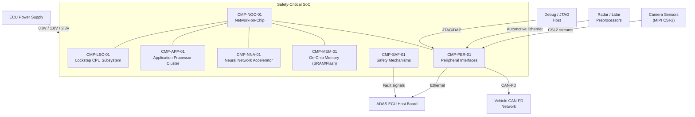

# Architecture

## System Context

## Functional Architecture

| FUN ID       | Function Name                        | Description                                                              | Inputs                                | Outputs                              | Dependencies        |
|--------------|--------------------------------------|--------------------------------------------------------------------------|---------------------------------------|--------------------------------------|----------------------|
| FUN-EXE-01   | Safety-Critical Execution            | Execute ASIL D safety functions in lockstep CPU pair                      | Safety application code, sensor data  | Actuation commands, diagnostic status | FUN-MEM-01, FUN-SAF-01 |
| FUN-EXE-02   | Application Processing               | Execute ADAS perception and planning algorithms on application cluster   | Sensor fusion data, map data          | Object lists, path plans             | FUN-MEM-01           |
| FUN-NNA-01   | Neural Network Inference             | Execute DNN inference for object detection and classification            | Image frames, feature maps            | Detection results, classifications   | FUN-MEM-01           |
| FUN-MEM-01   | Memory Protection and Correction     | Provide ECC-protected SRAM/flash access with background scrubbing        | Read/write requests                   | Corrected data, ECC error flags      | None                 |
| FUN-NOC-01   | Interconnect Partitioning            | Enforce bandwidth and latency guarantees between mixed-criticality masters | Bus transactions from all masters    | Arbitrated, partitioned bus access   | None                 |
| FUN-SAF-01   | Hardware Safety Monitoring           | Monitor lockstep, voltage, temperature, clock; assert fault signals      | Analog monitors, comparator outputs   | Fault signals, safe-state triggers   | None                 |
| FUN-BIT-01   | Power-On Self-Test                   | Execute MBIST on SRAM, LBIST on logic, verify safety mechanism function  | Power-on trigger                      | BIST pass/fail, fault reports        | None                 |
| FUN-IO-01    | Sensor Input Processing              | Receive and frame camera, radar, and lidar data from peripheral ports    | CSI-2, Ethernet, CAN-FD streams      | Framed sensor data to memory         | FUN-MEM-01           |

## Physical Architecture

### Component Hierarchy

| CMP ID        | Component Name                        | Type      | Parent   | Description                                                        |
|---------------|---------------------------------------|-----------|----------|--------------------------------------------------------------------|
| CMP-LSC-01    | Lockstep CPU Subsystem                | Hardware  | System   | Dual Cortex-R52 cores with split-lock comparator for ASIL D execution |
| CMP-LSC-01A   | Cortex-R52 Core Pair                  | Hardware  | CMP-LSC-01 | Dual cores executing identical instruction streams in lockstep     |
| CMP-LSC-01B   | Split-Lock Comparator                 | Hardware  | CMP-LSC-01 | Cycle-by-cycle signature comparison with 2-cycle fault detection   |
| CMP-APP-01    | Application Processor Cluster         | Hardware  | System   | Quad Cortex-A78AE with split/lock capability for performance ADAS compute |
| CMP-NNA-01    | Neural Network Accelerator            | Hardware  | System   | 8 TOPS INT8 inference engine with dedicated SRAM                   |
| CMP-MEM-01    | On-Chip Memory Subsystem              | Hardware  | System   | 4 MB SRAM with inline ECC + 16 MB flash with ECC and secure boot  |
| CMP-MEM-01A   | SRAM Array with Inline ECC            | Hardware  | CMP-MEM-01 | SEC-DED ECC with single-cycle correction and background scrub      |
| CMP-MEM-01B   | Flash with ECC and Secure Boot ROM    | Hardware  | CMP-MEM-01 | Embedded flash for firmware storage with integrity checking        |
| CMP-NOC-01    | Network-on-Chip                       | Hardware  | System   | Time-division / credit-based interconnect with end-to-end parity   |
| CMP-SAF-01    | Safety Mechanism Block                | Hardware  | System   | Watchdog, voltage monitor, temperature monitor, clock monitor      |
| CMP-PER-01    | Peripheral Interface Block            | Hardware  | System   | CSI-2, Automotive Ethernet, CAN-FD, SPI, JTAG controllers         |

## Allocation

| FUN ID       | REQ ID(s)                                    | CMP ID(s)                          | Assurance Level | Rationale                                                    |
|--------------|----------------------------------------------|-------------------------------------|-----------------|--------------------------------------------------------------|
| FUN-EXE-01   | REQ-FUN-002                                  | CMP-LSC-01                          | ASIL D          | Lockstep execution provides ASIL D diagnostic coverage       |
| FUN-EXE-02   | REQ-FUN-001                                  | CMP-APP-01                          | QM              | Application processing is not safety-critical; faults detected by system-level checks |
| FUN-NNA-01   | REQ-FUN-005                                  | CMP-NNA-01                          | QM              | NNA outputs are validated by safety-critical post-processing |
| FUN-MEM-01   | REQ-FUN-003, REQ-FUN-004                     | CMP-MEM-01                          | ASIL D          | Memory is shared by safety functions; ECC and scrub are safety mechanisms |
| FUN-NOC-01   | REQ-SAF-003                                  | CMP-NOC-01                          | ASIL D          | Freedom from interference requires ASIL D interconnect partitioning |
| FUN-SAF-01   | REQ-SAF-001, REQ-SAF-002, REQ-SAF-004, REQ-SAF-005 | CMP-SAF-01                   | ASIL D          | Safety monitoring functions require highest integrity         |
| FUN-BIT-01   | REQ-SAF-001, REQ-SAF-002                     | CMP-LSC-01, CMP-MEM-01, CMP-SAF-01 | ASIL D          | BIST coverage directly contributes to SPFM and LFM metrics   |
| FUN-IO-01    | REQ-FUN-006, REQ-IFC-001, REQ-IFC-002        | CMP-PER-01                          | QM              | Sensor input is validated by downstream safety functions      |

## Interfaces

### External Interfaces

| IFC ID       | Partner System                  | Data Item                               | Direction     | Protocol             | Timing                 |
|--------------|---------------------------------|-----------------------------------------|---------------|----------------------|------------------------|
| IFC-EXT-001  | Camera Sensors                  | Raw image frames (up to 8 streams)      | In            | MIPI CSI-2 (4-lane)  | Frame rate (30-60 fps) |
| IFC-EXT-002  | Radar/Lidar Preprocessors       | Point clouds, target lists              | In            | 100BASE-T1 Ethernet  | 50 ms cycle            |
| IFC-EXT-003  | ADAS ECU Host                   | Actuation commands, diagnostic status   | Bidirectional | 100BASE-T1 Ethernet  | < 5 us link latency    |
| IFC-EXT-004  | Vehicle CAN-FD Network          | Safety messages, vehicle state          | Bidirectional | CAN-FD (5 Mbit/s)    | 10 ms cycle            |
| IFC-EXT-005  | Debug Host                      | Debug trace, register access            | Bidirectional | JTAG / CoreSight DAP | On demand              |
| IFC-EXT-006  | ECU Power Supply                | Core/IO supply rails                    | In            | Electrical (DC)      | Continuous              |

### Internal Interfaces

| IFC ID       | Source CMP ID  | Target CMP ID  | Data Item                                | Mechanism              | Timing               |
|--------------|----------------|-----------------|------------------------------------------|------------------------|----------------------|
| IFC-INT-001  | CMP-LSC-01     | CMP-NOC-01      | Safety CPU bus transactions              | AXI with parity        | Single-cycle         |
| IFC-INT-002  | CMP-APP-01     | CMP-NOC-01      | Application CPU bus transactions         | AXI                    | Single-cycle         |
| IFC-INT-003  | CMP-NNA-01     | CMP-NOC-01      | DMA read/write for inference data        | AXI                    | Burst transfers      |
| IFC-INT-004  | CMP-NOC-01     | CMP-MEM-01      | Memory read/write with ECC              | AXI with ECC sideband  | Single-cycle (ECC)   |
| IFC-INT-005  | CMP-SAF-01     | CMP-LSC-01      | Lockstep fault acknowledge               | Hardwired discrete     | < 2 clock cycles     |
| IFC-INT-006  | CMP-SAF-01     | IFC-EXT-003     | Safe-state assertion to ECU host         | GPIO / interrupt       | < 10 us              |

## Failure Containment / Partitioning

### Lockstep CPU Isolation

The lockstep subsystem (CMP-LSC-01) runs ASIL D safety functions with hardware-enforced error detection. The split-lock comparator (CMP-LSC-01B) operates on independent clock-domain-crossing logic, ensuring that a single transient fault in one core does not propagate to the comparator itself. Upon mismatch detection, the comparator asserts a non-maskable interrupt to the safety mechanism block and simultaneously signals the ECU host via IFC-INT-006. The application processor cluster (CMP-APP-01) operates independently; a lockstep fault does not corrupt application core state.

### NoC Mixed-Criticality Partitioning

The Network-on-Chip (CMP-NOC-01) enforces bandwidth reservation and latency caps through credit-based flow control. ASIL D masters (CMP-LSC-01) receive guaranteed minimum bandwidth and maximum latency bounds. QM masters (CMP-APP-01, CMP-NNA-01) are constrained to remaining bandwidth. End-to-end parity on all NoC transactions detects data corruption during transport. Formal verification confirms that no QM transaction pattern can violate the guaranteed ASIL D access timing.

### Safety Mechanism Independence

The safety mechanism block (CMP-SAF-01) operates from an independent clock source and voltage reference. The voltage monitor compares the supply rail against an internal bandgap reference, the temperature monitor uses an on-chip diode with factory-trimmed calibration, and the watchdog timer runs from a dedicated RC oscillator independent of the system PLL. This ensures that a single PLL failure or supply glitch is detected rather than corrupting both the safety monitor and the monitored logic.

## Architecture Decisions

### AD-01: Split-Lock Comparator over Cycle-by-Cycle Comparison

**Decision:** Compare instruction-retired signatures rather than full pipeline state every clock cycle.

**Rationale:** Full cycle-by-cycle comparison of dual Cortex-R52 pipelines at 1.5 GHz would require matching all pipeline register outputs, creating extreme timing closure pressure on the comparator logic. Signature-based comparison (hashing committed architectural state) reduces comparator fan-in and meets timing at the target frequency while maintaining > 99.9% fault detection coverage per ISO 26262-11 Annex D analysis.

**Trade-off:** Signature comparison introduces a 2-cycle detection latency (the pipeline may execute 1-2 additional instructions before a fault is flagged). Accepted because the watchdog and software-level health checks provide a secondary detection layer for any fault that propagates within this window.

### AD-02: Inline ECC over Parity for SRAM Protection

**Decision:** Implement full SEC-DED (single-error-correct, double-error-detect) ECC on all SRAM accesses rather than simpler parity protection.

**Rationale:** Parity detects single-bit errors but cannot correct them, requiring the entire safety function to treat every parity error as a detected-but-uncorrected fault, driving up the residual fault rate beyond the PMHF budget. Inline ECC with single-cycle correction allows single-bit soft errors to be transparently corrected, keeping the PMHF contribution from SRAM below 1 FIT.

**Trade-off:** ECC adds approximately 12% area overhead to the SRAM array (check bits) and introduces a small critical-path delay for the ECC decoder. Accepted because SRAM area is the dominant contributor to both SPFM and PMHF budgets.

### AD-03: Dedicated Safety Mechanism Block over Distributed Monitors

**Decision:** Centralize watchdog, voltage monitor, temperature monitor, and clock monitor into a single safety mechanism block (CMP-SAF-01) with an independent clock and power domain.

**Rationale:** Distributing monitors within each subsystem creates dependency between the monitor and the monitored logic (shared clock, shared power). A centralized, independent block with its own clock reference and voltage reference can detect failures in the system PLL, system power supply, and system clock simultaneously, without the monitored failure also disabling the monitor.

**Trade-off:** Centralization means the safety block is a single point of failure for all monitoring functions. Mitigated by internal redundancy (dual comparators in the voltage/temperature monitors) and by the external ECU-level watchdog as a secondary safety layer.
