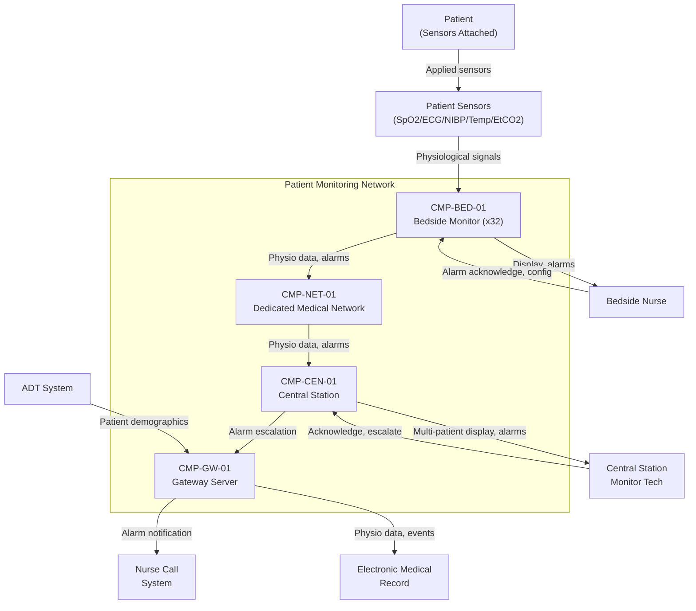

# Architecture

## System Context

## Functional Architecture

| FUN ID       | Function Name                     | Description                                                                   | Inputs                                       | Outputs                                     | Dependencies      |
|--------------|-----------------------------------|-------------------------------------------------------------------------------|----------------------------------------------|---------------------------------------------|--------------------|
| FUN-ACQ-01   | Parameter Acquisition             | Acquire, digitize, and process physiological signals from patient sensors     | Raw sensor signals (SpO2, ECG, NIBP, temp, EtCO2) | Processed parameters, waveforms           | None               |
| FUN-ALM-01   | Bedside Alarm Management          | Detect alarm conditions, assign priorities per IEC 60601-1-8, annunciate locally | Processed parameters, alarm limits          | Audible/visual alarms, alarm events         | FUN-ACQ-01         |
| FUN-DSP-01   | Bedside Display                   | Render waveforms, numeric parameters, and alarm status on bedside screen     | Processed parameters, alarm state            | Display content                             | FUN-ACQ-01         |
| FUN-NET-01   | Network Data Transmission         | Transmit physiological data and alarm events from bedside to central station  | Processed data, alarm events                 | Network packets                             | FUN-ACQ-01         |
| FUN-AGG-01   | Central Alarm Aggregation         | Receive, aggregate, and display alarms from all bedside monitors             | Network alarm events                         | Multi-patient alarm display, escalation queue | FUN-NET-01         |
| FUN-ESC-01   | Alarm Escalation                  | Escalate unacknowledged alarms to nurse call system after timeout            | Unacknowledged alarm events, timeout         | Nurse call notification                     | FUN-AGG-01         |
| FUN-LOG-01   | Data Logging and Trending         | Store physiological data for retrospective review and trend analysis         | Processed parameters                         | Trend database, event log                   | FUN-ACQ-01         |
| FUN-ADT-01   | Patient-Monitor Association       | Associate patient demographics with bedside monitor via ADT integration      | ADT messages, bed assignments                | Patient context for display and EMR         | FUN-NET-01         |

## Physical Architecture

| CMP ID        | Component Name                         | Type     | Parent       | Description                                                          |
|---------------|----------------------------------------|----------|--------------|----------------------------------------------------------------------|
| CMP-BED-01    | Bedside Monitor                        | Assembly | System       | Multi-parameter patient monitor with display and local alarms        |
| CMP-BED-01A   | SpO2 Acquisition Module                | Module   | CMP-BED-01   | Pulse oximetry signal processing (pleth waveform, SpO2, pulse rate)  |
| CMP-BED-01B   | ECG Acquisition Module                 | Module   | CMP-BED-01   | ECG signal processing (3/5/12-lead, heart rate, arrhythmia detection) |
| CMP-BED-01C   | Multi-Parameter Module (NIBP/Temp/EtCO2) | Module | CMP-BED-01   | NIBP inflation control, temperature digitization, capnography processing |
| CMP-BED-01D   | Alarm Management Software              | Software | CMP-BED-01   | Alarm condition detection, priority assignment, delay logic, suppression rules |
| CMP-BED-01E   | Alarm Annunciator                      | Hardware | CMP-BED-01   | Speaker, LED indicators for audible/visual alarm annunciation        |
| CMP-BED-01F   | Network Interface                      | Hardware | CMP-BED-01   | Medical-grade Ethernet with isolation transformer (2 MOPP)           |
| CMP-BED-01G   | Bedside Display                        | Hardware | CMP-BED-01   | 12-inch color display with touchscreen for waveforms and parameters  |
| CMP-BED-01H   | Bedside Processor                      | Board    | CMP-BED-01   | ARM processor running parameter acquisition, alarm, display software |
| CMP-NET-01    | Dedicated Medical Network              | Infrastructure | System  | Managed Ethernet switches, shielded cabling, medical isolation       |
| CMP-CEN-01    | Central Station                        | Assembly | System       | Multi-patient monitoring display and alarm aggregation workstation   |
| CMP-CEN-01A   | Central Display and Alarm Engine       | HW/SW    | CMP-CEN-01   | Multi-patient display rendering, alarm aggregation, nurse assignment |
| CMP-CEN-01B   | Central Station Server                 | Hardware | CMP-CEN-01   | Server hardware for data aggregation, trending, storage              |
| CMP-CEN-01C   | Alarm Escalation Module                | Software | CMP-CEN-01   | Unacknowledged alarm timeout tracking and nurse call escalation logic |
| CMP-GW-01     | Gateway Server                         | HW/SW    | System       | Protocol translation between monitoring network and hospital systems |

## Allocation

| FUN ID       | REQ ID(s)                                  | CMP ID(s)                                      | Assurance Level   | Rationale                                                     |
|--------------|---------------------------------------------|------------------------------------------------|-------------------|---------------------------------------------------------------|
| FUN-ACQ-01   | REQ-FUN-001                                | CMP-BED-01A, CMP-BED-01B, CMP-BED-01C, CMP-BED-01H | IEC 62304 Class B | Parameter measurement error can lead to missed clinical events |
| FUN-ALM-01   | REQ-FUN-002, REQ-FUN-003, REQ-SAF-002     | CMP-BED-01D, CMP-BED-01E                      | IEC 62304 Class B | Alarm failure can delay intervention for life-threatening conditions |
| FUN-DSP-01   | REQ-FUN-001 (display aspect)               | CMP-BED-01G, CMP-BED-01H                      | IEC 62304 Class B | Display failure is detectable; alarms function independently   |
| FUN-NET-01   | REQ-FUN-004, REQ-SAF-001, REQ-SAF-003     | CMP-BED-01F, CMP-NET-01                       | IEC 62304 Class A | Network failure degrades to local monitoring; no direct harm path |
| FUN-AGG-01   | REQ-FUN-005                                | CMP-CEN-01A, CMP-CEN-01B                      | IEC 62304 Class B | Central station failure leaves bedside monitoring intact       |
| FUN-ESC-01   | REQ-FUN-006                                | CMP-CEN-01C, CMP-GW-01                        | IEC 62304 Class A | Escalation failure does not affect primary bedside alarms      |
| FUN-LOG-01   | REQ-PRF-001 (implicit)                     | CMP-BED-01H, CMP-CEN-01B                      | IEC 62304 Class A | Logging failure does not affect real-time monitoring or alarms |
| FUN-ADT-01   | REQ-IFC-002                                | CMP-GW-01, CMP-CEN-01A                        | IEC 62304 Class A | ADT integration failure requires manual patient-monitor association |

## Interfaces

### External Interfaces

| IFC ID       | Partner System              | Data Item                                   | Direction     | Protocol             | Timing                     |
|--------------|-----------------------------|---------------------------------------------|---------------|----------------------|----------------------------|
| IFC-EXT-001  | Patient Sensors             | Physiological signals (analog/digital)      | In            | Proprietary sensor protocols | Continuous (parameter-specific) |
| IFC-EXT-002  | Electronic Medical Record   | Physiological data, alarm events            | Out           | HL7 v2 / FHIR       | Within 60 s of event       |
| IFC-EXT-003  | Nurse Call System           | Escalated alarm notifications               | Out           | Dry-contact / IP     | Within 30 s of escalation  |
| IFC-EXT-004  | ADT System                  | Patient demographics, bed assignments       | In            | HL7 v2 ADT           | Event-driven               |

### Internal Interfaces

| IFC ID       | Source CMP ID   | Target CMP ID   | Data Item                                | Mechanism              | Timing                  |
|--------------|-----------------|------------------|------------------------------------------|------------------------|-------------------------|
| IFC-INT-001  | CMP-BED-01A/B/C | CMP-BED-01H     | Digitized physiological parameters       | Internal bus (SPI/I2C) | Parameter-specific rate  |
| IFC-INT-002  | CMP-BED-01H     | CMP-BED-01D      | Processed parameters for alarm checking  | Shared memory          | Per parameter update     |
| IFC-INT-003  | CMP-BED-01D     | CMP-BED-01E      | Alarm activation commands                | GPIO / I2S             | < 200 ms from detection  |
| IFC-INT-004  | CMP-BED-01F     | CMP-NET-01        | Physiological data packets, alarm events | Ethernet (TCP/UDP)     | Continuous streaming     |
| IFC-INT-005  | CMP-NET-01      | CMP-CEN-01A       | Aggregated bedside data and alarm events | Ethernet (TCP/UDP)     | < 2 s network transit    |
| IFC-INT-006  | CMP-CEN-01C     | CMP-GW-01         | Escalation commands                      | TCP socket             | Event-driven             |

## Failure Containment / Partitioning

The architecture uses a layered monitoring model where each layer operates independently, so failure of an outer layer does not degrade the inner layer.

**Bedside independence (innermost layer):** Each bedside monitor is a self-contained monitoring device. Local parameter acquisition, alarm detection, alarm annunciation, and display function independently of the network and central station. Network failure triggers MODE-004 but does not degrade bedside monitoring. This ensures patient safety is maintained even during complete network outage.

**Central station as supplementary layer:** The central station provides multi-patient visibility and alarm escalation as an additional layer of protection. Central station failure does not affect any bedside monitor's ability to acquire parameters, detect alarms, or annunciate locally. Alarm escalation to nurse call is lost during central station failure, but bedside alarms remain fully functional.

**Network isolation:** The dedicated monitoring network (CMP-NET-01) is physically separated from the hospital general-purpose network. Medical-grade isolation transformers on each bedside network interface (CMP-BED-01F) provide 2 MOPP electrical isolation, preventing patient-to-patient and patient-to-ground leakage current paths through the network cabling. The gateway server (CMP-GW-01) is the sole connection point between the monitoring network and hospital systems, providing a defined security and safety boundary.

## Architecture Decisions

### AD-01: Dedicated Medical Network over Shared Hospital Network

**Decision:** Deploy a physically dedicated Ethernet network for the monitoring system rather than using VLANs on the shared hospital network.

**Rationale:** IEC 80001-1 risk management for the monitoring network identified that shared network congestion, broadcast storms, and security events on the hospital network could violate the 5-second alarm latency budget. A dedicated network eliminates cross-traffic interference and simplifies the network risk analysis. Physical separation also provides inherent electrical isolation for patient safety.

**Trade-off:** Higher infrastructure cost (dedicated switches, cabling). Accepted because the alarm latency guarantee and patient safety isolation justify the dedicated infrastructure.

### AD-02: Bedside-First Alarm Architecture over Central-First

**Decision:** Implement alarm detection and annunciation at the bedside monitor as the primary alarm pathway, with central station alarm aggregation as a secondary backup layer.

**Rationale:** A central-first alarm architecture (where alarm detection occurs at the central station from streamed data) introduces the network as a single point of failure for alarm notification. If the network fails, no alarms are generated. The bedside-first architecture ensures alarm detection and annunciation are available even during complete network outage (MODE-004). The central station adds value through multi-patient aggregation and escalation, but is not required for patient safety.

**Trade-off:** Alarm logic runs on each bedside monitor (duplicated computation). Accepted because the safety independence of bedside alarm detection outweighs the efficiency of centralized alarm processing.

### AD-03: Configurable Alarm Delay with Non-Delayable Lethal Arrhythmia Exceptions

**Decision:** Allow clinician-configurable alarm delay (0-30 seconds) for all parameters except lethal arrhythmias (asystole, ventricular fibrillation) and apnea, which are always annunciated immediately.

**Rationale:** Alarm fatigue is a recognized patient safety problem. Configurable delay reduces nuisance alarms from transient artifacts (motion, cuff inflation, probe repositioning) without delaying notification of immediately life-threatening conditions. The non-delayable exception list is fixed by the manufacturer and not clinician-configurable, ensuring that the most critical alarms cannot be inadvertently suppressed.

**Trade-off:** Some genuine but non-lethal alarm conditions (e.g., moderate tachycardia) may be delayed by up to 30 seconds. Accepted because the reduction in alarm fatigue improves overall clinician responsiveness to genuine alarms per published alarm fatigue research.
