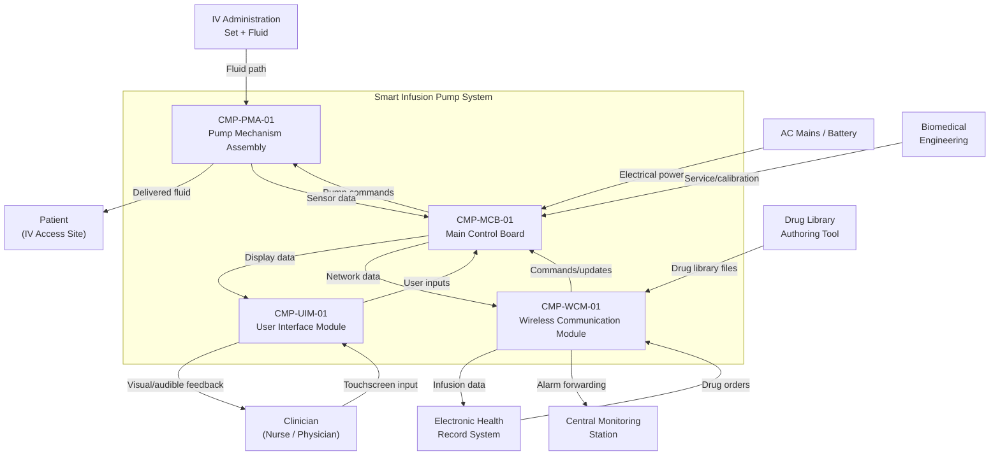
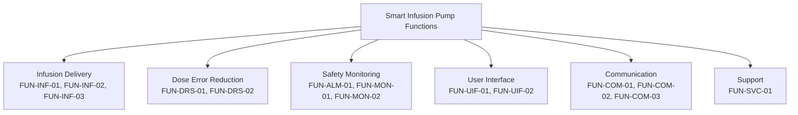
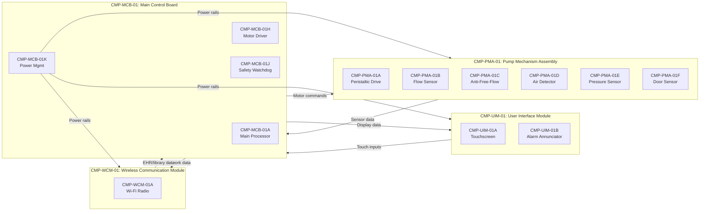

# Architecture

## System Context

## Functional Architecture

### System Functions

| FUN ID       | Function Name                  | Description                                                                    | Inputs                                  | Outputs                                  | Dependencies      |
|--------------|--------------------------------|--------------------------------------------------------------------------------|-----------------------------------------|------------------------------------------|--------------------|
| FUN-INF-01   | Infusion Rate Control          | Regulate peristaltic pump to deliver fluid at the programmed rate              | Programmed rate, flow sensor feedback    | Motor drive commands, actual flow rate    | FUN-MON-01         |
| FUN-INF-02   | Volume Tracking                | Accumulate delivered volume and compare against programmed VTBI               | Flow sensor pulses, programmed VTBI     | Volume infused, volume remaining          | FUN-INF-01         |
| FUN-INF-03   | Bolus Delivery                 | Deliver clinician-initiated bolus at elevated rate with volume limit           | Bolus rate, bolus volume, clinician command | Motor drive commands, bolus progress    | FUN-INF-01, FUN-DRS-01 |
| FUN-DRS-01   | Dose Error Reduction (DERS)    | Check programmed parameters against drug library limits                        | Drug selection, concentration, dose, rate | Soft/hard limit alerts, override logging | None               |
| FUN-DRS-02   | Drug Library Management        | Store, validate, and activate drug library datasets                           | Library files from WCM, activation command | Active drug library, library version ID | FUN-COM-01         |
| FUN-ALM-01   | Alarm Management               | Detect alarm conditions, prioritize, annunciate audible/visual alarms         | Sensor data, system status               | Alarm signals (audio, visual, data)      | FUN-MON-01         |
| FUN-MON-01   | Infusion Monitoring            | Continuously monitor flow, pressure, air-in-line, and door status             | Flow sensor, pressure sensor, air detector, door sensor | Monitoring status, alarm triggers | None               |
| FUN-MON-02   | Battery Management             | Monitor battery state of charge, estimate remaining runtime, manage charging  | Battery voltage, current, temperature    | SoC, runtime estimate, charge commands   | None               |
| FUN-UIF-01   | User Interface Control         | Render display screens, process touch inputs, manage workflow navigation      | MCB display data, touch events           | Screen content, parsed user commands     | None               |
| FUN-UIF-02   | Infusion Programming           | Guide clinician through infusion parameter entry with DERS integration        | Touch inputs, drug library data          | Programmed parameters, DERS check request | FUN-DRS-01, FUN-UIF-01 |
| FUN-COM-01   | EHR Communication              | Exchange infusion data and drug orders with hospital EHR via HL7/FHIR         | Infusion status, EHR messages            | Auto-documentation data, drug orders     | FUN-COM-02         |
| FUN-COM-02   | Network Management             | Manage Wi-Fi connectivity, authentication, and secure transport               | Network configuration, credentials       | Network link status, secure channel      | None               |
| FUN-COM-03   | Alarm Forwarding               | Forward active alarm data to central monitoring station                        | Alarm state from FUN-ALM-01             | Alarm notification messages              | FUN-COM-02, FUN-ALM-01 |
| FUN-SVC-01   | Self-Test and Diagnostics      | Power-up self-test, continuous background diagnostics, service mode            | Power-on trigger, service commands       | Test results, fault codes                | None               |

### Functional Decomposition

## Physical Architecture

### Component Hierarchy

| CMP ID        | Component Name                        | Type     | Parent        | Description                                                          |
|---------------|---------------------------------------|----------|---------------|----------------------------------------------------------------------|
| CMP-PMA-01    | Pump Mechanism Assembly               | Assembly | System        | Peristaltic pump, sensors, and anti-free-flow mechanism              |
| CMP-PMA-01A   | Peristaltic Pump Drive                | Module   | CMP-PMA-01    | Stepper motor, cam assembly, tubing compression fingers              |
| CMP-PMA-01B   | Flow Sensor                           | Module   | CMP-PMA-01    | Ultrasonic flow measurement for closed-loop rate control             |
| CMP-PMA-01C   | Anti-Free-Flow Clamp                  | Module   | CMP-PMA-01    | Spring-loaded tubing clamp that engages on door open or power loss   |
| CMP-PMA-01D   | Air-in-Line Detector                  | Module   | CMP-PMA-01    | Ultrasonic air bubble detector on tubing path                        |
| CMP-PMA-01E   | Occlusion Pressure Sensor             | Module   | CMP-PMA-01    | Upstream and downstream pressure transducers for occlusion detection |
| CMP-PMA-01F   | Door Latch Sensor                     | Module   | CMP-PMA-01    | Magnetic reed switch detecting cassette door open/closed state       |
| CMP-MCB-01    | Main Control Board                    | Board    | System        | Central computation, infusion control, DERS, alarm management        |
| CMP-MCB-01A   | Main Processor                        | IC       | CMP-MCB-01    | ARM Cortex-R5 safety processor running RTOS and applications         |
| CMP-MCB-01B   | Infusion Control Application          | Software | CMP-MCB-01    | Rate control, volume tracking, bolus delivery algorithms             |
| CMP-MCB-01C   | DERS Engine                           | Software | CMP-MCB-01    | Drug library lookup, limit checking, override management             |
| CMP-MCB-01D   | Alarm Management Application          | Software | CMP-MCB-01    | Alarm condition detection, prioritization, escalation logic          |
| CMP-MCB-01E   | RTOS (SOUP)                           | Software | CMP-MCB-01    | Real-time operating system; task scheduling, memory management       |
| CMP-MCB-01F   | TCP/IP Stack (SOUP)                   | Software | CMP-MCB-01    | Network protocol stack for Wi-Fi communication                       |
| CMP-MCB-01G   | TLS Library (SOUP)                    | Software | CMP-MCB-01    | Transport layer security for encrypted network communication         |
| CMP-MCB-01H   | Motor Driver Circuit                  | Hardware | CMP-MCB-01    | Stepper motor driver with current limiting and fault detection       |
| CMP-MCB-01J   | Safety Watchdog                       | Hardware | CMP-MCB-01    | Independent hardware watchdog timer for processor monitoring         |
| CMP-MCB-01K   | Power Management Unit                 | Hardware | CMP-MCB-01    | AC/DC conversion, battery charging, power rail monitoring            |
| CMP-UIM-01    | User Interface Module                 | Module   | System        | Touchscreen display, alarm annunciators, status indicators           |
| CMP-UIM-01A   | Touchscreen Display                   | Hardware | CMP-UIM-01    | 5-inch color LCD with capacitive touch overlay                       |
| CMP-UIM-01B   | Alarm Annunciator                     | Hardware | CMP-UIM-01    | Piezoelectric buzzer and LED indicators for alarm signaling          |
| CMP-UIM-01C   | Display Application Software          | Software | CMP-UIM-01    | Screen rendering, touch input processing, workflow navigation        |
| CMP-WCM-01    | Wireless Communication Module         | Module   | System        | Wi-Fi radio, network stack, EHR interface, library update manager    |
| CMP-WCM-01A   | Wi-Fi Radio                           | Hardware | CMP-WCM-01    | 802.11ac dual-band radio with antenna                                |
| CMP-WCM-01B   | EHR Interface Application             | Software | CMP-WCM-01    | HL7/FHIR message formatting, drug order parsing, auto-documentation  |
| CMP-WCM-01C   | Drug Library Update Manager           | Software | CMP-WCM-01    | Library file download, integrity verification, staged activation     |

### SOUP Identification

| SOUP ID     | CMP ID      | Name                    | Version  | Manufacturer / Source | Functional Requirements                                    | Known Anomaly Evaluation |
|-------------|-------------|-------------------------|----------|----------------------|-------------------------------------------------------------|--------------------------|
| SOUP-001    | CMP-MCB-01E | Real-Time Operating System | v3.2.1 | Commercial RTOS vendor | Task scheduling, memory protection, interrupt management   | Vendor errata list reviewed; no anomalies affecting infusion control or alarm paths |
| SOUP-002    | CMP-MCB-01F | TCP/IP Protocol Stack   | v2.8.0   | Open source (BSD)    | IPv4/IPv6, TCP, UDP, DHCP, DNS for hospital network comms  | CVE database reviewed; patched to current security baseline |
| SOUP-003    | CMP-MCB-01G | TLS Library             | v1.3.4   | Open source (Apache) | TLS 1.2/1.3 handshake, cipher suites, certificate validation | CVE database reviewed; no known vulnerabilities affecting device |

### Physical Architecture Diagram

## Allocation

| FUN ID       | REQ ID(s)                                             | CMP ID(s)                              | Assurance Level   | Rationale                                                     |
|--------------|--------------------------------------------------------|----------------------------------------|-------------------|---------------------------------------------------------------|
| FUN-INF-01   | REQ-FUN-001, REQ-FUN-002, REQ-FUN-003                | CMP-MCB-01B, CMP-PMA-01A, CMP-PMA-01B | IEC 62304 Class C | Rate control error can cause over/under-infusion (serious injury) |
| FUN-INF-02   | REQ-FUN-004, REQ-FUN-005                              | CMP-MCB-01B                            | IEC 62304 Class C | Volume tracking error can delay KVO transition or cause over-infusion |
| FUN-INF-03   | REQ-FUN-006                                           | CMP-MCB-01B, CMP-PMA-01A              | IEC 62304 Class C | Bolus delivery error can cause rapid over-infusion             |
| FUN-DRS-01   | REQ-FUN-007, REQ-FUN-008, REQ-FUN-009                | CMP-MCB-01C                            | IEC 62304 Class C | DERS failure can allow erroneous dose to reach patient         |
| FUN-DRS-02   | REQ-FUN-010, REQ-FUN-011                              | CMP-MCB-01C, CMP-WCM-01C              | IEC 62304 Class C | Corrupted drug library can defeat DERS protection              |
| FUN-ALM-01   | REQ-FUN-012, REQ-FUN-013, REQ-FUN-014                | CMP-MCB-01D, CMP-UIM-01B              | IEC 62304 Class C | Missed alarm delays intervention for life-threatening condition |
| FUN-MON-01   | REQ-FUN-015, REQ-FUN-016, REQ-FUN-017, REQ-FUN-018  | CMP-MCB-01D, CMP-PMA-01D, CMP-PMA-01E, CMP-PMA-01F | IEC 62304 Class C | Monitoring failure can mask occlusion, air, or free-flow       |
| FUN-MON-02   | REQ-FUN-019                                           | CMP-MCB-01K                            | IEC 62304 Class B | Battery failure causes loss of infusion (non-serious if alarm works) |
| FUN-UIF-01   | REQ-FUN-020, REQ-FUN-021                              | CMP-UIM-01A, CMP-UIM-01C              | IEC 62304 Class C | Misleading display can cause programming errors leading to harm |
| FUN-UIF-02   | REQ-FUN-022                                           | CMP-UIM-01C, CMP-MCB-01C              | IEC 62304 Class C | Programming workflow error can bypass DERS checking            |
| FUN-COM-01   | REQ-IFC-001, REQ-IFC-002                              | CMP-WCM-01B                            | IEC 62304 Class B | EHR data error is clinically visible; not direct harm path     |
| FUN-COM-02   | REQ-IFC-003, REQ-IFC-004                              | CMP-WCM-01A, CMP-MCB-01F, CMP-MCB-01G | IEC 62304 Class B | Network loss does not stop infusion; degrades to standalone    |
| FUN-COM-03   | REQ-IFC-005                                           | CMP-WCM-01B, CMP-MCB-01D              | IEC 62304 Class B | Alarm forwarding failure reduces remote visibility; local alarm unaffected |
| FUN-SVC-01   | REQ-FUN-023                                           | CMP-MCB-01, CMP-MCB-01J               | IEC 62304 Class C | Self-test failure can mask latent faults in safety-critical paths |

## Interfaces

### External Interfaces

| IFC ID       | Partner System                  | Data Item                             | Direction     | Protocol          | Timing               |
|--------------|---------------------------------|---------------------------------------|---------------|-------------------|-----------------------|
| IFC-EXT-001  | Electronic Health Record        | Infusion status, auto-documentation   | Out           | HL7 v2 / FHIR    | Event-driven (30 s max) |
| IFC-EXT-002  | Electronic Health Record        | Drug orders, patient context          | In            | HL7 v2 / FHIR    | Event-driven           |
| IFC-EXT-003  | Drug Library Authoring Tool     | Drug library dataset files            | In            | HTTPS file transfer | On demand             |
| IFC-EXT-004  | Central Monitoring Station      | Alarm notifications, pump status      | Out           | Proprietary / HL7 | Within 10 s of alarm  |
| IFC-EXT-005  | AC Mains Power                  | 100-240 VAC, 50/60 Hz               | In            | IEC 60320 C14     | Continuous             |
| IFC-EXT-006  | IV Administration Set           | Fluid path (mechanical interface)     | Bidirectional | Cassette engagement | Continuous during infusion |
| IFC-EXT-007  | Hospital Wi-Fi Network          | IP network connectivity               | Bidirectional | 802.11ac, WPA2/WPA3 | Continuous            |
| IFC-EXT-008  | Biomedical Engineering Tools    | Calibration data, service commands    | Bidirectional | USB / Bluetooth   | On demand (service mode) |

### Internal Interfaces

| IFC ID       | Source CMP ID  | Target CMP ID  | Data Item                              | Mechanism       | Timing               |
|--------------|----------------|-----------------|----------------------------------------|-----------------|----------------------|
| IFC-INT-001  | CMP-MCB-01     | CMP-PMA-01A     | Motor step commands, direction, enable | SPI bus         | 10 ms control loop   |
| IFC-INT-002  | CMP-PMA-01B    | CMP-MCB-01      | Flow sensor pulses, flow rate          | Analog/GPIO     | Continuous (1 ms sample) |
| IFC-INT-003  | CMP-PMA-01D    | CMP-MCB-01      | Air bubble detection status            | GPIO interrupt  | < 100 ms detection   |
| IFC-INT-004  | CMP-PMA-01E    | CMP-MCB-01      | Upstream/downstream pressure           | ADC (12-bit)    | 10 ms sample rate    |
| IFC-INT-005  | CMP-PMA-01F    | CMP-MCB-01      | Door open/closed status                | GPIO interrupt  | < 50 ms detection    |
| IFC-INT-006  | CMP-MCB-01     | CMP-UIM-01      | Display buffer, alarm state, status    | SPI bus         | 50 ms refresh        |
| IFC-INT-007  | CMP-UIM-01     | CMP-MCB-01      | Touch coordinates, key events          | SPI bus         | Event-driven (< 100 ms) |
| IFC-INT-008  | CMP-MCB-01     | CMP-WCM-01      | Infusion data, alarm data, requests    | UART            | Event-driven          |
| IFC-INT-009  | CMP-WCM-01     | CMP-MCB-01      | EHR responses, drug library data       | UART            | Event-driven          |
| IFC-INT-010  | CMP-MCB-01     | CMP-UIM-01B     | Alarm activation commands              | GPIO (direct)   | < 50 ms from detection |
| IFC-INT-011  | CMP-MCB-01J    | CMP-MCB-01A     | Watchdog reset / processor reset       | Hardware signal  | 200 ms timeout       |

## Failure Containment / Partitioning

### Safety-Critical Function Isolation

The MCB software architecture partitions safety-critical infusion control and alarm functions from non-safety-critical communication and display functions using RTOS task isolation and memory protection.

**Partition assignments:**

| Partition | Functions                              | Safety Class   | Rationale                                                     |
|-----------|----------------------------------------|----------------|---------------------------------------------------------------|
| P1        | Infusion Control (FUN-INF-01/02/03)    | Class C        | Direct control of fluid delivery; error causes patient harm   |
| P2        | DERS Engine (FUN-DRS-01)               | Class C        | DERS bypass allows erroneous dose delivery                    |
| P3        | Alarm Management (FUN-ALM-01, FUN-MON-01) | Class C     | Alarm failure masks hazardous conditions                      |
| P4        | Communication (FUN-COM-01/02/03)       | Class B        | Network failure degrades to standalone; no direct harm path   |
| P5        | Display/UI (FUN-UIF-01/02)             | Class C        | Misleading display causes programming errors                  |
| P6        | Self-Test (FUN-SVC-01)                 | Class C        | Self-test failure masks latent faults                         |

**Isolation enforcement:**
- RTOS memory protection unit (MPU) enforces spatial isolation between task partitions. Communication (P4) cannot write to infusion control (P1) memory.
- Priority-based preemptive scheduling ensures infusion control and alarm tasks execute within their deadlines regardless of communication or display task load.
- Inter-partition communication uses message queues with defined sizes and priorities. No shared writable memory between safety-critical and non-safety-critical partitions.
- Hardware watchdog (CMP-MCB-01J) operates independently of the main processor and RTOS. If the watchdog is not serviced within 200 ms, the processor is reset and the pump transitions to a safe state (infusion stopped, anti-free-flow engaged, alarm activated).

### Anti-Free-Flow Independence

The anti-free-flow clamp (CMP-PMA-01C) is a passive spring-loaded mechanism that operates independently of all electronic components. The clamp is held open by the door latch mechanism during normal operation. When the door is opened or the power is lost, the clamp spring engages and occludes the tubing mechanically. This design provides inherent safety against free-flow that is independent of software, processor, or electrical power.

**Independence argument:**
- The anti-free-flow mechanism is entirely mechanical (spring + cam). No electrical signal is required to engage it.
- The mechanism engages on door open, power loss, and manual cassette release — covering single-fault failure of the door sensor, processor, or power supply.
- Verification includes mechanical endurance testing (100,000 cycles) and worst-case tubing compliance analysis.

### Network Isolation from Safety Functions

The Wireless Communication Module (CMP-WCM-01) communicates with the Main Control Board via a serial UART interface (IFC-INT-008, IFC-INT-009) with defined message protocol and bounds checking. The MCB validates all incoming data from the WCM before acting on it. A compromised or failed WCM cannot directly modify infusion parameters, pump motor commands, or alarm state — all such actions require MCB-side validation.

**Isolation enforcement:**
- MCB-to-WCM communication is unidirectional for safety-critical data: the MCB sends infusion status to the WCM; the WCM cannot command infusion start, stop, or rate change.
- Drug library updates received via WCM are validated by the MCB (CRC-32 + digital signature) before activation.
- Network loss causes the pump to continue operating in standalone mode with local alarm annunciation. No safety function depends on network availability.

## Architecture Decisions

### AD-01: Mechanical Anti-Free-Flow over Electronic Clamp

**Decision:** Use a passive spring-loaded anti-free-flow clamp rather than an electronically actuated clamp.

**Rationale:** Free-flow prevention is the highest-priority safety function. A mechanical clamp provides inherent safety that is independent of processor, software, and power — addressing the three most common electronic failure modes simultaneously. An electronic clamp would require its own power source, fail-safe logic, and independent monitoring, adding complexity without improving the safety argument.

**Trade-off:** The mechanical clamp requires the door to be opened to load the tubing cassette, which adds steps to the IV set loading workflow. Accepted because the safety benefit outweighs the usability cost, and usability testing confirmed acceptable task completion times.

### AD-02: Single Processor with RTOS Partitioning over Dual Processor

**Decision:** Use a single safety processor (ARM Cortex-R5) with RTOS memory protection rather than a dual-processor architecture with a separate safety co-processor.

**Rationale:** The infusion pump has a simpler functional architecture than avionics or automotive safety systems — the safety-critical path is infusion control, alarm management, and DERS, all of which can execute within a single processor's compute budget with timing margin. The RTOS MPU provides partition isolation. The hardware watchdog provides independent processor monitoring. A dual-processor architecture would increase PCB size, power consumption, and cost without a proportionate improvement in the safety argument.

**Trade-off:** All Class C software runs on a single processor. Mitigated by the hardware watchdog (CMP-MCB-01J), RTOS partition isolation, and the mechanical anti-free-flow clamp providing defense in depth against processor failure.

### AD-03: UART for MCB-WCM Communication over Shared Bus

**Decision:** Use a dedicated UART link between the MCB and WCM rather than sharing the SPI bus used for PMA and UIM.

**Rationale:** The UART provides physical isolation between the network-facing WCM and the safety-critical MCB communication paths (SPI to PMA and UIM). A shared bus would create a potential interference path where WCM network traffic could delay safety-critical sensor data from the PMA or display updates to the UIM. The dedicated UART also simplifies the cybersecurity boundary analysis by providing a single, well-defined interface between the network domain and the safety domain.

**Trade-off:** Additional UART peripheral and wiring. Accepted because the isolation benefit supports both the safety and cybersecurity arguments.

### AD-04: Closed-Loop Flow Control over Open-Loop Volumetric

**Decision:** Use closed-loop flow control with an ultrasonic flow sensor rather than open-loop volumetric delivery based on motor step counting alone.

**Rationale:** Open-loop delivery accuracy depends on tubing compliance, temperature, viscosity, and mechanical wear — all of which vary in clinical use. Closed-loop control with a flow sensor (CMP-PMA-01B) compensates for these variables in real time, improving delivery accuracy across the operating envelope. The flow sensor also enables detection of partial occlusion and free-flow conditions that motor current monitoring alone cannot reliably detect.

**Trade-off:** The flow sensor adds cost and a potential single-point failure for flow measurement. Mitigated by the motor step counter serving as a backup delivery estimate, and the alarm system detecting flow sensor failure.

### AD-05: SOUP Minimization for Safety-Critical Path

**Decision:** Limit SOUP usage to the RTOS, TCP/IP stack, and TLS library. All infusion control, DERS, and alarm logic is custom-developed software.

**Rationale:** Custom development of safety-critical infusion control software enables full IEC 62304 Class C lifecycle evidence (detailed design, unit implementation, unit verification) without dependence on third-party source code access or anomaly response timelines. The RTOS is SOUP but is a well-established medical device RTOS with an existing safety qualification package. The TCP/IP and TLS SOUP components are isolated in the communication partition (P4) where their failure does not directly impact patient safety.

**Trade-off:** Higher development cost for custom infusion control software. Accepted because the Class C evidence burden for SOUP in the safety-critical path would be comparable (SOUP anomaly management, functional requirements verification) and would leave the development team dependent on external SOUP vendor responsiveness for safety-relevant anomaly resolution.
