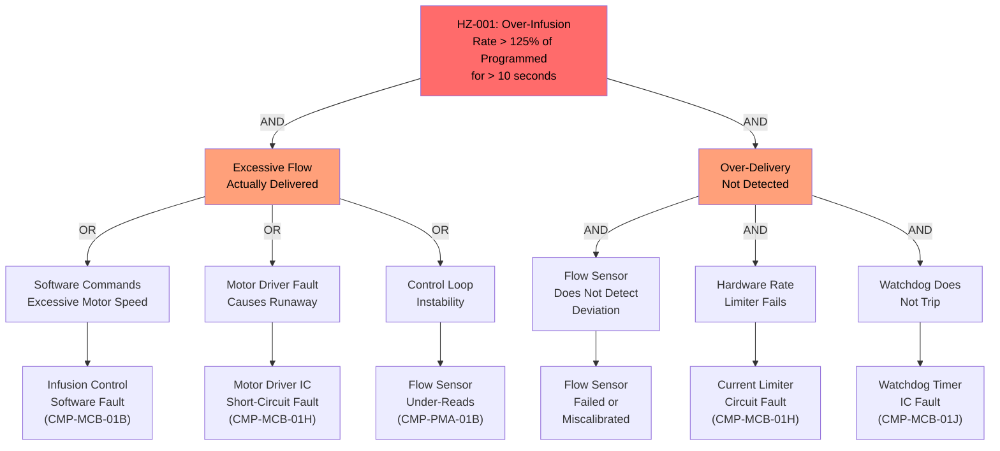

# Hazard Analysis

## Methodology

This risk management file follows ISO 14971:2019 (Application of risk management to medical devices). The scope covers the Smart Infusion Pump System as defined in the system boundary (README.md), analyzed across all operating modes (MODE-001 through MODE-005) and all reasonably foreseeable use conditions including normal use, reasonably foreseeable misuse, and fault conditions.

The analysis addresses:
- **Hazard identification**: Systematic identification of hazards and hazardous situations using intended use, reasonably foreseeable misuse, and failure mode analysis.
- **Risk estimation**: Estimation of severity and probability of occurrence for each hazardous situation.
- **Risk evaluation**: Comparison of estimated risk against the acceptability matrix.
- **Risk control**: Selection and implementation of risk control measures following the ISO 14971 hierarchy.
- **Risk-benefit analysis**: For residual risks that are not individually acceptable, evaluation of whether the medical benefits outweigh the residual risks.
- **Overall residual risk evaluation**: Assessment of the totality of residual risk from all identified hazardous situations.

## Terminology

| Term                | Definition (this system)                                                                         | Standard Reference         |
|---------------------|--------------------------------------------------------------------------------------------------|----------------------------|
| Hazard              | Potential source of harm associated with the infusion pump system                                | ISO 14971 Clause 3.9       |
| Hazardous Situation | Circumstance in which people, property, or the environment are exposed to one or more hazards    | ISO 14971 Clause 3.10      |
| Harm                | Physical injury or damage to the health of people, or damage to property or the environment      | ISO 14971 Clause 3.3       |
| Severity            | Measure of the possible consequences of a hazard (Catastrophic, Critical, Serious, Minor, Negligible) | ISO 14971 Clause 3.20 |
| Probability of Occurrence | Likelihood that the hazardous situation leads to harm, considering exposure and clinical context | ISO 14971 Clause D.4    |
| Sequence of Events  | The chain from initial cause through hazardous situation to harm                                 | ISO 14971 Clause C.4       |

## Risk Acceptability Matrix

| | Negligible (S1) | Minor (S2) | Serious (S3) | Critical (S4) | Catastrophic (S5) |
|---|---|---|---|---|---|
| **Frequent (P5)**     | ALARP | Unacceptable | Unacceptable | Unacceptable | Unacceptable |
| **Probable (P4)**     | Acceptable | ALARP | Unacceptable | Unacceptable | Unacceptable |
| **Occasional (P3)**   | Acceptable | Acceptable | ALARP | Unacceptable | Unacceptable |
| **Remote (P2)**       | Acceptable | Acceptable | Acceptable | ALARP | Unacceptable |
| **Improbable (P1)**   | Acceptable | Acceptable | Acceptable | Acceptable | ALARP |

- **Acceptable**: Risk is acceptable without further action.
- **ALARP**: Risk must be reduced As Low As Reasonably Practicable; residual risk may be acceptable after risk-benefit analysis.
- **Unacceptable**: Risk must be reduced before release.

## Assumptions and Preconditions

| Assumption ID | Statement                                                                                              | Validity Basis                          |
|---------------|--------------------------------------------------------------------------------------------------------|-----------------------------------------|
| ASM-001       | Clinicians operating the pump are trained on infusion pump programming, alarm response, and IV line management. | Hospital credentialing and in-service training requirements |
| ASM-002       | The IV administration set used with the pump is compatible with the cassette loading mechanism and meets the manufacturer's specifications. | Instructions for use; labeling per 21 CFR 801 |
| ASM-003       | The hospital pharmacy maintains the drug library with clinically validated soft and hard limits reviewed at least annually. | Pharmacy best practice per ISMP recommendations |
| ASM-004       | Hospital power infrastructure provides regulated AC power within IEC 60601-1 tolerances; uninterruptible power is available in critical care areas. | Hospital electrical system design per NFPA 99 |
| ASM-005       | The hospital Wi-Fi network provides coverage in all clinical areas where the pump is deployed, with redundant access points per IEC 80001-1 risk management. | Hospital IT infrastructure management |

## Hazard Log

| HZ ID   | Description                                                           | Cause(s)                                                                     | Effect                                                                         | MODE ID(s)        | Severity       | Probability | Initial Risk  | CTL ID(s)              | Residual Risk | Owner / Acceptance Authority | REQ ID(s)                                      |
|---------|-----------------------------------------------------------------------|------------------------------------------------------------------------------|--------------------------------------------------------------------------------|-------------------|----------------|-------------|---------------|------------------------|---------------|------------------------------|-------------------------------------------------|
| HZ-001  | Over-infusion: pump delivers fluid at a rate significantly exceeding the programmed rate | Software fault commanding excessive motor speed; flow sensor failure masking over-delivery; control loop instability | Patient receives medication overdose; severity depends on drug (e.g., heparin, insulin — potentially fatal) | MODE-001, MODE-002 | Catastrophic (S5) | Remote (P2) | ALARP | CTL-001, CTL-002 | Acceptable | Quality/Regulatory; FDA | REQ-FUN-002, REQ-FUN-003, REQ-FUN-015, REQ-SAF-003, REQ-SAF-004 |
| HZ-002  | Bolus over-delivery: pump delivers bolus volume exceeding the safe limit for the selected drug | DERS failure to check bolus against hard limits; software fault in bolus volume tracking | Rapid medication overdose during bolus delivery; potentially fatal for high-risk drugs | MODE-002 | Catastrophic (S5) | Remote (P2) | ALARP | CTL-003 | Acceptable | Quality/Regulatory; FDA | REQ-FUN-006, REQ-FUN-007, REQ-FUN-008 |
| HZ-003  | DERS failure: dose error reduction software fails to alert on out-of-range parameters | DERS engine software fault; corrupted drug library with incorrect limits; DERS bypass in UI workflow | Clinician unknowingly programs an unsafe dose that the pump delivers without warning | MODE-001, MODE-005 | Catastrophic (S5) | Remote (P2) | ALARP | CTL-003, CTL-009 | Acceptable | Quality/Regulatory; FDA | REQ-FUN-007, REQ-FUN-008, REQ-FUN-011, REQ-FUN-022, REQ-SAF-010 |
| HZ-004  | Air embolism: air enters the patient's bloodstream via the IV line | Air-in-line detector failure; air introduced after the detector; large air bubble in cassette | Venous air embolism; potential cardiovascular compromise; death in severe cases | MODE-001, MODE-002 | Catastrophic (S5) | Remote (P2) | ALARP | CTL-004 | Acceptable | Quality/Regulatory; FDA | REQ-FUN-013 |
| HZ-005  | Free-flow: uncontrolled gravity-driven fluid delivery through the IV line | Anti-free-flow clamp fails to engage on door open; cassette dislodged without clamp engagement; IV set removed without clamping | Rapid uncontrolled infusion of entire container contents; potentially fatal medication overdose | MODE-001, MODE-004, MODE-005 | Catastrophic (S5) | Improbable (P1) | ALARP | CTL-006 | Acceptable | Quality/Regulatory; FDA | REQ-SAF-001, REQ-FUN-017 |
| HZ-006  | Processor failure: main processor halts or enters undefined state during infusion | Hardware fault, software exception, power transient causing processor lockup | Pump may continue delivering at last commanded rate without monitoring or alarm capability | MODE-001, MODE-002 | Critical (S4) | Remote (P2) | ALARP | CTL-007 | Acceptable | Quality/Regulatory; FDA | REQ-SAF-002, REQ-SAF-006 |
| HZ-007  | Alarm failure: safety alarm not generated or not audible when alarm condition exists | Alarm application software fault; buzzer hardware failure; alarm task preempted by other tasks | Clinician unaware of occlusion, air, battery depletion, or other alarm conditions; delayed intervention | MODE-001, MODE-002 | Critical (S4) | Remote (P2) | ALARP | CTL-008 | Acceptable | Quality/Regulatory; FDA | REQ-FUN-014, REQ-SAF-007 |
| HZ-008  | Network-originated attack modifies infusion parameters or corrupts drug library | Unauthorized access to pump via hospital network; man-in-the-middle attack; malicious drug library injection | Altered infusion parameters lead to over/under-infusion; corrupted library defeats DERS | MODE-001, MODE-005 | Catastrophic (S5) | Improbable (P1) | ALARP | CTL-012, CTL-009 | Acceptable | Quality/Regulatory; FDA | REQ-IFC-003, REQ-IFC-004, REQ-IFC-006, REQ-SAF-005, REQ-SAF-009, REQ-FUN-011 |
| HZ-009  | Corrupted drug library accepted as valid | Storage media corruption; transmission error during library download; deliberate tampering | DERS checks against incorrect limits; unsafe doses may pass limit checking | MODE-005 | Catastrophic (S5) | Remote (P2) | ALARP | CTL-009 | Acceptable | Quality/Regulatory; FDA | REQ-FUN-011, REQ-SAF-010 |
| HZ-010  | Under-infusion: pump delivers at rate significantly below programmed rate | Downstream occlusion not detected; partial tubing kink; pump mechanism wear reducing output | Patient receives sub-therapeutic medication dose; delayed treatment effect; potential disease progression | MODE-001 | Serious (S3) | Occasional (P3) | ALARP | CTL-005, CTL-001 | Acceptable | Quality/Regulatory | REQ-FUN-012, REQ-FUN-015, REQ-FUN-016 |
| HZ-011  | Misleading display: screen shows incorrect infusion parameters | Display application software fault; data corruption on MCB-UIM interface; race condition in display update | Clinician makes clinical decisions based on incorrect information; may not intervene when intervention is needed | MODE-001, MODE-002 | Serious (S3) | Remote (P2) | Acceptable | CTL-010 | Acceptable | Quality/Regulatory | REQ-FUN-020, REQ-FUN-018 |
| HZ-012  | SOUP failure in RTOS causes system-wide malfunction | RTOS scheduling fault, memory management corruption, interrupt handling failure | Multiple safety functions (infusion control, alarm, DERS) affected simultaneously | MODE-001 | Catastrophic (S5) | Improbable (P1) | ALARP | CTL-007, CTL-011 | Acceptable | Quality/Regulatory; FDA | REQ-SAF-002, REQ-SAF-006, REQ-FUN-023 |

## Risk Controls

| CTL ID   | HZ ID(s)               | Description                                                                                                    | Type                            | REQ ID(s)                                        | VER ID(s)                  | Residual Risk Contribution                                   |
|----------|------------------------|----------------------------------------------------------------------------------------------------------------|---------------------------------|--------------------------------------------------|----------------------------|--------------------------------------------------------------|
| CTL-001  | HZ-001, HZ-010         | Closed-loop flow control with flow sensor feedback and flow deviation alarm                                     | Inherent safety by design       | REQ-FUN-002, REQ-FUN-003, REQ-FUN-015, REQ-SAF-004 | VER-T-001, VER-T-002, VER-T-003 | Detects and corrects flow deviations; alarms on gross deviation |
| CTL-002  | HZ-001                 | Independent hardware motor current limiter preventing pump speed exceeding 999 mL/hr equivalent               | Inherent safety by design       | REQ-SAF-003                                      | VER-T-004, VER-A-001       | Provides absolute hardware-enforced rate ceiling              |
| CTL-003  | HZ-002, HZ-003         | DERS with drug library hard/soft limits enforced before infusion start; hard limits non-overridable            | Protective measure              | REQ-FUN-007, REQ-FUN-008, REQ-FUN-022, REQ-IFC-002 | VER-T-005, VER-T-006, VER-T-007 | Intercepts dose errors at programming time                   |
| CTL-004  | HZ-004                 | Ultrasonic air-in-line detector with automatic infusion pause on detection threshold (50 uL)                  | Protective measure              | REQ-FUN-013                                      | VER-T-008                  | Detects air bubbles and stops infusion before clinically significant volume enters patient |
| CTL-005  | HZ-010                 | Upstream and downstream occlusion detection with high-priority alarm                                           | Protective measure              | REQ-FUN-012, REQ-FUN-016                         | VER-T-009, VER-T-010       | Detects occlusion conditions within 5 seconds                 |
| CTL-006  | HZ-005                 | Passive mechanical anti-free-flow clamp independent of electronics, engaging on door open or power loss        | Inherent safety by design       | REQ-SAF-001, REQ-FUN-017                         | VER-T-011                  | Eliminates free-flow as primary control; independent of all electronic failure modes |
| CTL-007  | HZ-006, HZ-012         | Independent hardware watchdog with processor reset to safe state within 200 ms                                | Protective measure              | REQ-SAF-002, REQ-SAF-006                         | VER-T-012, VER-T-013       | Detects processor failure and forces safe state               |
| CTL-008  | HZ-007                 | Alarm annunciator hardware (buzzer + LED) driven directly by alarm management, independent of display application | Protective measure           | REQ-FUN-014, REQ-SAF-007                         | VER-T-014                  | Maintains alarm capability even if display application fails  |
| CTL-009  | HZ-003, HZ-008, HZ-009 | Drug library integrity verification (CRC-32 + digital signature) with activation restricted to standby mode   | Protective measure              | REQ-FUN-011, REQ-SAF-010                         | VER-T-015, VER-T-016       | Prevents acceptance of corrupted or tampered drug library      |
| CTL-010  | HZ-011                 | Flow sensor backup via motor step counting; MCB-UIM data integrity checking                                   | Protective measure              | REQ-FUN-018, REQ-FUN-020                         | VER-T-017, VER-T-018       | Provides degraded-accuracy backup and detects display data corruption |
| CTL-011  | HZ-012                 | Power-up self-test covering all sensors, alarm, watchdog, and processor before infusion permitted             | Information for safety          | REQ-FUN-023                                      | VER-T-019                  | Detects latent faults before infusion begins                  |
| CTL-012  | HZ-008                 | Network security controls: TLS 1.2+ encryption, WPA2/WPA3 authentication, MCB input validation, RTOS partition isolation | Protective measure        | REQ-IFC-003, REQ-IFC-004, REQ-IFC-006, REQ-SAF-005, REQ-SAF-009 | VER-T-020, VER-T-021, VER-T-022 | Defense in depth against network-originated attacks |

## Fault Analysis

### Preliminary FMEA Excerpt: Pump Mechanism Assembly

| Component         | Failure Mode                       | Effect on System                                                    | Severity | Detection Method        | CTL ID(s)  | RPN Assessment |
|-------------------|------------------------------------|---------------------------------------------------------------------|----------|-------------------------|------------|----------------|
| CMP-PMA-01A (Peristaltic Drive) | Motor runs at excessive speed | Over-infusion at rate exceeding programmed rate | Catastrophic | Flow sensor deviation alarm; hardware current limiter | CTL-001, CTL-002 | Severity high; detection high; occurrence low |
| CMP-PMA-01A | Motor stalls | Infusion stops; under-infusion | Serious | Flow sensor zero-flow alarm; motor current monitoring | CTL-001, CTL-005 | Severity moderate; detection high; occurrence low |
| CMP-PMA-01B (Flow Sensor) | Sensor reads zero when flow exists | False no-flow alarm; pump may increase motor speed if in closed loop | Critical | Motor current vs. flow sensor cross-check; transition to open loop | CTL-010, CTL-001 | Severity high; detection moderate; occurrence low |
| CMP-PMA-01B | Sensor reads flow when no flow exists | Pump believes delivery is occurring when it is not; under-infusion | Serious | Occlusion pressure comparison; VTBI completion time check | CTL-005 | Severity moderate; detection moderate; occurrence low |
| CMP-PMA-01C (Anti-Free-Flow) | Clamp fails to engage on door open | Free-flow condition when IV set is exposed | Catastrophic | Door sensor triggers electronic pump stop as backup; mechanical endurance testing | CTL-006 (primary mechanical) | Severity catastrophic; detection moderate; occurrence very low |
| CMP-PMA-01D (Air Detector) | Detector fails to detect air | Air embolism | Catastrophic | Power-up self-test of detector; periodic auto-calibration | CTL-004, CTL-011 | Severity catastrophic; detection moderate; occurrence very low |
| CMP-PMA-01E (Pressure Sensor) | Sensor reads normal when occlusion exists | Occlusion not detected; under-infusion | Serious | Flow sensor deviation alarm as backup detection | CTL-001, CTL-005 | Severity moderate; detection high; occurrence low |

### Fault Tree: Uncontrolled Over-Infusion (HZ-001)

**Cut set analysis:**

The top event requires BOTH excessive flow delivery AND failure of all detection mechanisms. The dominant cut set is:

- Software fault (BE1) AND Flow sensor failed (BE4) AND Hardware limiter fault (BE5) AND Watchdog fault (BE6)

The hardware motor current limiter (CTL-002) provides an independent ceiling that is not software-controlled. For this cut set to occur, the software, flow sensor, hardware current limiter, and watchdog must all fail simultaneously. Given the independence of these mechanisms (different failure modes, different physical components), the combined probability is well below the ALARP threshold.

The mechanical anti-free-flow clamp (CTL-006) provides an additional independent barrier for the specific case where over-infusion results from a gravity-driven free-flow condition. This control is entirely independent of all electronic components.

## Risk-Benefit Analysis

For hazardous situations where residual risk falls in the ALARP region after all practicable risk controls are applied, the following risk-benefit analysis demonstrates that the medical benefits of the device outweigh the residual risks.

**Intended medical benefits:**
- Accurate, controlled intravenous fluid and medication delivery replacing manual gravity infusion
- DERS reduces medication dosing errors by an estimated 70-80% compared to pumps without DERS (per published ECRI Institute data)
- Automated volume tracking and KVO transition reduce the risk of air embolism from empty containers
- EHR integration reduces medication transcription errors
- Alarm management provides early warning of occlusion, air, and other hazardous conditions

**Residual risk summary:**

| HZ ID | Residual Risk Level | Benefit Justification |
|-------|--------------------|-----------------------|
| HZ-001 | Acceptable (after CTL-001, CTL-002) | Closed-loop control with hardware rate limiting reduces over-infusion risk below that of gravity infusion |
| HZ-002 | Acceptable (after CTL-003) | DERS hard limit on bolus eliminates the most dangerous bolus errors |
| HZ-003 | Acceptable (after CTL-003, CTL-009) | DERS with validated drug library provides protection not available with non-DERS pumps |
| HZ-004 | Acceptable (after CTL-004) | Air-in-line detection with automatic pause provides protection not available with gravity infusion |
| HZ-005 | Acceptable (after CTL-006) | Mechanical anti-free-flow clamp eliminates the most dangerous infusion pump failure mode |
| HZ-008 | Acceptable (after CTL-012, CTL-009) | Network connectivity benefits (EHR integration, alarm forwarding) outweigh residual cybersecurity risk with defense-in-depth controls |

**Conclusion:** For all identified hazardous situations, the residual risk after application of risk controls is acceptable, either directly or through risk-benefit analysis. The medical benefits of the device (accurate infusion delivery, dose error reduction, automated monitoring, EHR integration) substantially outweigh the residual risks.

## Overall Residual Risk Evaluation

Per ISO 14971 Clause 8, this section evaluates the overall residual risk from all identified hazardous situations considered together.

**Evaluation method:** Review of the completeness of the hazard identification process, confirmation that all identified hazards have been addressed by risk controls, and assessment of whether the combination of individual residual risks creates a cumulative risk that is unacceptable.

**Findings:**

1. **Completeness of hazard identification.** The hazard identification process used a combination of intended use analysis, reasonably foreseeable misuse analysis, fault mode analysis (FMEA) of all subsystems, and review of the FDA Infusion Pump Improvement Initiative findings and MAUDE database reports for predicate infusion pump devices. The process is judged to be sufficiently comprehensive.

2. **Risk control coverage.** All 12 identified hazardous situations have at least one risk control measure assigned. The 10 hazardous situations with Catastrophic or Critical severity have multiple independent risk control measures, consistent with defense-in-depth principles.

3. **Cumulative risk assessment.** The individual residual risks do not create a cumulative burden that changes the acceptability determination. The pump provides substantial medical benefits (DERS, closed-loop control, automated monitoring) that are not available from manual gravity infusion. The risk controls are predominantly inherent safety by design (mechanical anti-free-flow, hardware rate limiter) and protective measures (flow sensor feedback, air detector, alarms) that are independent of each other.

4. **Post-market data contribution.** The DERS override logging (REQ-FUN-009) and alarm data forwarding (REQ-IFC-005) provide ongoing post-market data that will be used to monitor the risk profile and refine drug library limits over the product lifecycle.

**Conclusion:** The overall residual risk of the Smart Infusion Pump System is acceptable. The medical benefits outweigh the residual risks, risk controls are adequate and independent, and post-market surveillance mechanisms are in place to detect emerging risks.
