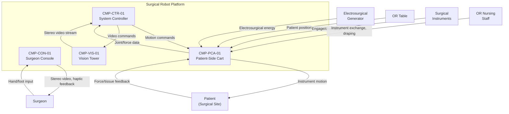

# Architecture

## System Context

## Functional Architecture

| FUN ID       | Function Name                    | Description                                                                | Inputs                                     | Outputs                                   | Dependencies      |
|--------------|----------------------------------|----------------------------------------------------------------------------|--------------------------------------------|-------------------------------------------|--------------------|
| FUN-MOT-01   | Motion Control                   | Map surgeon inputs to instrument arm joint commands with scaling and tremor filtering | Hand controller data, scaling ratio, joint feedback | Joint motor commands, position feedback | FUN-SAF-01         |
| FUN-HAP-01   | Haptic Feedback                  | Relay force/torque data from instrument tips to console haptic actuators    | Force/torque sensor data                   | Haptic actuator drive signals             | FUN-MOT-01         |
| FUN-VIS-01   | Vision Processing                | Capture, process, and distribute stereoscopic endoscope video              | Raw camera frames                          | Processed stereo video, instrument overlay | None               |
| FUN-SAF-01   | Safety Supervision               | Monitor arm envelopes, collision avoidance, communication integrity        | Joint positions, velocities, torques, link status | Halt commands, mode transitions, alarms  | None               |
| FUN-SAF-02   | Emergency Stop                   | Remove motor power and engage brakes on e-stop activation                  | E-stop button signal                       | Motor power cutoff, brake engagement      | None               |
| FUN-INS-01   | Instrument Management            | Identify instruments, track usage, manage engagement state                 | Instrument RFID/memory, engagement sensors | Instrument ID, usage status, engage/lock  | None               |

## Physical Architecture

| CMP ID        | Component Name                     | Type     | Parent       | Description                                                         |
|---------------|-------------------------------------|----------|--------------|---------------------------------------------------------------------|
| CMP-CON-01    | Surgeon Console                     | Assembly | System       | Ergonomic workstation with hand controllers, foot pedals, display   |
| CMP-CON-01A   | Console Processor                   | Board    | CMP-CON-01   | ARM processor running console application and haptic rendering      |
| CMP-CON-01B   | Master Hand Controllers             | Module   | CMP-CON-01   | 7-DOF bilateral manipulators with position/force sensing            |
| CMP-CON-01C   | Haptic Feedback Actuators           | Module   | CMP-CON-01   | Motorized force-feedback actuators on each hand controller axis     |
| CMP-CON-01D   | Stereoscopic Display                | Module   | CMP-CON-01   | Dual-channel 4K display with polarized stereo separation            |
| CMP-CON-01E   | Foot Pedal Array / E-Stop           | Module   | CMP-CON-01   | Clutch, camera, energy, and emergency stop foot controls            |
| CMP-CTR-01    | System Controller                   | Board    | System       | Central computation for motion control, safety, and coordination    |
| CMP-CTR-01A   | Motion Control Processor            | IC/SW    | CMP-CTR-01   | Real-time motion control algorithms, tremor filter, scaling logic   |
| CMP-CTR-01B   | Safety Supervisory Software         | Software | CMP-CTR-01   | Envelope monitoring, collision avoidance, communication watchdog    |
| CMP-PCA-01    | Patient-Side Cart                   | Assembly | System       | Four articulated arms with instrument drives and sensors            |
| CMP-PCA-01A   | Cart Processor                      | Board    | CMP-PCA-01   | Joint servo control, sensor acquisition, local safety monitoring    |
| CMP-PCA-01B   | Articulated Arm Assembly (x4)       | Module   | CMP-PCA-01   | 6-DOF arms with joint encoders, torque sensors, cable drives        |
| CMP-PCA-01C   | Force/Torque Sensors                | Module   | CMP-PCA-01   | 6-axis force/torque sensing at each instrument tip                  |
| CMP-PCA-01D   | Instrument Interface                | Module   | CMP-PCA-01   | Instrument recognition (RFID), sterile adapter, energy pass-through |
| CMP-PCA-01E   | Motor Driver with Current Limiter   | Hardware | CMP-PCA-01   | Servo driver with independent hardware current limiting per joint   |
| CMP-PCA-01F   | Emergency Stop / Brake Assembly     | Hardware | CMP-PCA-01   | Hardwired e-stop relay and spring-engaged joint brakes              |
| CMP-VIS-01    | Vision Tower                        | Assembly | System       | Endoscope interface, image processing, light source control         |
| CMP-VIS-01A   | Stereoscopic Endoscope Interface    | Module   | CMP-VIS-01   | Dual-channel camera head with 4K image sensors                      |
| CMP-VIS-01B   | Image Processor                     | Board    | CMP-VIS-01   | Real-time stereo image processing, instrument overlay rendering     |

## Allocation

| FUN ID       | REQ ID(s)                              | CMP ID(s)                                       | Assurance Level   | Rationale                                                     |
|--------------|----------------------------------------|--------------------------------------------------|-------------------|---------------------------------------------------------------|
| FUN-MOT-01   | REQ-FUN-001, REQ-FUN-002              | CMP-CTR-01A, CMP-CON-01B, CMP-PCA-01B           | IEC 62304 Class C | Motion control error can cause unintended tissue injury       |
| FUN-HAP-01   | REQ-FUN-003                            | CMP-PCA-01C, CMP-CON-01C, CMP-CTR-01A           | IEC 62304 Class C | Loss of haptic feedback removes force awareness from surgeon  |
| FUN-VIS-01   | REQ-FUN-004                            | CMP-VIS-01A, CMP-VIS-01B, CMP-CON-01D           | IEC 62304 Class B | Vision loss is clinically observable; surgeon can pause        |
| FUN-SAF-01   | REQ-SAF-001, REQ-SAF-002, REQ-SAF-003 | CMP-CTR-01A, CMP-CTR-01B, CMP-PCA-01B           | IEC 62304 Class C | Safety supervision failure can allow hazardous arm motion     |
| FUN-SAF-02   | REQ-SAF-005                            | CMP-CON-01E, CMP-PCA-01F                        | Hardware (independent) | E-stop is hardwired; not software-dependent                   |
| FUN-INS-01   | REQ-FUN-005                            | CMP-PCA-01D, CMP-CTR-01A                        | IEC 62304 Class B | Worn instrument failure is detectable clinically              |

## Interfaces

### External Interfaces

| IFC ID       | Partner System                 | Data Item                              | Direction     | Protocol               | Timing                   |
|--------------|--------------------------------|----------------------------------------|---------------|------------------------|--------------------------|
| IFC-EXT-001  | Surgeon                        | Hand controller positions/forces       | In            | Analog/encoder         | 1 kHz sample rate        |
| IFC-EXT-002  | Surgeon                        | Stereoscopic video, haptic force       | Out           | DisplayPort, haptic PWM | 60 fps video, 1 kHz haptic |
| IFC-EXT-003  | Surgical Instruments           | Instrument ID, engagement status       | Bidirectional | RFID + GPIO            | On instrument exchange   |
| IFC-EXT-004  | Electrosurgical Generator      | Energy activation command              | Out           | Isolated digital I/O   | < 50 ms activation       |
| IFC-EXT-005  | OR Table                       | Table position (optional integration)  | In            | RS-232 / Ethernet      | On demand                |

### Internal Interfaces

| IFC ID       | Source CMP ID   | Target CMP ID   | Data Item                                  | Mechanism              | Timing                 |
|--------------|-----------------|------------------|--------------------------------------------|------------------------|------------------------|
| IFC-INT-001  | CMP-CON-01      | CMP-CTR-01       | Hand controller state, foot pedal state    | Fiber-optic Ethernet   | 1 kHz deterministic    |
| IFC-INT-002  | CMP-CTR-01      | CMP-CON-01       | Haptic feedback commands, video stream     | Fiber-optic Ethernet   | 1 kHz haptic, 60 fps video |
| IFC-INT-003  | CMP-CTR-01      | CMP-PCA-01       | Joint motor commands, instrument commands  | EtherCAT              | 1 kHz servo loop       |
| IFC-INT-004  | CMP-PCA-01      | CMP-CTR-01       | Joint encoder, force/torque, status        | EtherCAT              | 1 kHz servo loop       |
| IFC-INT-005  | CMP-VIS-01      | CMP-CTR-01       | Processed stereo video frames              | Fiber-optic link       | 60 fps                 |

## Failure Containment / Partitioning

The system uses physical separation and independent processors to contain faults within subsystem boundaries.

**Console-Cart isolation:** The surgeon console and patient-side cart are physically separate units connected by a dedicated fiber-optic link. A communication fault triggers MODE-003 (Fault Hold) with instruments locked in place. The console cannot directly drive patient-side motors; all commands pass through the system controller safety supervision layer.

**Safety supervision independence:** The safety supervisory software (CMP-CTR-01B) runs as an independent task with higher priority than the motion control task on the system controller. It independently monitors joint envelopes and communication integrity. The emergency stop circuit (CMP-PCA-01F) is entirely hardwired, bypassing all software.

**Vision isolation:** Vision processing failure does not affect motion control or safety supervision. Loss of video triggers a surgeon notification but does not halt instrument arms, as the surgeon can request pause via the clutch pedal.

## Architecture Decisions

### AD-01: Dedicated Fiber-Optic Link over Hospital Network

**Decision:** Use a dedicated point-to-point fiber-optic link between the surgeon console and the system controller rather than routing over the hospital Ethernet network.

**Rationale:** The teleoperation control loop requires deterministic sub-2 ms round-trip latency and near-zero packet loss. Hospital networks cannot guarantee this quality of service. A dedicated link also eliminates the cybersecurity attack surface of routing safety-critical motion commands over a shared network.

**Trade-off:** The surgeon console cannot be located in a geographically distant site. Accepted because the clinical use case is same-building teleoperation, not remote surgery.

### AD-02: EtherCAT for Patient-Side Servo Communication

**Decision:** Use EtherCAT as the real-time fieldbus between the system controller and the patient-side cart joint servos.

**Rationale:** EtherCAT provides deterministic sub-microsecond jitter communication to multiple servo drives on a single network, supporting the 1 kHz servo loop rate required for stable joint control. The protocol's distributed clock synchronization ensures all joints receive commands within the same control cycle.

**Trade-off:** EtherCAT requires specialized interface hardware on each joint servo drive. Accepted because the servo loop timing requirements cannot be met with standard Ethernet protocols.

### AD-03: Hardware Current Limiting Independent of Software

**Decision:** Implement per-joint hardware current limiters on each motor driver (CMP-PCA-01E) that are not configurable or overridable by software.

**Rationale:** The maximum force limit (25 N per arm) must hold even under complete software failure. A hardware current limiter provides a force ceiling that is physically enforced regardless of commanded torque values, providing defense in depth against motion control software faults.

**Trade-off:** The fixed hardware limit constrains the maximum achievable force even in legitimate high-force scenarios. Accepted because 25 N exceeds the force required for any intended surgical manipulation, and exceeding this force against tissue would constitute a hazardous condition.
